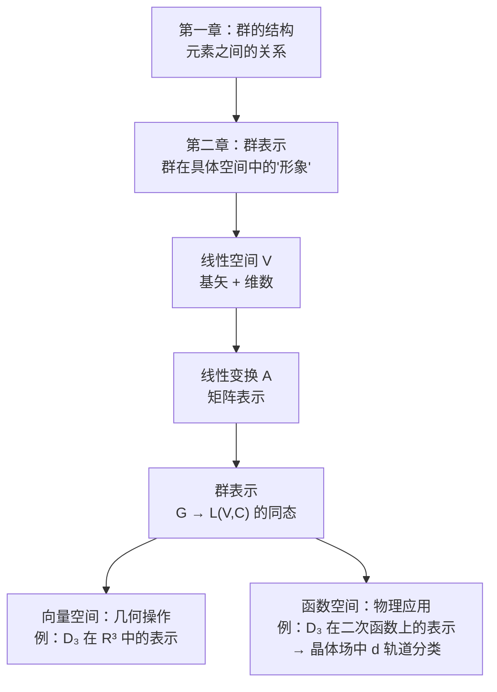

# 2.1 群表示

> [!abstract] 本节核心
> 群表示是抽象群 $G$ 到线性变换群 $L(V, C)$ 的同态映射——把抽象的群元素"翻译"成具体的线性变换（或矩阵），且保持乘法结构不变。本节从线性空间、线性变换出发，建立完整的数学框架，最终给出群表示的定义，并以 $D_3$ 群在函数空间上的表示为典型示例。

---

## 一、群表示的核心思想

> [!important] 一句话概括
> **群表示**是群 $G$ 到线性空间 $V$ 上的线性变换群 $L(V, C)$ 的**同态映射**。
>
> 也就是说：把抽象的群元素"翻译"成具体的线性变换（或矩阵），且保持乘法结构不变。

> [!tip] 为什么需要表示？
> 第一章研究的群是"抽象的"——元素之间只有乘法关系，没有具体形象。但物理中我们需要让群"作用"在具体的对象上（波函数、原子坐标、电磁场……）。
>
> 表示就是给抽象群穿上"具体衣服"的框架：同一个抽象群可以有无数种表示（不同维数、不同空间），但都保持群乘法结构。
>
> 同态映射允许"多对一"；如果还是一一对应的同构，就叫**忠实表示**。

---

## 二、从线性空间到线性变换

### 线性空间

> [!note] 定义 2.1（线性空间）
> 定义在数域 $K$（可以是 $\mathbb{R}$ 或 $\mathbb{C}$）上的向量集合 $V = \{x, y, z, \cdots\}$，定义了加法和数乘运算，满足封闭性和八条公理（加法交换律、结合律、零元、负元；数乘结合律、分配律等），则 $V$ 构成一个**线性空间**。

最直接的例子就是我们所处的三维实空间。

### 线性相关与基矢

> [!note] 定义 2.2（线性无关）
> 线性空间 $V$ 中，若 $n$ 个向量 $X_1, X_2, \cdots, X_n$ 的线性组合 $a_1 X_1 + a_2 X_2 + \cdots + a_n X_n = 0$ 当且仅当所有系数为零时成立，则称这些向量**线性无关**。

> [!note] 定义 2.3（维数）
> 线性空间中线性无关向量的最大个数 $m$ 称为线性空间的**维数**，记为 $\dim V = m$。

> [!note] 定义 2.4（基矢）
> $n$ 维线性空间中任意一组 $n$ 个线性无关的向量 $(e_1, e_2, \cdots, e_n)$ 都称为 $V$ 的**基矢**。
>
> 任意向量可表示为基矢的线性组合：
> $$X = \sum_{i=1}^{n} x_i e_i$$

### 线性变换

> [!note] 定义 2.5（线性变换）
> 线性变换 $A$ 是将线性空间 $V$ 映入 $V$ 的映射，满足：
> $$A(ax + y) = aAx + Ay, \quad \forall x, y \in V, \; a \in K$$

#### 线性变换的矩阵表示

给定一组基 $(e_1, e_2, \cdots, e_n)$，线性变换 $A$ 可以用矩阵表示。

**矩阵元的求法**：对基矢 $e_j$ 做变换 $A e_j$，得到的新向量用旧基展开：

$$e_j' = A e_j = \sum_{i=1}^{n} a_{ij} e_i$$

$a_{ij}$ 就是矩阵 $A$ 的第 $i$ 行第 $j$ 列元素。

> [!tip] 一句话记忆
> **矩阵的第 $j$ 列 = 变换作用在第 $j$ 个基矢上的结果在旧基下的展开系数。**

用矩阵形式表示线性变换对任意向量 $x = \sum_j x_j e_j$ 的作用：

$$[A][x] = [y]$$

其中 $[A] = (a_{ij})$ 是 $n \times n$ 矩阵，$[x]$ 和 $[y]$ 是列向量。

### 线性变换群

> [!note] 定义 2.6（线性变换群 / 一般线性群）
> 定义两个线性变换的乘法为相继作用，则 $n$ 维复线性空间 $V$ 上的全部**非奇异**线性变换在此乘法下构成一个群，称为 $n$ 维复**一般线性群** $\mathrm{GL}(V, C)$，其任一子群称为 $V$ 上的**线性变换群** $L(V, C)$。

> [!warning] 为什么要"非奇异"？
> 线性变换群必须是群，每个元素都要有逆。奇异矩阵（行列式为零）不可逆，所以排除。
>
> 这和第一章例 1.4 的道理完全一样：实数在数乘下不构成群，因为 0 没有逆元。

---

## 三、群表示的定义

> [!note] 定义 2.7（群表示）
> 设有群 $G$，如存在一个从 $G$ 到 $n$ 维线性空间 $V$ 上的线性变换群 $L(V, C)$ 的**同态映射** $A$，则称 $A$ 是群 $G$ 的一个**线性表示**，$V$ 为**表示空间**，$n$ 是表示的**维数**。
>
> 由同态的定义：
> - $\forall g_\alpha \in G$，有 $A(g_\alpha) \in L(V, C)$
> - $\forall g_\alpha, g_\beta \in G$，有 $A(g_\alpha g_\beta) = A(g_\alpha) A(g_\beta)$
> - $G$ 的单位元对应 $V$ 上的恒等变换
> - 互逆元素对应互逆变换

### 三个关键点

**（1）表示 = 同态映射关系**

教材说了一句很精辟的话："在具体讨论中，我们又经常说'某线性变换群（或某矩阵群）是某抽象群的表示'。在说类似句子的时候，我们其实已经把这个'同态映射关系（也就是表示）'，用其同态映射的目标（也就是线性变换群或矩阵群）代替了。"

> [!tip] 两种说法
> - 严格说法："表示"是同态映射 $A: G \to L(V, C)$
> - 方便说法："表示"就是线性变换群 $\{A(g_\alpha)\}$ 本身
>
> 后者更常用，但别忘了它背后的映射关系。

**（2）在选定基下，表示就是矩阵群**

如果选定 $V$ 的一组基 $(e_1, e_2, \cdots, e_n)$，每个线性变换 $A(g_\alpha)$ 对应一个矩阵 $[A(g_\alpha)]$，这些矩阵构成一个矩阵群。

**（3）忠实表示 = 同构**

如果同态映射 $A$ 还是一一对应的，就叫**忠实表示**。此时抽象群 $G$ 和表示矩阵群结构完全等价。

---

## 四、四个典型例子

### 例 2.1 恒等表示（显然表示）

任何群 $G$ 恒与 $\{1\}$（一阶单位矩阵）同态。这是一维恒等表示。

> [!tip] 物理意义
> 恒等表示对应的是"完全不敏感"的物理量——不管做什么对称操作，它都不变。比如标量。

### 例 2.2 矩阵群的自身表示

任何矩阵群都是自身的表示，且为忠实表示。

### 例 2.3 三个同构二阶群的三维表示

三个抽象群：
- $\{E, \sigma_k\}$：对 $x$-$y$ 平面的反射
- $\{E, C_k(\pi)\}$：绕 $z$ 轴转 $\pi$
- $\{E, I\}$：空间反演

取三维实空间，基矢为 $\{\hat{i}, \hat{j}, \hat{k}\}$：

| 操作 | 对基矢的效果 | 表示矩阵 |
|------|------------|---------|
| $E$ | $\hat{i}, \hat{j}, \hat{k} \to \hat{i}, \hat{j}, \hat{k}$ | $\begin{pmatrix} 1&0&0\\0&1&0\\0&0&1 \end{pmatrix}$ |
| $\sigma_k$ | $\hat{i}, \hat{j}, \hat{k} \to \hat{i}, \hat{j}, -\hat{k}$ | $\begin{pmatrix} 1&0&0\\0&1&0\\0&0&-1 \end{pmatrix}$ |
| $C_k(\pi)$ | $\hat{i}, \hat{j}, \hat{k} \to -\hat{i}, -\hat{j}, \hat{k}$ | $\begin{pmatrix} -1&0&0\\0&-1&0\\0&0&1 \end{pmatrix}$ |
| $I$ | $\hat{i}, \hat{j}, \hat{k} \to -\hat{i}, -\hat{j}, -\hat{k}$ | $\begin{pmatrix} -1&0&0\\0&-1&0\\0&0&-1 \end{pmatrix}$ |

> [!tip] 同构的群可以有相同的表示
> 这三个抽象群相互同构，所以这三个矩阵群中的任何一个都可以作为这三个抽象群的表示。

### 例 2.4 绕 $z$ 轴转动群的表示

绕 $z$ 轴转动角度 $\varphi$ 的操作对基矢的效果：

$$C_k(\varphi) \hat{i} = \cos\varphi \, \hat{i} + \sin\varphi \, \hat{j}$$
$$C_k(\varphi) \hat{j} = -\sin\varphi \, \hat{i} + \cos\varphi \, \hat{j}$$
$$C_k(\varphi) \hat{k} = \hat{k}$$

表示矩阵：

$$[C_k(\varphi)] = \begin{pmatrix} \cos\varphi & -\sin\varphi & 0 \\ \sin\varphi & \cos\varphi & 0 \\ 0 & 0 & 1 \end{pmatrix}$$

> [!important] 物理意义
> 这就是量子力学中轨道角动量在三维空间中的表示。$l=1$ 的三个态（$p_x, p_y, p_z$）在 $SO(2)$ 转动下的变换矩阵就是这个。

---

## 五、函数空间中的表示

这是 2.1 节最重要的部分，也是后续量子力学应用的核心。

### 问题设置

表示空间的基矢不再是几何向量，而是**函数**：

$$\{\Psi_1(r), \Psi_2(r), \cdots, \Psi_n(r)\}$$

抽象群的群元 $g_\alpha$ 作用在函数的自变量 $r$ 上：$r' = g_\alpha r$。

对应的线性变换 $A(g_\alpha)$ 作用在函数上：$A(g_\alpha) \Psi_i(r) = \Psi_i'(r)$。

### 核心公式

> [!important] 函数空间中的表示公式
> $$A(g_\alpha) \Psi_i(\mathbf{r}) = \Psi_i(g_\alpha^{-1} \mathbf{r})$$

### 为什么是 $g_\alpha^{-1}$ 而不是 $g_\alpha$？

这是理解函数空间表示的关键。推导如下：

**物理要求**：变换后的函数 $\Psi_i'$ 在变换后的点 $r'$ 处的值，等于原函数 $\Psi_i$ 在原点 $r$ 处的值：

$$\Psi_i'(r') = \Psi_i(r), \quad \text{其中 } r' = g_\alpha r$$

这意味着：

$$\Psi_i'(r) = \Psi_i(g_\alpha^{-1} r)$$

> [!tip] 直觉
> 想象函数是一个画在纸上的图案。对称操作把纸（坐标空间）变换了。变换后的图案在某个位置 $r$ 的值，来自变换前的 $g_\alpha^{-1} r$ 位置。
>
> 这和 4.1 节中 $\hat{P}_g \varphi(\mathbf{x}) = \varphi(g^{-1}\mathbf{x})$ 的道理完全一样——波函数值是贴在空间点上的"标签"，系统变换后，点 $\mathbf{x}$ 处的函数值来自变换前的 $g^{-1}\mathbf{x}$ 处。

### 求矩阵表示的步骤

1. 对每个基函数 $\Psi_i(r)$，计算 $A(g_\alpha) \Psi_i(r) = \Psi_i(g_\alpha^{-1} r)$
2. 将结果按旧基 $\{\Psi_1(r), \Psi_2(r), \cdots, \Psi_n(r)\}$ 展开
3. 展开系数就是表示矩阵的第 $i$ 列

### 例 2.5 $D_3$ 群在六个二次函数上的表示

表示空间的基：

$$\{\Psi_1 = x^2, \; \Psi_2 = y^2, \; \Psi_3 = z^2, \; \Psi_4 = xy, \; \Psi_5 = yz, \; \Psi_6 = xz\}$$

以 $d$（绕 $z$ 轴转 $120^\circ$）为例：

$$d^{-1} \mathbf{r} = \begin{pmatrix} -1/2 & \sqrt{3}/2 & 0 \\ -\sqrt{3}/2 & -1/2 & 0 \\ 0 & 0 & 1 \end{pmatrix} \begin{pmatrix} x \\ y \\ z \end{pmatrix} = \begin{pmatrix} -x/2 + \sqrt{3}y/2 \\ -\sqrt{3}x/2 - y/2 \\ z \end{pmatrix}$$

计算 $A(d) \Psi_1(\mathbf{r}) = \Psi_1(d^{-1} \mathbf{r})$：

$$= \left(-\frac{1}{2}x + \frac{\sqrt{3}}{2}y\right)^2 = \frac{1}{4}x^2 - \frac{\sqrt{3}}{2}xy + \frac{3}{4}y^2$$

按基展开：$= \frac{1}{4}\Psi_1 + \frac{3}{4}\Psi_2 + 0 \cdot \Psi_3 - \frac{\sqrt{3}}{2}\Psi_4 + 0 \cdot \Psi_5 + 0 \cdot \Psi_6$

所以表示矩阵的第 1 列为 $(1/4, \; 3/4, \; 0, \; -\sqrt{3}/2, \; 0, \; 0)^T$。

> [!important] 物理意义
> 这六个二次函数对应着原子轨道中的 $d$ 轨道（$d_{x^2-y^2}, d_{z^2}, d_{xy}, d_{yz}, d_{xz}$ 的线性组合）。$D_3$ 群在这些函数上的表示，就是在三角对称性（比如三角晶体场）下 $d$ 轨道如何变换和分类。这是晶体场理论的群论基础。

---

## 六、2.1 节的三句话总结

> [!important] 2.1 节的三句话总结
> 1. **群表示**是抽象群 $G$ 与线性变换群的同态映射关系。
> 2. **求表示矩阵**：把每个基矢进行变换，然后按旧基展开，展开系数为表示矩阵的列。
> 3. **函数空间中的表示**：$A(g_\alpha) \Psi_i(\mathbf{r}) = \Psi_i(g_\alpha^{-1} \mathbf{r})$

---

## 七、2.1 节与第一章的连接

群表示把第一章的抽象结构"落地"到了具体的线性空间上。后续的不可约表示理论（2.2节）和特征标理论（后续章节）将告诉我们：一个群只有少数几个"本质不同的"不等价不可约表示，而这几个表示就决定了物理系统的所有对称性行为。
