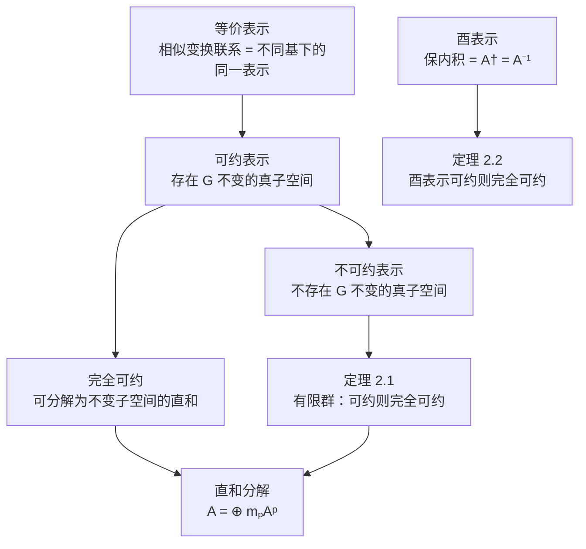

# 2.2 等价表示、不可约表示、酉表示

> [!abstract] 本节核心
> 2.1 节定义了群表示，本节研究表示的"分类"问题。等价表示是同一组线性变换在不同基下的不同外观；可约/不可约表示取决于表示空间是否存在 $G$ 不变的真子空间；酉表示是保内积的表示，与量子力学的概率守恒直接对应。核心定理：有限群表示可约则完全可约，酉表示可约则完全可约。

---

## 一、等价表示：不同"视角"下的同一表示

> [!note] 定义 2.8（等价表示）
> 设群 $G$ 在表示空间 $V$ 上的一个表示 $A$ 是 $\{A(g_\alpha)\}$。设 $P$ 是 $V$ 上的一个非奇异变换，则 $\{P^{-1} A(g_\alpha) P\}$ 也给出群 $G$ 的一个表示，称为 $\{A(g_\alpha)\}$ 的**等价表示**。

### 等价表示的实质

> [!important] 一句话
> 等价表示就是由**相似变换**联系起来的表示。

验证 $\{P^{-1} A(g_\alpha) P\}$ 是表示：
- 每个 $g_\alpha$ 唯一对应一个 $P^{-1} A(g_\alpha) P$ ✓
- $P^{-1} A(g_\alpha g_\beta) P = P^{-1} A(g_\alpha) P P^{-1} A(g_\beta) P$ ✓（保持乘法）

### 等价表示与基变换

教材做了一个非常关键的推导：等价表示本质上就是**同一组线性变换在不同基下的矩阵表示**。

设 $V$ 有两组基：
- $B = (e_1, e_2, \cdots, e_n)$
- $B' = (e_1', e_2', \cdots, e_n')$

两组基之间的关系：

$$(e_1', e_2', \cdots, e_n') = (e_1, e_2, \cdots, e_n) [P]_B$$

则同一组线性变换 $\{A(g_\alpha)\}$ 在两组基下的矩阵群之间的关系为：

$$[A(g_\alpha)]_{B'} = [P^{-1}]_B [A(g_\alpha)]_B [P]_B$$

> [!tip] 直觉
> 等价表示 = 同一个"物理实在"（线性变换群）在不同"坐标系"（基）下的"数学外观"（矩阵群）。
>
> 就像同一个向量在不同坐标系下有不同分量，但向量本身不变。

### 关于等价表示的三点说明

**（1）等价表示的维数相同**

因为相似变换不改变矩阵的维数。

**（2）判断等价：特征标**

原则上要找到不依赖于 $g_\alpha$ 的 $P$ 使得 $P^{-1} A(g_\alpha) P = A'(g_\alpha)$，这很难。后面会引入**特征标**（character），用它可以方便地判断两个表示是否等价。

**（3）等价表示的表示空间可以不同**

两个不同表示空间上的表示矩阵群如果可以通过相似变换联系，它们也等价。

---

## 二、可约表示：存在不变的真子空间

> [!note] 定义 2.9（可约表示）
> 设 $A$ 是群 $G$ 在表示空间 $V$ 上的一个表示，如果 $V$ 存在一个 $G$ 不变的**真子空间** $W$（"真"指 $W \neq V$ 且 $W \neq \{0\}$），则称 $A$ 是**可约表示**。

> [!tip] $G$ 不变的真子空间
> $\forall y \in W, \forall g_\alpha \in G$，有 $A(g_\alpha) y \in W$。
>
> 也就是说：表示矩阵作用在 $W$ 中的向量上，结果不会跑出 $W$。

### 可约表示的矩阵形式

当 $V$ 存在 $G$ 不变的真子空间 $W$（维数为 $m$）时，总可以在 $V$ 中取一组基 $(e_1, \cdots, e_m, e_{m+1}, \cdots, e_n)$，其中前 $m$ 个是 $W$ 中的向量。

在这组基下，表示矩阵具有**上三角分块形式**：

$$[A(g_\alpha)] = \begin{pmatrix} C_\alpha & N_\alpha \\ 0 & B_\alpha \end{pmatrix} \tag{2.6}$$

其中：
- $C_\alpha$ 是 $m \times m$ 矩阵（$W$ 中的变换）
- $N_\alpha$ 是 $m \times (n-m)$ 矩阵（耦合项）
- $B_\alpha$ 是 $(n-m) \times (n-m)$ 矩阵（$W'$ 中的变换）
- 左下角的 $0$ 是 $(n-m) \times m$ 的零矩阵（关键！保证 $W$ 不变）

> [!important] 关键理解
> 判断一个表示是否可约，**不是看它是否已经具备 (2.6) 式的形式**，而是要看它是否**具备成为 (2.6) 式形式的潜质**。
>
> 这个潜质体现在**表示空间**上——表示空间是否存在 $G$ 不变的真子空间。表示矩阵是外在的东西，表示空间是内在的东西，**关键看内在**。

> [!tip] 例子
> 绕 $z$ 轴的转动群在三维空间中的表示是可约的，因为 $x$-$y$ 平面是 $G$ 不变的子空间。
>
> 但如果选的基矢中前两个不在 $x$-$y$ 平面内，表示矩阵就不会具备上三角分块形式——但表示仍然是可约的。

---

## 三、不可约表示：没有不变的真子空间

如果群 $G$ 的表示 $A$ 的表示空间 $V$ **不存在** $G$ 不变的真子空间，则称 $A$ 是 $G$ 的**不可约表示**。

不可约表示的矩阵**不能**通过任何基变换写成 (2.6) 的形式。

> [!important] 核心目标
> **"对任何群，求其全部不等价不可约表示是群表示论的主要课题。"**
>
> 原因：任何表示都可以分解为不可约表示的直和（后面会证明），所以只要知道了所有不等价不可约表示，就知道了所有表示。

---

## 四、直和与完全可约

### 直和

> [!note] 定义 2.10（直和）
> 对于群 $G$ 的表示空间 $V$，$W$ 与 $W'$ 是它的子空间，如 $\forall x \in V$，都能找到 $y \in W, z \in W'$，使得 $x$ 可**唯一地**分解为 $x = y + z$，则称 $V$ 是 $W$ 与 $W'$ 的**直和**，记为 $V = W \oplus W'$。
>
> 唯一分解要求 $W \cap W' = \{0\}$。

### 完全可约

> [!note] 定义 2.11（完全可约）
> 把 $G$ 的表示空间 $V$ 分解为 $W$ 与 $W'$ 的直和，如 $W$ 与 $W'$ **都是 $G$ 不变的**，则称表示空间 $V$ **完全可约**。

当表示完全可约时，(2.6) 式可以进一步化为：

$$[A(g_\alpha)] = \begin{pmatrix} C_\alpha & 0 \\ 0 & B_\alpha \end{pmatrix}$$

> [!tip] 记号
> 称 $A$ 可以**约化**为 $C$ 与 $B$ 的直和，记为 $A(g_\alpha) = C(g_\alpha) \oplus B(g_\alpha)$。

### 直和分解

如果每个可约表示都是完全可约的，则任何表示最终都可以约化为不可约表示的直和：

$$A(g_\alpha) = \sum_p \oplus m_p A^p(g_\alpha)$$

其中 $m_p$ 代表不可约表示 $A^p$ 出现的次数，称为**重复度**。

---

## 五、定理 2.1：有限群表示可约则完全可约

> [!important] 定理 2.1
> 对于有限群，表示可约则完全可约。

这是有限群表示论中最基本的定理之一。

### 证明思路

设可约表示可写成上三角形式：

$$A(g_\alpha) = \begin{pmatrix} G_1(g_\alpha) & R(g_\alpha) \\ 0 & G_2(g_\alpha) \end{pmatrix}$$

目标是找到一个矩阵 $P$，使得 $P^{-1} A(g_\alpha) P$ 为对角分块形式。

设 $P = \begin{pmatrix} I_m & C \\ 0 & I_{n-m} \end{pmatrix}$，其中 $C$ 是待定的 $m \times (n-m)$ 矩阵。

由 $P^{-1} A(g_\alpha) P = G_0(g_\alpha)$（对角分块），等价于 $A(g_\alpha) P = P G_0(g_\alpha)$，展开后得到关键方程：

$$G_1(g_\alpha) C + R(g_\alpha) = C G_2(g_\alpha) \tag{2.7}$$

### 构造 $C$

利用" $A$ 是群表示"的条件（$A(g_\alpha)A(g) = A(g_\alpha g)$），经过变形，(2.7) 式等价于：

$$G_1(g_\alpha) C G_2(g_\alpha^{-1}) = C - R(g_\alpha) G_2(g_\alpha^{-1}) \tag{2.9}$$

> [!important] 关键构造
> $$C = \frac{1}{n_G} \sum_{g \in G} R(g) G_2(g^{-1}) \tag{2.10}$$
>
> 其中 $n_G = |G|$ 是群的阶。

### 验证 $C$ 满足 (2.9) 式

将 (2.10) 代入 (2.9) 左边，利用群表示的性质 $G_1(g_\alpha)R(g) + R(g_\alpha)G_2(g) = R(g_\alpha g)$，经过一系列代数操作：

$$G_1(g_\alpha) C G_2(g_\alpha^{-1}) = \frac{1}{n_G} \sum_{g \in G} [R(g_\alpha g) - R(g_\alpha)G_2(g)] G_2((g_\alpha g)^{-1})$$

右边第一项：由**重排定理**，当 $g$ 取遍 $G$ 时，$g_\alpha g$ 也取遍 $G$，所以：

$$\frac{1}{n_G} \sum_{g \in G} R(g_\alpha g) G_2((g_\alpha g)^{-1}) = \frac{1}{n_G} \sum_{g' \in G} R(g') G_2(g'^{-1}) = C$$

右边第二项：

$$\frac{1}{n_G} \sum_{g \in G} R(g_\alpha) G_2(g) G_2((g_\alpha g)^{-1}) = R(g_\alpha) G_2(g_\alpha^{-1})$$

所以：

$$G_1(g_\alpha) C G_2(g_\alpha^{-1}) = C - R(g_\alpha) G_2(g_\alpha^{-1})$$

这正是 (2.9) 式！$\square$

> [!tip] 定理的适用范围
> 证明中用到了对 $g$ 的求和 $\sum_{g \in G}$，所以**只对有限群成立**。无限群不一定满足"可约则完全可约"。

---

## 六、酉表示：保内积的表示

> [!note] 定义 2.12（酉表示）
> 由**酉变换群**或**酉矩阵群**进行的表示是**酉表示**。

酉变换 = 保内积的变换。在正交归一基下，酉变换的矩阵满足：

$$U^\dagger U = I, \quad \text{即} \quad U^{-1} = U^\dagger$$

> [!tip] 矩阵元形式
> 酉表示的特征是 $A(g_\alpha)^\dagger = A(g_\alpha)^{-1} = A(g_\alpha^{-1})$。
>
> 写成矩阵元的形式：$[A(g_\alpha)]_{j,i}^* = [A(g_\alpha^{-1})]_{i,j}$。

> [!important] 物理意义
> 量子力学中的对称操作对应的算符必须是**幺正算符**（保持内积 = 保持概率守恒）。所以量子力学中涉及的群表示天然是酉表示。

### 定理 2.2：酉表示可约则完全可约

> [!important] 定理 2.2
> 酉表示可约则完全可约。

**证明**：

酉表示定义在内积空间 $V$ 上。$A$ 可约，则 $V$ 中有 $G$ 不变的真子空间 $W$。

将 $V$ 做直和分解 $V = W \oplus W^\perp$，其中 $W^\perp$ 是 $W$ 的正交补空间。

已知 $W$ 是 $G$ 不变的，下面证明 $W^\perp$ 也是 $G$ 不变的。

$\forall y \in W, \forall z \in W^\perp$，有 $(y|z) = 0$。

$$\forall g_\alpha \in G: \quad (A(g_\alpha) z | y) = (z | A(g_\alpha)^\dagger y) = (z | A(g_\alpha)^{-1} y) = (z | A(g_\alpha^{-1}) y)$$

由于 $W$ 是 $G$ 不变的，$A(g_\alpha^{-1}) y \in W$，所以 $(z | A(g_\alpha^{-1}) y) = 0$。

即 $(A(g_\alpha) z | y) = 0$ 对所有 $y \in W$ 成立，所以 $A(g_\alpha) z \in W^\perp$。

因此 $W^\perp$ 也是 $G$ 不变的，$A$ 完全可约。$\square$

> [!important] 推论
> 有限维酉表示总可分解为不可约表示的直和。
>
> 这对量子力学至关重要：任何量子系统的对称性表示都可以分解为不可约表示的直和，每个不可约表示对应一个"不可再分"的对称性模式。

---

## 七、可约 vs 不可约的判断：不是看矩阵形式

> [!warning] 常见误区
> 看到矩阵是上三角分块形式 → 可约。看到矩阵不是上三角分块形式 → 不可约？
>
> **错！** 可约性的本质在于**表示空间是否存在 $G$ 不变的真子空间**，而不在于矩阵的外观。
>
> 一个不可约表示在"错误"的基下可能看起来像上三角形式，但通过适当的基变换可以消除上三角结构。
>
> 反之，一个可约表示在"错误"的基下可能不呈现上三角形式，但本质上是可约的。

> [!tip] 正确思路
> 判断可约性，应该看**内在的表示空间结构**，而不是**外在的矩阵形式**。
>
> 后面引入的**特征标**提供了判断可约性的实用工具。

---

## 八、2.2 节的核心逻辑链

> [!important] 本章六节的整体结构
> - **2.1–2.2 节**：基础概念（表示、等价、可约、不可约、酉表示）
> - **2.3 节**：群代数与正则表示（铺垫）
> - **2.4–2.5 节**：有限群表示理论与特征标理论（**重中之重**）
> - **2.6 节**：应用
