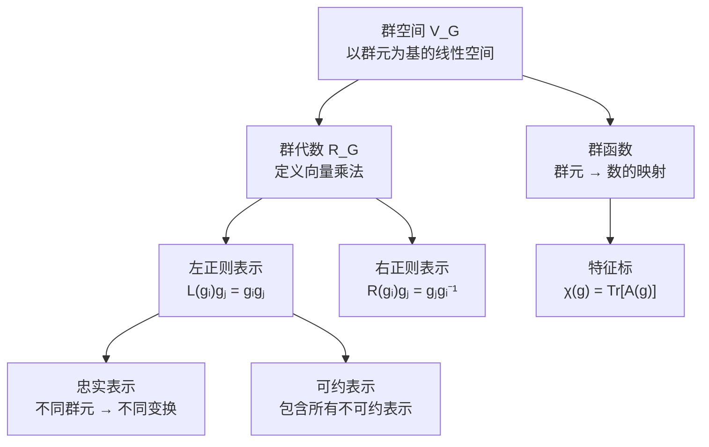

# 2.3 群代数与正则表示

> [!abstract] 本节核心
> 进入 2.4 节（有限群表示理论）和 2.5 节（特征标理论）之前的最后铺垫。三个核心概念：群代数（以群元为基的线性空间 + 向量乘法）、正则表示（群在自身群空间上的左/右作用）、群函数（特征标的载体空间）。正则表示是忠实的、可约的，且包含了群的所有不可约表示。

---

## 一、群代数：把群变成线性空间

### 动机

前面我们有了"群"（元素的集合 + 乘法）和"线性空间"（向量的集合 + 加法和数乘）两个概念。现在要把它们打通：**让群本身成为一个线性空间**。

### 群空间

> [!note] 定义 2.14（群空间）
> 设 $G = \{g_\alpha\}$ 是一个群，以群元的线性组合为向量：
> $$x = \sum_\alpha x_\alpha g_\alpha, \quad x_\alpha \in \mathbb{C}$$
>
> 定义加法和数乘：
> - $x + y = \sum_\alpha (x_\alpha + y_\alpha) g_\alpha$
> - $ax = \sum_\alpha (ax_\alpha) g_\alpha$
>
> 这些向量形成一个线性空间，称为**群空间**，记为 $V_G$。

> [!tip] 直觉
> 群空间就是以群元为"基矢"的线性空间。如果群有 $n$ 个元素，群空间就是 $n$ 维的。
>
> 每个群元 $g_\alpha$ 本身也是群空间中的一个向量（系数为 1 在 $g_\alpha$ 位置，其余为 0）。

### 群代数

> [!note] 定义 2.15（群代数）
> 在群空间 $V_G$ 上定义向量乘法：
> $$xy = \left(\sum_\alpha x_\alpha g_\alpha\right)\left(\sum_\beta y_\beta g_\beta\right) = \sum_{\alpha,\beta} x_\alpha y_\beta (g_\alpha g_\beta)$$
>
> 或者等价地写成：
> $$xy = \sum_\gamma (xy)_\gamma g_\gamma, \quad (xy)_\gamma = \sum_\alpha x_\alpha y_{\alpha^{-1}\gamma}$$
>
> 这样形成的代数称为**群代数**，记为 $R_G$。

> [!tip] 两种求和形式的理解
> - 第一种 $\sum_{\alpha,\beta}$ 形式：直接展开，$g_\alpha g_\beta$ 按群乘法得到另一个群元 $g_\gamma$，系数相乘后归并
> - 第二种 $\sum_\gamma$ 形式：直接按结果群元 $g_\gamma$ 组织，$(xy)_\gamma$ 是 $x$ 和 $y$ 的"卷积"
>
> 第二种形式更紧凑，但计算 $(xy)_\gamma$ 时需要遍历 $\alpha$，取 $y$ 在 $g_{\alpha^{-1} g_\gamma}$ 处的分量。

### 例 2.7 $C_3$ 群的群代数

$C_3 = \{e, d, f\}$，取 $x = e + 2d + 3f$，$y = 2e + 3d + f$。

**第一种算法**：直接展开

$$xy = (e + 2d + 3f)(2e + 3d + f)$$
$$= 2e + 3d + f + 4d + 6f + 2e + 6f + 9e + 3d = 13e + 10d + 13f$$

**第二种算法**：按结果群元组织

- $g_\gamma = e$：$x$ 中的 $e$ 对应 $y$ 中的 $e$（系数 $1 \times 2 = 2$），$x$ 中的 $d$ 对应 $y$ 中的 $f$（系数 $2 \times 1 = 2$），$x$ 中的 $f$ 对应 $y$ 中的 $d$（系数 $3 \times 3 = 9$）。总计 $2 + 2 + 9 = 13$。
- $g_\gamma = d$：$x$ 中的 $e$ 对应 $y$ 中的 $d$（$1 \times 3 = 3$），$x$ 中的 $d$ 对应 $y$ 中的 $e$（$2 \times 2 = 4$），$x$ 中的 $f$ 对应 $y$ 中的 $f$（$3 \times 1 = 3$）。总计 $3 + 4 + 3 = 10$。
- $g_\gamma = f$：$x$ 中的 $e$ 对应 $y$ 中的 $f$（$1 \times 1 = 1$），$x$ 中的 $d$ 对应 $y$ 中的 $d$（$2 \times 3 = 6$），$x$ 中的 $f$ 对应 $y$ 中的 $e$（$3 \times 2 = 6$）。总计 $1 + 6 + 6 = 13$。

两种算法结果一致：$13e + 10d + 13f$。✓

> [!tip] 群代数满足结合代数条件
> - $xy \in R_G$（封闭性）
> - $x(y+z) = xy + xz$（分配律）
> - $a(xy) = (ax)y = x(ay)$（数乘结合交换）
> - $(xy)z = x(yz)$（结合律）

---

## 二、正则表示：群在自身群空间上的作用

### 左正则表示

有了群代数，每个群元 $g_i$ 自然诱导群空间上的一个线性变换：

$$L(g_i) x = \sum_j x_j g_i g_j$$

> [!note] 定义 2.16（左正则表示）
> 如上所述的抽象群 $G$ 与线性变换群 $\{L(g_i)\}$ 的同态映射关系，形成群 $G$ 的一个表示。因为 $L(g_i)$ 从**左边**作用到群空间向量上，称为**左正则表示**。

等价的定义方式（更常见）：

$$L(g_i) g_j = g_i g_j$$

即 $L(g_i)$ 把基矢 $g_j$ 映为 $g_i g_j$。

> [!important] 左正则表示是忠实表示
> $g_i \neq g_j$ 对应的线性变换 $L(g_i) \neq L(g_j)$。
>
> 证明：若 $L(g_i) = L(g_j)$，则对任意 $g_k$ 有 $g_i g_k = g_j g_k$，进而 $g_i = g_j$，矛盾。
>
> 所以左正则表示是同构映射，是忠实表示。

### 右正则表示

类似地，可以定义从右边作用的变换：

$$R(g_i) g_j = g_j g_i^{-1}$$

> [!tip] 为什么是 $g_i^{-1}$ 而不是 $g_i$？
> 这是为了保证 $R(g_i)R(g_j) = R(g_ig_j)$（同态性）。
>
> 验证：$R(g_i)R(g_j)g_k = R(g_i)(g_k g_j^{-1}) = g_k g_j^{-1} g_i^{-1} = g_k (g_ig_j)^{-1} = R(g_ig_j)g_k$。✓
>
> 如果定义为 $g_j g_i$，则 $R(g_i)R(g_j) = R(g_j g_i)$，顺序反了，变成反同态。

### 左正则 vs 右正则

| | 左正则表示 | 右正则表示 |
|--|----------|----------|
| **定义** | $L(g_i) g_j = g_i g_j$ | $R(g_i) g_j = g_j g_i^{-1}$ |
| **方向** | 从左边乘 | 从右边乘（带逆） |
| **同态性** | $L(g_i)L(g_j) = L(g_ig_j)$ | $R(g_i)R(g_j) = R(g_ig_j)$ |
| **忠实性** | 是 | 是 |
| **维数** | $n$ 维（$n = |G|$） | $n$ 维 |

> [!tip] 统称
> 左正则与右正则表示统称**正则表示**（也叫**正规表示**），是 $n$ 维表示。

### 例 2.8 $Z_2$ 群的左正则表示

$Z_2 = \{e, a\}$，基为 $|e\rangle, |a\rangle$。

- $L(e)|e\rangle = e \cdot e = |e\rangle$，$L(e)|a\rangle = e \cdot a = |a\rangle$
- $L(a)|e\rangle = a \cdot e = |a\rangle$，$L(a)|a\rangle = a \cdot a = |e\rangle$

表示矩阵：

$$L(e) = \begin{pmatrix} 1 & 0 \\ 0 & 1 \end{pmatrix}, \quad L(a) = \begin{pmatrix} 0 & 1 \\ 1 & 0 \end{pmatrix}$$

> [!tip] 可约性检验
> 这个矩阵群表面上没有上三角分块形式，但取 $X = \frac{1}{\sqrt{2}}\begin{pmatrix} 1 & 1 \\ 1 & -1 \end{pmatrix}$，做相似变换：
>
> $$X^{-1} \begin{pmatrix} 0 & 1 \\ 1 & 0 \end{pmatrix} X = \begin{pmatrix} 1 & 0 \\ 0 & -1 \end{pmatrix}$$
>
> 这就有了对角分块形式，说明 $Z_2$ 的正则表示**可约**。
>
> 这再次验证了：**可约性不取决于矩阵外观，而取决于表示空间的内在结构**。

### 例 2.9 $D_3$ 群的左正则表示

$D_3 = \{e, d, f, a, b, c\}$，基为 $|e\rangle, |d\rangle, |f\rangle, |a\rangle, |b\rangle, |c\rangle$。

$L(a)$ 作用到各基矢上（查乘法表第 $a$ 行）：
- $L(a)|e\rangle = a \cdot e = |a\rangle$
- $L(a)|d\rangle = a \cdot d = |b\rangle$
- $L(a)|f\rangle = a \cdot f = |c\rangle$
- $L(a)|a\rangle = a \cdot a = |e\rangle$
- $L(a)|b\rangle = a \cdot b = |d\rangle$
- $L(a)|c\rangle = a \cdot c = |f\rangle$

表示矩阵（每列是变换结果在旧基下的展开系数）：

$$L(a) = \begin{pmatrix} 0 & 0 & 0 & 1 & 0 & 0 \\ 0 & 0 & 0 & 0 & 1 & 0 \\ 0 & 0 & 0 & 0 & 0 & 1 \\ 1 & 0 & 0 & 0 & 0 & 0 \\ 0 & 1 & 0 & 0 & 0 & 0 \\ 0 & 0 & 1 & 0 & 0 & 0 \end{pmatrix}$$

> [!tip] 规律
> 正则表示的矩阵是**置换矩阵**——每行每列恰好有一个 1，其余为 0。这是因为 $L(g_i)$ 把每个群元基矢映射为另一个群元基矢，没有"混合"。

---

## 三、正则表示的两个关键性质

> [!important] 性质一：正则表示是忠实表示
> 不同的群元对应不同的线性变换，同态映射是同构。

> [!important] 性质二：除一阶群外，有限群的正则表示都可约
> 这是 Burnside 定理的推论。
>
> 直觉：正则表示的维数是 $|G|$，而不可约表示的维数通常远小于 $|G|$（比如 $D_3$ 的不可约表示最大维数是 2），所以正则表示必然包含多个不可约表示，因此可约。

> [!tip] 正则表示的意义
> 虽然正则表示本身可约，但它**包含了群的所有不可约表示**（每个不可约表示在正则表示中至少出现一次）。
>
> 这使得正则表示成为研究群表示的"母表示"——从它可以提取出所有不等价不可约表示的信息。

---

## 四、群函数：特征标的自然载体

群函数是把每个群元对应到一个数的函数：

$$f: G \to \mathbb{C}, \quad f(g_\alpha) \in \mathbb{C}$$

所有群函数的集合构成一个线性函数空间，与群空间 $V_G$ 对偶。

> [!tip] 与群代数的关系
> - 群代数 $R_G$ 的元素是 $\sum_\alpha x_\alpha g_\alpha$（群元的线性组合）
> - 群函数是 $f(g_\alpha)$（群元上的函数值）
> - 二者构成对偶空间：$\langle f, x \rangle = \sum_\alpha f(g_\alpha)^* x_\alpha$

> [!important] 群函数 = 特征标的载体
> 后面 2.5 节要讲的**特征标** $\chi(g_\alpha) = \mathrm{Tr}[A(g_\alpha)]$ 就是一个特殊的群函数——表示矩阵的迹。
>
> 特征标理论的核心就是：用群函数（特征标）来分类和区分不等价不可约表示。

---

## 五、2.3 节与 2.4 节的衔接

2.3 节为 2.4 节的六大定理做了三个铺垫：

> [!important] 三个铺垫
> 1. **群代数** $R_G$：提供了在群上做线性代数的框架
> 2. **正则表示**：提供了一个具体的、忠实的、可约的表示，包含了所有不可约表示的信息
> 3. **群函数**：提供了特征标的载体空间

2.4 节的六大定理：

| 定理 | 内容 | 作用 |
|------|------|------|
| Schur 引理一 | 不等价不可约表示之间不存在非零的 intertwining 算子 | 不可约表示的"刚性" |
| Schur 引理二 | 与不可约表示所有矩阵互易的矩阵必为常数矩阵 | 不可约表示的"不可交换性" |
| 等价酉表示定理 | 有限群在内积空间的每个表示都有等价的酉表示 | 可以假设表示是酉的 |
| 正交性定理 | 不可约酉表示的矩阵元满足正交关系 | 不可约表示的"正交归一性" |
| 完备性定理 | 不可约表示的矩阵元构成群函数空间的完备基 | 任何群函数可展开为特征标的线性组合 |
| Burnside 定理 | 正则表示包含所有不可约表示 | 正则表示的"完备性" |

> [!tip] 最核心的两个定理
> **正交性定理**和**完备性定理**是重中之重。它们建立了不可约表示的特征标之间的正交归一关系，以及特征标作为群函数空间的完备基的地位。
>
> 后续第四章中判断选择定则、能级劈裂等问题，本质上都是在用正交性定理和完备性定理。

---

## 六、2.3 节的核心逻辑链

