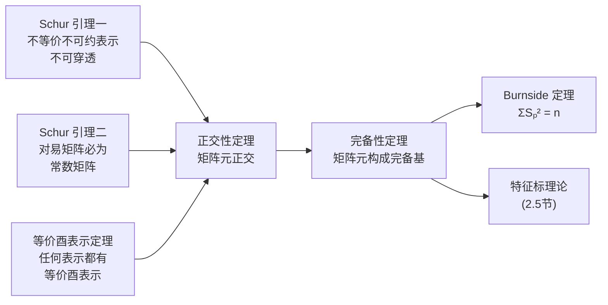
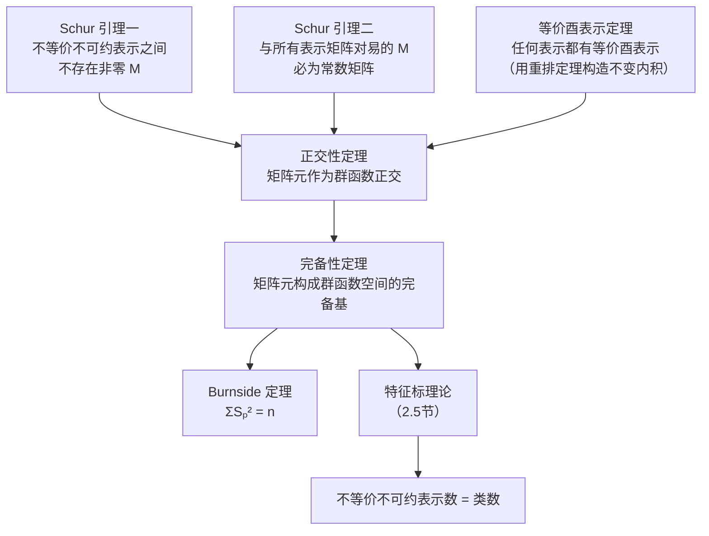

# 2.4 有限群表示理论

> [!abstract] 本节核心
> 本书理论核心的六个定理：Schur 引理一（不等价不可约表示之间不存在非零 intertwining 算子）、Schur 引理二（与不可约表示所有矩阵互易的矩阵必为常数矩阵）、等价酉表示定理（有限群在内积空间的每个表示都有等价的酉表示）、正交性定理（不等价不可约酉表示的矩阵元作为群函数正交）、完备性定理（所有不等价不可约酉表示的矩阵元构成群函数空间的完备基）、Burnside 定理（不等价不可约表示维数平方和等于群阶）。

---

## 一、本节在整体框架中的位置

> [!important] 本书理论核心
> - **第一章**：群的结构（基础语言）
> - **第二章 2.1–2.2**：群表示的基本概念
> - **第二章 2.3**：群代数与正则表示（铺垫）
> - **第二章 2.4–2.5**：**重中之重**——有限群表示理论与特征标理论
> - **第四章**：群论在量子力学中的应用（选择定则等）

2.4 节有六个定理，构成一条完整的逻辑链：

---

## 二、进入正题前的铺垫：群函数空间

### 群函数与群空间向量的对应

> [!important] 对应关系
> - **群函数**：$f(g_i)$，把每个群元映射到一个数
> - **群空间向量**：$f = \sum_{i=1}^n f(g_i) g_i$，把函数值作为群元基上的系数
>
> 二者**一一对应**。群函数空间也是 $n$ 维的。

### 群函数空间的内积

$$(x|y) = \frac{1}{n} \sum_{i=1}^n x^*(g_i) y(g_i)$$

> [!tip] 与群空间内积的对应
> 这个定义与群空间 $R_G$ 中的内积完全对应，使得群函数空间和群空间不仅是线性同构的，还是内积同构的。

### 正则表示的酉性

在这个内积下，**正则表示是酉表示**：

$$(L(g_k)x | L(g_k)y) = \frac{1}{n} \sum_{i=1}^n x^*(g_i) y(g_i) = (x|y)$$

> [!tip] 直觉
> 正则表示在群函数空间中的酉性，来源于内积定义中的"群平均"——对 $G$ 中所有元素求和再除以 $n$，这本质上是一种"不变内积"构造。

### 三句话展开后续

> [!important] 三句话
> 1. 群表示矩阵元 $A_{\mu\nu}^p(g_i)$ 是群函数（每个 $S_p$ 维表示有 $S_p^2$ 个矩阵元 = $S_p^2$ 个群函数）
> 2. 群函数空间的自由度为 $n$（群的阶）
> 3. 正交性定理和完备性定理说的就是：不等价不可约酉表示的矩阵元作为群函数，在群函数空间的**正交性**与**完备性**

---

## 三、定理 2.3（Schur 引理一）

> [!important] 定理 2.3（Schur 引理一）
> 设群 $G$ 在有限维向量空间 $V_A$ 与 $V_B$ 上有不可约表示 $A$ 与 $B$。若存在线性变换 $M: V_A \to V_B$，满足：
> $$B(g_\alpha) M = M A(g_\alpha), \quad \forall g_\alpha \in G$$
> 则：
> 1. 当 $A$ 与 $B$ **不等价**时，$M \equiv 0$（零矩阵）
> 2. 当 $M$ **不为零**时，$A$ 与 $B$ 必等价

### 物理直觉

> [!tip] 什么是 $M$？
> $M$ 是一个"桥梁"算子，它把表示 $A$ 的作用"翻译"成表示 $B$ 的作用。
>
> Schur 引理一说的就是：**两个不等价不可约表示之间，不存在非零的"翻译桥梁"**。
>
> 如果存在非零的 $M$，那 $A$ 和 $B$ 本质上就是同一个表示（等价）。

### 证明（反证法，三步）

**假设**：$A$ 与 $B$ 不等价，但 $M \neq 0$。

**第一步**：定义 $N = \{x \in V_A | Mx = 0\}$（$M$ 的零空间）。

$N$ 是 $G$ 不变的：$\forall x \in N$，
$$MA(g_\alpha)x = B(g_\alpha)Mx = B(g_\alpha) \cdot 0 = 0$$
所以 $A(g_\alpha)x \in N$。

因为 $A$ 是不可约表示，$N$ 是 $G$ 不变子空间，所以 $N$ 要么等于 $V_A$，要么只包含零向量。

**第二步**：若 $N = V_A$，则 $M$ 作用到 $V_A$ 所有向量上都得到零向量，所以 $M \equiv 0$。这与 $M \neq 0$ 矛盾。

**第三步**：若 $N = \{0\}$（只含零向量），则：
- **一一性**：$V_A$ 中不同向量对应 $V_B$ 中不同元素。若 $Mx_1 = Mx_2$，则 $M(x_1 - x_2) = 0$，所以 $x_1 - x_2 \in N = \{0\}$，即 $x_1 = x_2$。
- **满性**：$Mx$（$x$ 走遍 $V_A$）走遍 $V_B$ 中所有元素。因为 $R = \{Mx | x \in V_A\}$ 是 $V_B$ 的 $G$ 不变子空间，而 $B$ 不可约，所以 $R = V_B$。

所以 $M$ 是 $V_A$ 与 $V_B$ 间的一一满映射，存在逆 $M^{-1}$。

由 $MA(g_\alpha) = B(g_\alpha)M$ 得：
$$A(g_\alpha) = M^{-1} B(g_\alpha) M$$

这意味着 $A$ 与 $B$ **等价**！与已知"不等价"矛盾。

所以第三步的情况也不成立，只能是 $N = V_A$，即 $M \equiv 0$。$\square$

> [!tip] 证明的精髓
> 这个证明的核心技巧是：**定义零空间 $N$，利用不可约性约束 $N$ 的可能取值，分情况讨论**。这是群表示论中反复出现的证明策略。

---

## 四、定理 2.4（Schur 引理二）

> [!important] 定理 2.4（Schur 引理二）
> 设 $A$ 是群 $G$ 在有限维**复**空间 $V$ 上的不可约表示，若 $V$ 上的线性变换 $M$ 满足：
> $$MA(g_\alpha) = A(g_\alpha)M, \quad \forall g_\alpha \in G$$
> 则 $M = \lambda E$（常数矩阵，$\lambda$ 为常数，$E$ 为单位矩阵）。

### 物理直觉

> [!tip]
> Schur 引理二说的就是：**与不可约表示所有矩阵都"互易"的矩阵，只能是平庸的常数矩阵**。
>
> 这体现了不可约表示的"刚性"——它没有非平凡的对称性。

### 证明

复空间线性变换 $M$ 至少有一个非零本征矢：$My_0 = \lambda_0 y_0$。

定义 $R = \{y \in V | My = \lambda_0 y\}$（$\lambda_0$ 本征子空间）。

$R$ 是 $G$ 不变的：
$$MA(g_\alpha)y = A(g_\alpha)My = \lambda_0 A(g_\alpha)y$$
所以 $A(g_\alpha)y \in R$。

因为 $A$ 不可约且 $R$ 非空（至少包含 $y_0$），所以 $R = V$。

因此 $\forall x \in V$，$Mx = \lambda_0 x$，即 $M = \lambda_0 E$。$\square$

> [!tip] 与 Schur 引理一的对比
> - Schur 引理一：两个表示之间的关系（$M$ 连接两个不同空间）
> - Schur 引理二：同一个表示内部的关系（$M$ 与同一个空间中的所有表示矩阵对易）
>
> 两个引理都体现了不可约表示的"刚性"。

---

## 五、定理 2.5：等价酉表示定理

> [!important] 定理 2.5
> 有限群在内积空间的每一个表示都有等价的酉表示。

这个定理的证明非常优美，核心是一个"不变内积"的构造。

### 证明

设 $A$ 是有限群 $G$（阶为 $n$）在内积空间 $V$ 上的表示。

**核心构造**——定义新内积：

$$\langle x | y \rangle = \frac{1}{n} \sum_{j=1}^{n} (A(g_j)x | A(g_j)y)$$

> [!tip] 直觉
> 这个构造的精髓是"**群平均**"：对群中所有元素的作用结果求平均，得到一个"不变"的内积。
>
> 类比：如果把群看作对称操作集合，这个构造就是"在所有对称操作下取平均"，结果自然是对称的（不变的）。

**第一步**：验证在新内积下 $A(g_i)$ 是酉变换。

$$\langle A(g_i)x | A(g_i)y \rangle = \frac{1}{n} \sum_{j=1}^{n} (A(g_j)A(g_i)x | A(g_j)A(g_i)y) = \frac{1}{n} \sum_{j=1}^{n} (A(g_j g_i)x | A(g_j g_i)y)$$

由**重排定理**，当 $g_j$ 取遍 $G$ 时，$g_j g_i$ 也取遍 $G$，所以：

$$= \frac{1}{n} \sum_{k=1}^{n} (A(g_k)x | A(g_k)y) = \langle x | y \rangle$$

所以 $A(g_i)$ 在新内积下是酉变换。✓

**第二步**：通过基变换把"新内积下的酉表示"转化为"原内积下的等价酉表示"。

取两组基：
- $(e_1, \cdots, e_m)$：旧内积下的正交归一基
- $(f_1, \cdots, f_m)$：新内积下的正交归一基

两组基通过非奇异变换 $X$ 联系：$(f_1, \cdots, f_m) = (e_1, \cdots, e_m) X$

通过坐标变换的推导（教材中的详细步骤），最终得到：

$$(X^{-1}A(g_i)Xx | X^{-1}A(g_i)Xy) = (x|y)$$

即 $X^{-1}A(g_i)X$ 在**原先内积**下就是酉表示。$\square$

> [!important] 三个关键点
> 1. $\langle | \rangle$ 的定义（群平均构造不变内积）
> 2. $\langle A(g_i)x|A(g_i)y\rangle = \langle x|y\rangle$（用重排定理证明）
> 3. $\langle Xx|Xy\rangle = (x|y)$（新旧内积的转换关系）

> [!tip] 推论
> 结合定理 2.1（有限群可约则完全可约），任何有限群在内积空间的表示都可以分解为**不等价不可约酉表示的直和**。
>
> 这意味着：我们总可以假设表示是酉的，且是不可约的。这极大简化了后续讨论。

---

## 六、定理 2.6（正交性定理）——重中之重

这是 2.4 节最核心、最难的定理。

> [!important] 定理 2.6（正交性定理）
> 设有限群 $G$ 有不等价不可约酉表示 $A^1, A^2, \cdots$，维数分别为 $S_1, S_2, \cdots$。
>
> 这些表示的矩阵元作为群函数，在群函数空间满足：
>
> $$(A_{\mu\nu}^p | A_{\mu'\nu'}^r) = \frac{1}{S_p} \delta_{pr} \delta_{\mu\mu'} \delta_{\nu\nu'}$$
>
> 或等价地：
> $$\sum_{i=1}^{n} (A_{\mu\nu}^p(g_i))^* A_{\mu'\nu'}^r(g_i) = \frac{n}{S_p} \delta_{pr} \delta_{\mu\mu'} \delta_{\nu\nu'}$$

### 三个正交关系

| 正交关系 | 条件 | 使用的定理 |
|---------|------|-----------|
| **行指标正交** | $\mu \neq \mu'$ 时正交 | Schur 引理二 |
| **列指标正交** | $\nu \neq \nu'$ 时正交 | Schur 引理二 |
| **表示指标正交** | $p \neq r$（不等价）时正交 | Schur 引理一 |

### 证明（行、列指标的正交性）

**核心构造**：作 $S_p \times S_p$ 矩阵 $C$，基于任意 $S_p \times S_p$ 矩阵 $D$：

$$C = \frac{1}{n} \sum_{i=1}^{n} A^p(g_i) D A^p(g_i^{-1})$$

**第一步**：证明 $A^p(g_j) C = C A^p(g_j)$。

$$A^p(g_j) C = \frac{1}{n} \sum_{i=1}^{n} A^p(g_j) A^p(g_i) D A^p(g_i^{-1})$$
$$= \frac{1}{n} \sum_{i=1}^{n} A^p(g_j g_i) D A^p(g_i^{-1} g_j^{-1}) A^p(g_j)$$

由**重排定理**，$g_j g_i$ 取遍 $G$ 等价于 $g_k$ 取遍 $G$，所以：

$$= \frac{1}{n} \sum_{k=1}^{n} A^p(g_k) D A^p(g_k^{-1}) A^p(g_j) = C A^p(g_j)$$

**第二步**：由 **Schur 引理二**，$C$ 与所有 $A^p(g_j)$ 对易，所以 $C = \lambda(D) E_{S_p \times S_p}$（常数对角矩阵）。

**第三步**：取特殊 $D$——只有 $D_{\nu'\nu} = 1$，其余为 0。

$$C_{\mu'\mu} = \frac{1}{n} \sum_{i=1}^{n} A_{\mu'\nu'}^p(g_i) A_{\nu\mu}^p(g_i^{-1})$$

由酉表示性质 $A_{\nu\mu}^p(g_i^{-1}) = (A_{\mu\nu}^p(g_i))^*$，所以：

$$C_{\mu'\mu} = \frac{1}{n} \sum_{i=1}^{n} A_{\mu'\nu'}^p(g_i) (A_{\mu\nu}^p(g_i))^* = \lambda(D) \delta_{\mu'\mu}$$

**第四步**：确定 $\lambda(D)$。取 $\mu' = \mu$ 并对 $\mu$ 求和：

$$\sum_{\mu=1}^{S_p} C_{\mu\mu} = \frac{1}{n} \sum_{i=1}^{n} \sum_{\mu=1}^{S_p} A_{\mu\nu'}^p(g_i) (A_{\mu\nu}^p(g_i))^* = \frac{1}{n} \sum_{i=1}^{n} \delta_{\nu\nu'} = \delta_{\nu\nu'}$$

另一方面 $\sum_{\mu=1}^{S_p} C_{\mu\mu} = \lambda(D) S_p$，所以 $\lambda(D) = \delta_{\nu\nu'} / S_p$。

因此：

$$\frac{1}{n} \sum_{i=1}^{n} A_{\mu'\nu'}^p(g_i) (A_{\mu\nu}^p(g_i))^* = \frac{\delta_{\nu\nu'}}{S_p} \delta_{\mu'\mu}$$

### 证明（表示指标的正交性）

**核心构造**：对两个不等价不可约酉表示 $A^r$ 与 $A^p$，作 $S_r \times S_p$ 矩阵：

$$C' = \frac{1}{n} \sum_{i=1}^{n} A^r(g_i) D' A^p(g_i^{-1})$$

可以证明 $C' A^p(g_j) = A^r(g_j) C'$。

由 **Schur 引理一**，当 $r \neq p$ 时 $C' \equiv 0$。

取特殊 $D'$ 可得：

$$\frac{1}{n} \sum_{i=1}^{n} A_{\mu'\nu'}^r(g_i) (A_{\mu\nu}^p(g_i))^* = 0 \quad (r \neq p)$$

### 正交性定理的物理意义

> [!important] 正交性定理是第四章选择定则的数学来源
>
> 第四章中，跃迁矩阵元 $(\Psi_\alpha | \hat{H}' | \Psi_\beta)$ 本质上就是"群函数空间的内积"。
>
> 正交性定理告诉我们：**不同不可约表示的矩阵元作为群函数是正交的**。
>
> 如果初态 $\Psi_\beta$、微扰 $\hat{H}'$、末态 $\Psi_\alpha$ 分别属于不同的不可约表示，它们的"内积"自然为零 → **跃迁禁戒**。
>
> 这就是为什么我们可以用特征标表来判断选择定则——特征标是矩阵元的"浓缩版"，保留了正交性信息。

---

## 七、定理 2.7（完备性定理）

> [!important] 定理 2.7（完备性定理）
> 设 $A^p (p = 1, 2, \cdots, q)$ 是有限群 $G$ 的所有不等价不可约酉表示，则 $A^p$ 的矩阵元 $A_{\mu\nu}^p(g_i)$ 在群函数空间是**完备的**。

### 证明思路

**第一步**：对第 $p$ 个不等价不可约酉表示，其第 $\mu$ 行的 $S_p$ 个矩阵元群函数：

$$\left\{\sum_{i=1}^{n} A_{\mu 1}^p(g_i) g_i, \; \sum_{i=1}^{n} A_{\mu 2}^p(g_i) g_i, \; \cdots, \; \sum_{i=1}^{n} A_{\mu S_p}^p(g_i) g_i\right\}$$

由于正交性，它们线性无关，形成群函数空间的 $S_p$ 维子空间。

**第二步**：右正则变换 $R(g_j)$ 作用到这些群函数上：

$$R(g_j) \left(\sum_{i=1}^{n} A_{\mu\nu}^p(g_i) g_i\right) = \sum_{\lambda=1}^{S_p} A_{\lambda\nu}^p(g_j) \left(\sum_{i=1}^{n} A_{\mu\lambda}^p(g_i) g_i\right)$$

这说明：
1. 这个子空间是 $G$ 不变的
2. $R(g_j)$ 在这个子空间中的表示矩阵恰好是 $A^p(g_j)$

**第三步**：所有不等价不可约表示的矩阵元群函数形成 $G$ 不变子空间 $V$，维数为 $\sum_p S_p^2$。

**第四步**：构造 $V$ 的正交补空间 $V^\perp$。

$R(g_j)$ 是酉表示，可约则完全可约，所以 $V^\perp$ 也是 $G$ 不变的。

**第五步**：若 $V^\perp$ 非零，则其中存在一组基 $X_1, \cdots, X_{S_r}$ 承载某个不可约表示 $A^r$。

通过细致的推导（教材中的 (2.16)–(2.17) 式），可以证明这意味着 $V^\perp$ 中的向量实际上属于 $V$，矛盾！

所以 $V^\perp = \{0\}$，$V = R_G$（整个群函数空间）。$\square$

> [!tip] 完备性定理的意义
> 任何群函数（包括特征标）都可以展开为不可约表示矩阵元的线性组合。
>
> 这就像：任何向量都可以用一组完备基展开。不可约表示的矩阵元就是群函数空间的"完备基"。

---

## 八、Burnside 定理

> [!important] 定理 2.8（Burnside 定理）
> 若群 $G$ 的阶为 $n$，其不等价不可约表示的维数是 $S_1, S_2, \cdots, S_q$，则：
> $$S_1^2 + S_2^2 + \cdots + S_q^2 = n$$

### 证明（极其优雅）

群空间是 $n$ 维的 → 群函数空间也是 $n$ 维的。

由正交性定理，$\sqrt{S_p} A_{\mu\nu}^p(g_i) g_i$ 构成群函数空间的**正交归一完备基**。

基的个数 = $\sum_{p=1}^{q} S_p^2$（每个 $S_p$ 维表示贡献 $S_p \times S_p = S_p^2$ 个基函数）。

完备基的个数 = 空间维数 = $n$。

所以 $S_1^2 + S_2^2 + \cdots + S_q^2 = n$。$\square$

> [!tip] Burnside 定理的直觉
> 这个定理告诉我们：一个群的"信息量"（阶 $n$）等于其所有不等价不可约表示"信息量"（维数平方）的总和。
>
> 类比：如果把群比作一个信号，不可约表示就是"频率分量"，Burnside 定理就是"能量守恒"——所有频率分量的能量之和等于总能量。

### 重要推论

**推论 1**：正则表示的直和分解

$$R(g_j) = \sum_{p=1}^{q} \oplus S_p A^p(g_j)$$

即正则表示中，第 $p$ 个不等价不可约表示出现 **$S_p$ 次**。

**推论 2**：不等价不可约表示的个数 = 群中类的个数

这由 2.5 节特征标空间的完备性推出。

---

## 九、六大定理的逻辑关系总结

> [!important] 2.4 节 vs. 2.5 节的分工
> - **2.4 节**：理论基础——建立了不可约表示的矩阵元的正交性和完备性
> - **2.5 节**：实用工具——特征标理论为我们提供了判断等价性、可约性的便捷手段
>
> 后续第四章中，判断选择定则、能级劈裂、宇称互补规则等问题，本质上都是在运用这些定理。
