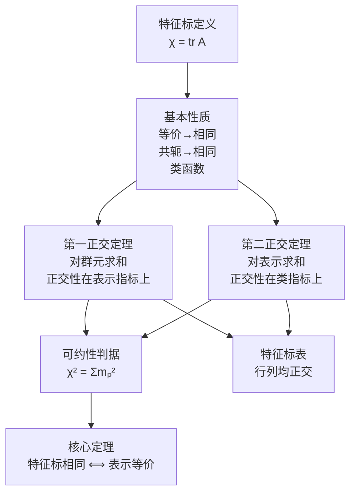

# 2.5 特征标理论

> [!abstract] 本节核心
> 特征标是表示矩阵的迹（"指纹"），保留了等价性和可约性的全部信息。两个正交定理建立了特征标之间的正交归一关系，特征标表是群论中最实用的计算工具。核心结论：两个表示等价的充要条件是它们的特征标相同。

---

## 一、特征标的定义

> [!note] 定义 2.17（特征标）
> 设 $A = \{A(g_\alpha)\}$ 是群 $G$ 的一个表示，**特征标**定义为表示矩阵的迹：
> $$\chi(g_\alpha) = \mathrm{tr} A(g_\alpha) = \sum_{\mu} A_{\mu\mu}(g_\alpha)$$

> [!tip] 直觉
> 特征标是表示矩阵的"指纹"——它把一个矩阵压缩成一个数，但保留了关键的对称性信息。
>
> 迹在相似变换下不变（$\mathrm{tr}(P^{-1}AP) = \mathrm{tr}A$），所以等价表示的特征标相同。

---

## 二、特征标的基本性质

### 性质一：等价表示的特征标相同

相似变换不改变矩阵的迹。

### 性质二：共轭元素的特征标相同

$$A(hgh^{-1}) = A(h)A(g)A(h^{-1})$$
$$\chi(hgh^{-1}) = \mathrm{tr}[A(h)A(g)A(h^{-1})] = \mathrm{tr}A(g) = \chi(g)$$

> [!important] 推论：特征标是类函数
> 同一类中的所有元素特征标相同。所以特征标可以看作"类"的函数，而不是"群元"的函数。
>
> 这意味着特征标表的列对应类，而不是单个群元。

### 性质三：单位元的特征标等于维数

$$A(e) = I \Rightarrow \chi(e) = \mathrm{tr}I = S$$

> [!tip] 重要推论
> - 单位元自成一类，所以特征标表中 $\chi(e)$ 就是表示的维数
> - 一维表示的特征标就是表示矩阵本身（因为 $1 \times 1$ 矩阵的迹就是矩阵元本身）

---

## 三、定理 2.9（特征标第一正交定理）

> [!important] 定理 2.9
> 有限群不可约表示的特征标满足：
> $$(\chi^p | \chi^r) = \frac{1}{n} \sum_{i=1}^{n} \chi^{p*}(g_i) \chi^r(g_i) = \delta_{pr}$$

### 证明

由正交性定理（对矩阵元）：

$$\frac{1}{n} \sum_{i=1}^{n} A_{\mu\nu}^{\prime p *}(g_i) A_{\mu'\nu'}^{\prime r}(g_i) = \frac{1}{S_p} \delta_{pr} \delta_{\mu\mu'} \delta_{\nu\nu'}$$

对 $\mu = \nu$ 和 $\mu' = \nu'$ 求和：

$$(\chi^{\prime p} | \chi^{\prime r}) = \frac{1}{n} \sum_{i=1}^{n} \left(\sum_{\mu=1}^{S_p} A_{\mu\mu}^{\prime p}(g_i)\right)^* \left(\sum_{\mu'=1}^{S_r} A_{\mu'\mu'}^{\prime r}(g_i)\right)$$

$$= \sum_{\mu=1}^{S_p} \sum_{\mu'=1}^{S_r} \frac{1}{n} \sum_{i=1}^{n} A_{\mu\mu}^{\prime p *}(g_i) A_{\mu'\mu'}^{\prime r}(g_i)$$

$$= \sum_{\mu=1}^{S_p} \sum_{\mu'=1}^{S_r} \frac{1}{S_p} \delta_{pr} \delta_{\mu\mu'} = \delta_{pr} \cdot \frac{S_p}{S_p} = \delta_{pr}$$

由于等价表示特征标相同，对非酉表示也成立。$\square$

### 写成类求和的形式

因为特征标是类函数，求和可以按类组织：

$$(\chi^p | \chi^r) = \frac{1}{n} \sum_{i=1}^{q'} n_i \chi^{p*}(K_i) \chi^r(K_i) = \delta_{pr}$$

其中 $q'$ 是类的个数，$n_i$ 是第 $i$ 个类的元素个数，$K_i$ 是第 $i$ 个类。

### 三个重要推论

**推论 1**：不可约表示的特征标与自身的内积为 1。

**推论 2**：可约表示中不可约表示的重复度

设 $B = \sum_{p=1}^{q} \oplus m_p A^p$，则：

$$(\chi^{A^p} | \chi^B) = m_p$$

> [!tip] 直觉
> 可约表示的特征标与某个不可约表示特征标的内积，恰好等于这个不可约表示在可约表示中出现的次数。
>
> 这就像"投影"——特征标内积是特征标空间中的投影操作。

**推论 3**：可约性的判据

$$(\chi^B | \chi^B) = \sum_{p=1}^{q} m_p^2$$

- 若 $(\chi^B | \chi^B) = 1$，则 $B$ **不可约**（只有一个 $m_p = 1$，其余为 0）
- 若 $(\chi^B | \chi^B) > 1$，则 $B$ **可约**

> [!important] 这是判断表示可约性的实用工具
> 不需要找不变子空间，只需要计算特征标的内积！

---

## 四、定理 2.10：特征标空间的完备性

> [!important] 定理 2.10
> 有限群的所有不等价不可约表示的特征标在**类函数空间**是完备的。

### 证明思路

任意类函数 $f(g_i)$ 满足 $f(g_j^{-1} g_i g_j) = f(g_i)$。

由完备性定理，任意群函数可展开为不可约表示矩阵元的线性组合：

$$f(g_i) = \sum_{p,\mu,\nu} a_{\mu\nu}^p A_{\mu\nu}^{\prime p}(g_i)$$

对类函数施加共轭不变性条件 $f(g_i) = \frac{1}{n}\sum_{j=1}^n f(g_j^{-1}g_i g_j)$，利用正交性定理，可以证明：

$$f(g_i) = \sum_p a^p \chi^p(g_i)$$

即任何类函数都可以用特征标展开。$\square$

### 推论：不等价不可约表示的个数 = 类的个数

> [!important]
> 这是群论中最优美的结论之一：
> - 类函数空间的维数 = 类的个数 $q'$
> - 不等价不可约表示的特征标构成类函数空间的完备基
> - 所以不等价不可约表示的个数 $q = q'$

> [!tip] 结合 Burnside 定理
> - $q = q'$（不可约表示数 = 类数）
> - $\sum_{p=1}^q S_p^2 = n$（维数平方和 = 群阶）
>
> 这两个定理完全确定了有限群不可约表示的结构。

---

## 五、定理 2.11（特征标第二正交定理）

> [!important] 定理 2.11（特征标第二正交定理）
> $$\frac{1}{n} \sum_{p=1}^{q} n_i \chi^{p*}(K_i) \chi^p(K_j) = \delta_{ij}$$

### 证明

构造 $q \times q$ 矩阵 $F$，行指标走遍不等价不可约表示，列指标走遍类：

$$F_{ri} = \sqrt{\frac{n_i}{n}} \chi^r(K_i)$$

由第一正交定理：

$$\sum_{i=1}^{q} F_{ri} (F^\dagger)_{ip} = \sum_{i=1}^{q} \sqrt{\frac{n_i}{n}} \chi^r(K_i) \sqrt{\frac{n_i}{n}} \chi^{p*}(K_i) = \delta_{rp}$$

即 $FF^\dagger = E$，所以 $F^\dagger = F^{-1}$，进而 $F^\dagger F = E$：

$$(F^\dagger F)_{ij} = \sum_{r=1}^{q} (F^\dagger)_{ir} F_{rj} = \sum_{r=1}^{q} \sqrt{\frac{n_i}{n}} \chi^{r*}(K_i) \sqrt{\frac{n_j}{n}} \chi^r(K_j) = \delta_{ij}$$

即：

$$\frac{1}{n} \sum_{r=1}^{q} n_i \chi^{r*}(K_i) \chi^r(K_j) = \delta_{ij} \quad \square$$

> [!tip] 两个正交定理的对称美
> - **第一正交定理**：对**群元**求和，正交性在**表示指标**上
> - **第二正交定理**：对**表示**求和，正交性在**类指标**上
>
> 这体现了群元与表示之间的深刻对偶关系——就像行和列的对称性。

---

## 六、特征标表

由两个正交定理，我们可以引入**特征标表**——群论中最实用的计算工具。

> [!important] 特征标表的结构
> - **列**：群的类 $K_i$，标注元素个数 $n_i$
> - **行**：不等价不可约表示 $A^p$
> - **矩阵元**：$\chi^p(K_i)$（第 $p$ 个不可约表示中第 $i$ 个类的特征标）
> - **行列都正交**：行对应第一正交定理，列对应第二正交定理

### 例 2.10 $n$ 阶循环群的特征标表

$n$ 阶循环群是 Abel 群，有 $n$ 个类（每个元素自成一类），所以每个不等价不可约表示都是一维的。

一维表示 $A(a)$ 满足 $(A(a))^n = 1$，所以 $A(a) = \exp[2\pi i (p-1)/n]$，$p = 1, 2, \cdots, n$。

四阶循环群的特征标表：

| | $1\{e\}$ | $1\{a\}$ | $1\{a^2\}$ | $1\{a^3\}$ |
|---|:---:|:---:|:---:|:---:|
| $A^1$ | 1 | 1 | 1 | 1 |
| $A^2$ | 1 | $i$ | $-1$ | $-i$ |
| $A^3$ | 1 | $-1$ | 1 | $-1$ |
| $A^4$ | 1 | $-i$ | $-1$ | $i$ |

> [!tip] 验证正交性
> - 行正交：$\sum_i \chi^{p*}(K_i) \chi^r(K_i) = n \delta_{pr}$
> - 列正交：$\sum_p n_i \chi^{p*}(K_i) \chi^p(K_j) = n \delta_{ij}$

### $D_3$ 群的特征标表

| | $1\{e\}$ | $2\{d, f\}$ | $3\{a, b, c\}$ |
|---|:---:|:---:|:---:|
| $A^1$ | 1 | 1 | 1 |
| $A^2$ | 1 | 1 | $-1$ |
| $A^3$ | 2 | $-1$ | 0 |

> [!important] 验证 Burnside 定理
> $S_1^2 + S_2^2 + S_3^2 = 1^2 + 1^2 + 2^2 = 6 = |D_3|$ ✓
>
> 验证类数 = 不可约表示数：3 个类 = 3 个不可约表示 ✓

---

## 七、核心定理：特征标相同 ⟺ 表示等价

> [!important] 两个表示等价的充要条件是它们的特征标相同。

**必要性**：等价表示的特征标相同（相似变换不改变迹）。

**充分性**：如果两个表示 $A$ 和 $B$ 的特征标相同，则它们对应的类函数相同。同一个类函数在类函数空间中可以分解为相同的不等价不可约表示特征标的线性组合。

即 $A$ 和 $B$ 分解为不可约表示的直和时，$\oplus m_p A^p$ 的形式完全一样。

> [!tip] 直观理解
> 1. 表示 $A$ 和 $B$ 的特征标相同
> 2. 通过相似变换化为具有相同分块结构的对角分块形式
> 3. 每个分块对应一个不可约表示
> 4. 分块结构相同意味着 $A$ 和 $B$ 等价

> [!important] 这个定理的实用价值
> 判断两个表示是否等价，不需要找相似变换矩阵 $X$，只需要比较特征标！
>
> 这就像：不需要做完整的矩阵对角化，只需要比较"指纹"（特征标）就能判断两个矩阵是否相似。

---

## 八、2.6 节：新表示的构成（概述）

2.6 节讲如何从已知表示构造新表示，有四个部分：

### 1. 群表示的直积

两个表示 $A$ 和 $B$ 的直积：$C(g_\alpha) = A(g_\alpha) \otimes B(g_\alpha)$

特征标：$\chi^C(g_\alpha) = \chi^A(g_\alpha) \chi^B(g_\alpha)$

> [!tip] 直积表示一般可约
> 两个不可约表示的直积一般是可约的（除非其中一个是恒等表示）。
>
> 例：$D_3$ 群中 $A^3 \otimes A^3$ 的特征标为 $(4, 1, 0)$，$(\chi^C|\chi^C) = (16+1+0)/6 = 17/6 > 1$，可约。
>
> 分解：$A^3 \otimes A^3 = A^1 \oplus A^2 \oplus A^3$

### 2. 直积群的表示

若 $G = G_1 \otimes G_2$，$A$ 是 $G_1$ 的表示，$B$ 是 $G_2$ 的表示，则：

$$C(g_{1\alpha} g_{2\beta}) = A(g_{1\alpha}) \otimes B(g_{2\beta})$$

是 $G$ 的表示。

> [!important] 与群表示直积的区别
> - 群表示的直积：已知 $G$ 的两个表示，做矩阵直积 → 新的表示（一般可约）
> - 直积群的表示：已知 $G_1$ 和 $G_2$ 的表示，构造 $G = G_1 \otimes G_2$ 的表示 → 不可约表示的直积仍不可约

### 3. 诱导表示

从子群 $H$ 的表示 $B$ 构造群 $G$ 的表示 $U$。

> [!tip] 核心思想
> - 表示空间 $V$ 是函数空间：$f: G \to W$（$W$ 是 $B$ 的表示空间）
> - 限制条件：$f(hg) = B(h)f(g)$（$\forall h \in H, g \in G$）
> - 线性变换：$[U(g)f](g'') = f(g''g)$
> - 维数：$\dim V = [G:H] \cdot \dim W = \frac{n}{m} d$

### 4. 群表示在子群上的缩小

最简单的操作：限制群 $G$ 的表示到其子群 $H$ 上。

---

## 九、2.5 节的核心逻辑链

> [!important] 2.5 节的总结
> - **特征标**是表示矩阵的迹，保留了等价性和可约性的全部信息
> - **两个正交定理**建立了特征标之间的正交归一关系
> - **特征标表**是群论中最实用的计算工具
> - **特征标相同则等价**是判断表示等价性的充要条件
>
> 后续第四章中，判断选择定则、能级劈裂、宇称互补规则等问题，本质上都是在运用特征标理论。
