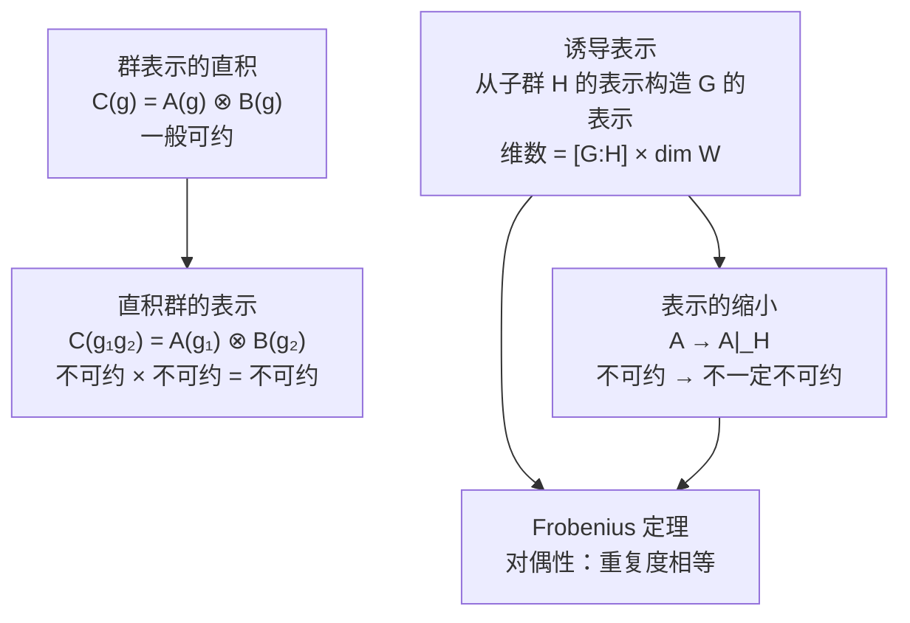

# 2.6 新表示的构成

> [!abstract] 本节核心
> 从已知表示构造新表示的四种方法：群表示的直积（已知两表示构造新表示，一般可约）、直积群的表示（从子群表示构造直积群表示，保持不可约性）、诱导表示（从子群表示构造群表示，最一般的方法）、群表示在子群上的缩小（限制操作）。Frobenius 定理建立了诱导与缩小之间的对偶关系。

---

## 一、为什么要讲新表示的构成？

> [!important] 本章总纲
> 对一个群对称性分析，最重要的是知道它的**特征标表**。
>
> - **简单群**：直接用 Burnside 定理、群元分类、正交条件求特征标表
> - **复杂群**：从简单的子群出发，**构造**复杂群的表示
>
> 2.6 节就是讲"如何从已知表示构造新表示"。

四个部分：
1. 群表示的直积
2. 直积群的表示
3. 诱导表示（**最难也最有用**）
4. 群表示在子群上的缩小 + Frobenius 定理

---

## 二、矩阵直积的定义与性质

在讨论群表示的直积之前，先回顾矩阵的直积（张量积）。

### 定义

$n \times n$ 矩阵 $A = (a_{ik})$ 和 $m \times m$ 矩阵 $B = (b_{jl})$ 的直积：

$$C = A \otimes B, \quad c_{ij,kl} = a_{ik} b_{jl}$$

这是一个 $(nm) \times (nm)$ 矩阵。

分块形式：

$$C = \begin{pmatrix} a_{11}B & a_{12}B & \cdots & a_{1n}B \\ a_{21}B & a_{22}B & \cdots & a_{2n}B \\ \vdots & \vdots & \ddots & \vdots \\ a_{n1}B & a_{n2}B & \cdots & a_{nn}B \end{pmatrix}$$

### 四个性质

1. $E_n \otimes E_m = E_{nm}$（单位矩阵的直积是单位矩阵）
2. 对角矩阵的直积是对角矩阵
3. **酉矩阵的直积仍为酉矩阵**
4. **混合积性质**：$(A^{(1)} \otimes B^{(1)})(A^{(2)} \otimes B^{(2)}) = (A^{(1)}A^{(2)}) \otimes (B^{(1)}B^{(2)})$

> [!tip] 性质 3 的证明
> $(A \otimes B)^\dagger (A \otimes B) = (A^\dagger \otimes B^\dagger)(A \otimes B) = (A^\dagger A) \otimes (B^\dagger B) = E_n \otimes E_m = E_{nm}$ ✓

> [!tip] 性质 4 的证明关键
> 左边矩阵乘法的指标求和 $k = i', l = j'$，右边两个矩阵分别求和（$k = i'$ 和 $l = j'$）再直积。结果指标都是 $(ij, k'l')$，完全相同。

---

## 三、群表示的直积

> [!note] 定义 2.18（群表示的直积）
> 群 $G$ 有两个表示 $A$ 与 $B$，做表示矩阵的直积：
> $$C(g_\alpha) = A(g_\alpha) \otimes B(g_\alpha)$$
> $C$ 也是群 $G$ 的一个表示，称为 $A$ 与 $B$ 的**直积表示**。

### 验证

$$C(g_\alpha)C(g_\beta) = (A(g_\alpha) \otimes B(g_\alpha))(A(g_\beta) \otimes B(g_\beta))$$
$$= (A(g_\alpha)A(g_\beta)) \otimes (B(g_\alpha)B(g_\beta)) = A(g_\alpha g_\beta) \otimes B(g_\alpha g_\beta) = C(g_\alpha g_\beta)$$

### 特征标

$$\chi^C(g_\alpha) = \mathrm{tr}(A(g_\alpha) \otimes B(g_\alpha)) = \mathrm{tr}A(g_\alpha) \cdot \mathrm{tr}B(g_\alpha) = \chi^A(g_\alpha) \chi^B(g_\alpha)$$

> [!important] 直积表示一般可约
>
> 如果 $A$ 与 $B$ 都是不可约表示，那么：
> $$(\chi^C | \chi^C) = \frac{1}{n} \sum_{i=1}^n \chi^{A*}(g_i) \chi^{B*}(g_i) \chi^A(g_i) \chi^B(g_i)$$
>
> 这个求和**不能**分解为两个独立的求和（因为 $\chi^A$ 和 $\chi^B$ 逐点相乘），一般情况下 $(\chi^C | \chi^C) > 1$，即可约。

### 例 2.11 $D_3$ 群的直积表示

利用表 2.3 的特征标表：

| 直积 | 特征标 | 等价于 | 可约？ |
|------|--------|--------|--------|
| $A^1 \otimes A^3$ | $(2, -1, 0)$ | $A^3$ | 不可约 |
| $A^2 \otimes A^3$ | $(2, -1, 0)$ | $A^3$ | 不可约 |
| $A^1 \otimes A^2$ | $(1, 1, -1)$ | $A^2$ | 不可约 |
| $A^3 \otimes A^3$ | $(4, 1, 0)$ | 可约 | ✓ |

对于 $A^3 \otimes A^3$，特征标为 $(4, 1, 0)$，$(\chi^C | \chi^C) = (16 + 2 \times 1 + 0)/6 = 3 > 1$。

分解：$(\chi^C | \chi^{A^1}) = 1$，$(\chi^C | \chi^{A^2}) = 1$，$(\chi^C | \chi^{A^3}) = 1$。

所以 $A^3 \otimes A^3 = A^1 \oplus A^2 \oplus A^3$。

> [!tip] 直积不可约的特殊情况
> 两个不可约表示的直积仍为不可约表示，当且仅当其中一个是**一维表示**且满足 $\chi^{B*}(g_i)\chi^B(g_i) = 1$（即 $B$ 是一维酉表示）。

---

## 四、直积群的表示

### 与群表示直积的区别

这是两个完全不同的概念：

| | 群表示的直积 | 直积群的表示 |
|--|------------|------------|
| **已知** | 群 $G$ 的两个表示 $A, B$ | 子群 $G_1$ 的表示 $A$ 和子群 $G_2$ 的表示 $B$ |
| **构造** | $C(g) = A(g) \otimes B(g)$ | $C(g_{1\alpha} g_{2\beta}) = A(g_{1\alpha}) \otimes B(g_{2\beta})$ |
| **结果** | $G$ 的表示（一般可约） | $G = G_1 \otimes G_2$ 的表示（若 $A, B$ 不可约则不可约） |

### 定义

> [!note] 定义 2.19（直积群的表示）
> 群 $G$ 是 $G_1$ 与 $G_2$ 的直积，$A$ 是 $G_1$ 的表示，$B$ 是 $G_2$ 的表示。
> $$C(g_{1\alpha} g_{2\beta}) = A(g_{1\alpha}) \otimes B(g_{2\beta})$$
> 构成群 $G$ 的表示，称为 $G_1$ 与 $G_2$ 直积群的表示。

### 不可约性

若 $A$ 与 $B$ 分别是 $G_1$ 与 $G_2$ 的不可约表示，则 $C$ 是 $G$ 的不可约表示。

**证明**：
$$(\chi^C | \chi^C) = \frac{1}{nm} \sum_{\alpha=1}^n \sum_{\beta=1}^m \chi^{A*}(g_{1\alpha})\chi^{B*}(g_{2\beta})\chi^A(g_{1\alpha})\chi^B(g_{2\beta})$$
$$= \left(\frac{1}{n}\sum_{\alpha=1}^n \chi^{A*}(g_{1\alpha})\chi^A(g_{1\alpha})\right)\left(\frac{1}{m}\sum_{\beta=1}^m \chi^{B*}(g_{2\beta})\chi^B(g_{2\beta})\right) = 1 \times 1 = 1$$

> [!tip] 为什么直积群的表示不可约？
> 关键区别在于：直积群的特征标是**乘积** $\chi^A(g_{1\alpha})\chi^B(g_{2\beta})$，求和可以**分解**为两个独立求和的乘积。而群表示直积的特征标是 $\chi^A(g_\alpha)\chi^B(g_\alpha)$，求和**不能**分解。

> [!important] 物理意义
> 直积群的表示在物理中非常重要。例如：
> - 三维空间的对称性 = 三个方向转动的直积
> - 分子对称性 = 点群 $\otimes$ 自旋群
>
> 直积群的不可约表示 = 各因子不可约表示的张量积。

---

## 五、诱导表示——本章最难也最有用

### 动机

实际研究中，经常面对的情况：群 $G$ 很复杂，但它的子群 $H$ 很简单。我们希望从 $H$ 的表示出发构造 $G$ 的表示。

> [!important] 与直积群表示的区别
> - 直积群表示：要求 $G = G_1 \otimes G_2$（非常强的条件）
> - 诱导表示：只要求 $G$ 有子群 $H$（非常弱的条件，不要求 $H$ 是不变子群）

### 诱导表示的构造（三步）

#### 第一步：定义表示空间 $V$

$V$ 是一个**函数空间**，其中的函数 $f$ 满足：
- **定义域**：$G$ 中的群元
- **值域**：$W$（$H$ 的表示 $B$ 的表示空间）
- **限制条件**：$f(hg) = B(h)f(g), \quad \forall h \in H, g \in G$

> [!tip] 直觉
> 限制条件 $f(hg) = B(h)f(g)$ 的意思是：函数 $f$ 在同一个陪集 $Hg$ 上的值由 $f(g)$ 和 $B(h)$ 决定。所以我们只需要知道每个陪集代表元 $g_i$ 处的 $f(g_i)$，就知道所有 $f$ 的值。

#### 第二步：定义线性变换 $U(g)$

$$[U(g)f](g'') = f(g''g)$$

即 $U(g)$ 把函数 $f$ 变成一个新的函数 $U(g)f$，新函数在 $g''$ 处的值等于原函数在 $g''g$ 处的值。

> [!tip] 验证 $U(g)f$ 仍满足限制条件
> $[U(g)f](hg'') = f(hg''g) = B(h)f(g''g) = B(h)[U(g)f](g'')$ ✓

#### 第三步：验证群结构

需要验证 $U(g')U(g) = U(g'g)$：

$$[U(g')U(g)f](g'') = [U(g')f](g''g) = f(g''g'g) = [U(g'g)f](g'')$$

所以 $\{U(g)\}$ 构成群 $G$ 的一个表示。$\square$

### 诱导表示的维数

> [!important]
> $\dim V = [G:H] \cdot \dim W = \frac{n}{m} \cdot d$
>
> 其中 $n = |G|$，$m = |H|$，$d = S_H$（$H$ 的表示 $B$ 的维数）。

**理由**：$G$ 按 $H$ 做陪集分解 $G = \{Hg_1, Hg_2, \cdots, Hg_l\}$，$l = n/m$。限制条件 $f(hg) = B(h)f(g)$ 意味着只需要指定 $f(g_1), f(g_2), \cdots, f(g_l)$，每个 $f(g_i)$ 是 $W$ 空间中的 $d$ 维向量。所以总自由度为 $l \times d$。

### 诱导表示的矩阵形式

诱导表示的矩阵可以写成以 $B$ 为基本单元的 $l \times l$ 块矩阵：

$$U(g) = \begin{pmatrix} \dot{B}(g_1 g g_1^{-1}) & \dot{B}(g_1 g g_2^{-1}) & \cdots & \dot{B}(g_1 g g_l^{-1}) \\ \dot{B}(g_2 g g_1^{-1}) & \dot{B}(g_2 g g_2^{-1}) & \cdots & \dot{B}(g_2 g g_l^{-1}) \\ \vdots & \vdots & \ddots & \vdots \\ \dot{B}(g_l g g_1^{-1}) & \dot{B}(g_l g g_2^{-1}) & \cdots & \dot{B}(g_l g g_l^{-1}) \end{pmatrix} \tag{2.24}$$

其中：

$$\dot{B}(g_m g g_j^{-1}) = \begin{cases} B(g_m g g_j^{-1}), & \text{若 } g_m g g_j^{-1} \in H \\ 0, & \text{其他情况} \end{cases}$$

> [!tip] 矩阵结构的特点
> 对固定的 $m$，$g_m g$ 只能落在 $H$ 的一个陪集中，所以第 $m$ 行只有一个非零块。
> 不同 $g_m g$ 和 $g_{m'}g$ 必落在不同陪集，所以不同行的非零块在不同列。
> 结果：**每行每列恰好一个非零块**——类似于置换矩阵的结构！

### 诱导表示的特征标

由 (2.24) 式，特征标为（只有对角块有贡献）：

$$\chi^U(g) = \sum_{j=1}^{l} \mathrm{tr}\dot{B}(g_j g g_j^{-1}) \tag{2.25}$$

可以进一步推广为对整个群 $G$ 求和：

$$\chi^U(g) = \frac{1}{m} \sum_{t \in G} \mathrm{tr}\dot{B}(t g t^{-1}) \tag{2.26}$$

> [!tip] 为什么能推广？
> 对陪集 $Hg_j$ 中的任意元素 $hg_j$：
> - $g_j g g_j^{-1} \in H \Leftrightarrow hg_j g g_j^{-1}h^{-1} \in H$（共轭不改变是否在 $H$ 中）
> - $\mathrm{tr}\dot{B}(g_j g g_j^{-1}) = \mathrm{tr}\dot{B}(hg_j g g_j^{-1}h^{-1})$（相似变换不改变迹）
>
> 所以每个陪集的 $m$ 个元素贡献相同，对 $t \in G$ 求和再除以 $m$ 就得到正确结果。

### 例 2.12 $D_3$ 群的诱导表示

$G = \{e, d, f, a, b, c\}$，$H = \{e, d, f\}$。

$H$ 的表示：$B(e) = 1$，$B(d) = \varepsilon = \exp[2\pi i/3]$，$B(f) = \varepsilon^2 = \exp[4\pi i/3]$。

陪集分解：$G = \{Hg_1, Hg_2\}$，$g_1 = e$，$g_2 = a$。

用 (2.24) 式计算各元素的诱导表示矩阵：

$$U(e) = \begin{pmatrix} B(e) & 0 \\ 0 & B(e) \end{pmatrix} = \begin{pmatrix} 1 & 0 \\ 0 & 1 \end{pmatrix}$$

$$U(d) = \begin{pmatrix} B(d) & 0 \\ 0 & B(f) \end{pmatrix} = \begin{pmatrix} \varepsilon & 0 \\ 0 & \varepsilon^2 \end{pmatrix}$$

$$U(f) = \begin{pmatrix} B(f) & 0 \\ 0 & B(d) \end{pmatrix} = \begin{pmatrix} \varepsilon^2 & 0 \\ 0 & \varepsilon \end{pmatrix}$$

$$U(a) = \begin{pmatrix} 0 & B(e) \\ B(e) & 0 \end{pmatrix} = \begin{pmatrix} 0 & 1 \\ 1 & 0 \end{pmatrix}$$

$$U(b) = \begin{pmatrix} 0 & B(f) \\ B(d) & 0 \end{pmatrix} = \begin{pmatrix} 0 & \varepsilon^2 \\ \varepsilon & 0 \end{pmatrix}$$

$$U(c) = \begin{pmatrix} 0 & B(d) \\ B(f) & 0 \end{pmatrix} = \begin{pmatrix} 0 & \varepsilon \\ \varepsilon^2 & 0 \end{pmatrix}$$

特征标：$\chi^U(e) = 2$，$\chi^U(d) = \varepsilon + \varepsilon^2 = -1$，$\chi^U(a) = 0$。

与表 2.3 对比：这正是 $A^3$（二维不可约表示）的特征标！所以这个诱导表示恰好不可约。

> [!important] 物理意义
> 这个例子告诉我们：$D_3$ 群的二维不可约表示可以通过其子群 $H = \{e, d, f\}$（三阶循环群）的一维表示诱导出来。
>
> 这在物理中非常普遍：复杂分子对称性的不可约表示，往往可以从简单子群的表示诱导得到。

---

## 六、群表示在子群上的缩小

> [!note] 定义（表示的缩小）
> $A$ 是群 $G$ 的表示，$H$ 是 $G$ 的子群。$\forall h \in H$，$A(h)$ 自然构成 $H$ 的一个表示，记为 $A|_H$。

> [!warning] 重要注意
> 若 $A$ 是 $G$ 的不可约表示，$A|_H$ **不一定**是 $H$ 的不可约表示！
>
> 例：$D_3$ 的二维不可约表示在子群 $H = \{e, d, f\}$ 上的缩小：
> $$A(e) = \begin{pmatrix} 1 & 0 \\ 0 & 1 \end{pmatrix}, \quad A(d) = \begin{pmatrix} \varepsilon & 0 \\ 0 & \varepsilon^2 \end{pmatrix}, \quad A(f) = \begin{pmatrix} \varepsilon^2 & 0 \\ 0 & \varepsilon \end{pmatrix}$$
>
> 这是对角矩阵群，显然可约（两个一维表示的直和）。

---

## 七、Frobenius 定理

> [!important] 定理 2.12（Frobenius 定理）
> 群 $G$ 与其子群 $H$ 分别存在不可约表示 $A$ 与 $B$。
>
> $A$ 在由 $B$ 诱导的表示 $U$ 中的**重复度**，等于 $B$ 在 $A$ 的缩小 $A|_H$ 中的**重复度**。
>
> 用数学式子：
> $$(\chi^A | \chi^U) = (\chi^B | \chi^{A|_H}) \tag{2.27}$$

### 物理直觉

> [!tip] 对偶性
> Frobenius 定理体现了一种深刻的"对偶性"：
> - 左边：把 $H$ 的表示 $B$ **提升**到 $G$，看 $A$ 在其中出现几次
> - 右边：把 $G$ 的表示 $A$ **降低**到 $H$，看 $B$ 在其中出现几次
>
> 两个方向的操作给出相同的数字。

### 证明

$$(\chi^A | \chi^U) = \frac{1}{n} \sum_{g \in G} \chi^{A*}(g) \chi^U(g) = \frac{1}{n} \sum_{g \in G} \chi^{A*}(g) \left\{\frac{1}{m} \sum_{t \in G} \mathrm{tr}\dot{B}(tgt^{-1})\right\}$$

令 $s = tgt^{-1}$，则 $g = t^{-1}st$：

$$= \frac{1}{m} \sum_{s \in H} \left\{\frac{1}{n} \sum_{t \in G} \chi^{A*}(t^{-1}st)\right\} \chi^B(s)$$

因为 $\chi^A$ 是类函数，$\chi^{A*}(t^{-1}st) = \chi^{A*}(s)$，内层求和为 $n \chi^{A*}(s)$：

$$= \frac{1}{m} \sum_{s \in H} \chi^{A*}(s) \chi^B(s) \cdot m = \sum_{s \in H} \chi^{A*}(s) \chi^B(s) = (\chi^B | \chi^{A|_H}) \quad \square$$

### 例 2.13 验证 Frobenius 定理

从例 2.12 的诱导表示 $U$（即 $A^3$）出发：

- $A^1$ 在 $U$ 中的重复度：$(\chi^{A^1} | \chi^U) = 0$
- $A^2$ 在 $U$ 中的重复度：$(\chi^{A^2} | \chi^U) = 0$
- $A^3$ 在 $U$ 中的重复度：$(\chi^{A^3} | \chi^U) = 1$

验证：
- $A^1$ 在 $H$ 上的缩小：$A^1(e) = A^1(d) = A^1(f) = 1$，$B$ 在其中的重复度 = 0 ✓
- $A^3$ 在 $H$ 上的缩小：特征标为 $(2, \varepsilon+\varepsilon^2, \varepsilon^2+\varepsilon) = (2, -1, -1)$
  - $(\chi^B | \chi) = \frac{1}{3}[2 \times 1 + (-1) \times \varepsilon + (-1) \times \varepsilon^2] = \frac{1}{3}[2 + 1] = 1$ ✓

---

## 八、2.6 节的核心逻辑链

> [!important] 2.6 节的总结
> - **群表示的直积**：已知两个表示，构造新的（一般可约的）表示
> - **直积群的表示**：从子群的表示构造直积群的表示（保持不可约性）
> - **诱导表示**：从子群的表示构造群的表示（最一般的方法）
> - **Frobenius 定理**：诱导与缩小之间的对偶关系
>
> 这四个概念构成了"从简单到复杂"构造群表示的完整工具箱。
