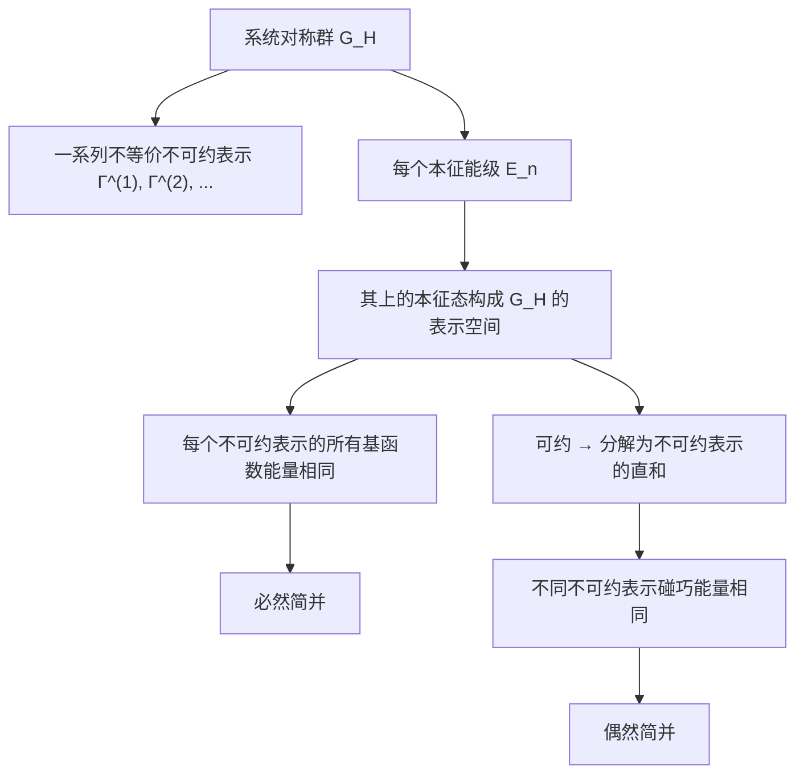
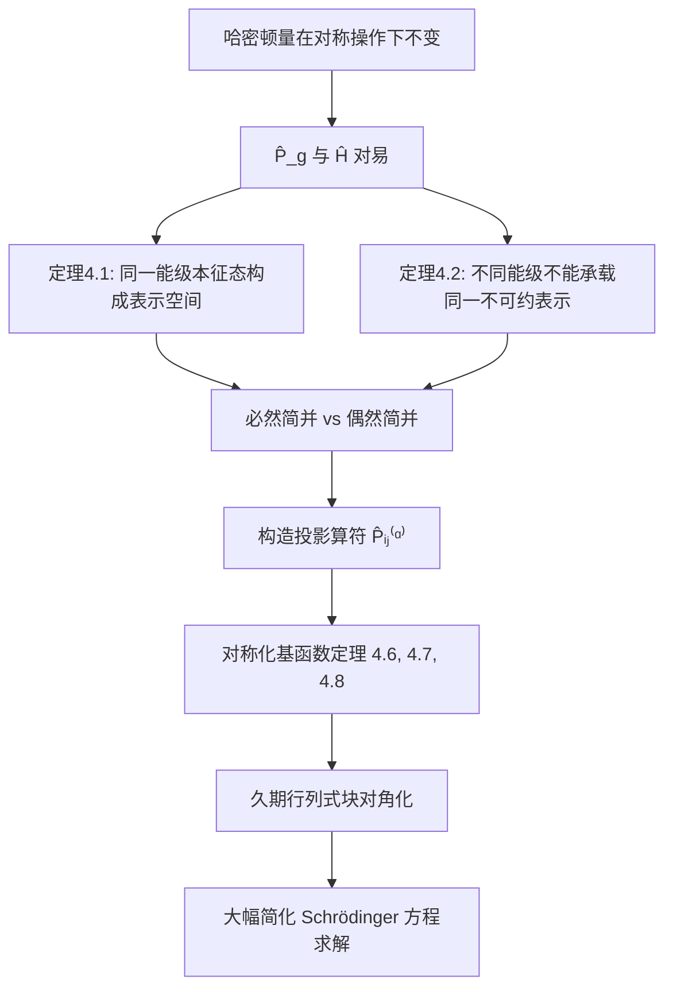

# 4.1 哈密顿算符群与相关定理

> [!abstract] 核心任务
> **一个物理系统的对称性，如何决定它的量子力学性质？**
>
> 这节是第四章的基石。建立的所有概念和定理，是后续 [[4.2 微扰引起的能级劈裂|能级劈裂]]、[[4.3 投影算符与久期行列式的对角化]]、[[4.4 矩阵元定理与选择定则|选择定则]] 的基础。

---

## 一、从哈密顿量的对称性出发

### 1.1 什么是对称操作？

一个物理系统由哈密顿量 $\hat{H}(\mathbf{x})$ 描述（$\mathbf{x}$ 是广义坐标）。如果对坐标空间做变换 $g$，坐标变成 $g\mathbf{x}$，而

$$\hat{H}(\mathbf{x}) = \hat{H}(g\mathbf{x})$$

则 $g$ 是系统的一个**对称操作**——它让系统回到与之前不可分辨的状态。

### 1.2 对称操作诱导 Hilbert 空间上的算符

坐标空间的变换 $g$ 会诱导 Hilbert 空间中的一个线性变换算符 $\hat{P}_g$，作用到波函数上为：

$$\boxed{\hat{P}_g \varphi(\mathbf{x}) = \varphi(g^{-1}\mathbf{x})}$$

> [!question] 为什么是 $g^{-1}$ 而不是 $g$？
> **核心原因**：保证 $\hat{P}_g$ 构成群 $G$ 的**同态表示**，即 $\hat{P}_{fg} = \hat{P}_f \hat{P}_g$。
>
> 验证：
> $$\hat{P}_f \hat{P}_g \varphi(\mathbf{x}) = \hat{P}_f \varphi(g^{-1}\mathbf{x}) = \varphi(g^{-1} f^{-1} \mathbf{x}) = \varphi((fg)^{-1}\mathbf{x}) = \hat{P}_{fg} \varphi(\mathbf{x}) \quad \checkmark$$
>
> 如果错误地定义为 $\varphi(g\mathbf{x})$，则 $\hat{P}_f \hat{P}_g = \hat{P}_{gf}$，顺序反了，变成**反同态**，所有表示论定理都无法直接使用。
>
> **直觉理解**：波函数值是贴在空间点上的"标签"。系统做变换 $g$ 后，点 $\mathbf{x}$ 处的函数值来自变换前的 $g^{-1}\mathbf{x}$ 处（因为原来在 $g^{-1}\mathbf{x}$ 的标签被移到了 $\mathbf{x}$）。就像绳子右移后，你脚底下的颜色来自左边。

### 1.3 核心结论：$\hat{P}_g$ 与 $\hat{H}$ 对易

由 $\hat{H}(\mathbf{x}) = \hat{H}(g\mathbf{x})$，插入 $\hat{P}_g \hat{P}_g^{-1} = \mathbb{1}$：

$$\hat{H}(\mathbf{x}) = \hat{P}_g \hat{H}(g\mathbf{x}) \hat{P}_g^{-1} = \hat{P}_g \hat{H}(\mathbf{x}) \hat{P}_g^{-1}$$

右乘 $\hat{P}_g$ 得：

$$\boxed{\hat{P}_g \hat{H}(\mathbf{x}) = \hat{H}(\mathbf{x}) \hat{P}_g}$$

> [!important] 物理含义
> 对称操作对应的算符与哈密顿量**互易**。这意味着能量和对称性对应的量子数可以同时确定——对称性给量子态带来了额外的"标签"。**这是整章所有定理的出发点。**

---

## 二、两个群的定义

> [!note] 定义 4.1（系统对称群）
> 所有保持哈密顿量不变的变换 $g$ 构成的群：
> $$G_H = \{g \mid \hat{H}(g\mathbf{x}) = \hat{H}(\mathbf{x})\}$$
> 也称为"哈密顿算符的群"或"Schrödinger 方程的群"。

> [!note] 定义 4.2（哈密顿算符群）
> 系统对称群中每个群元 $g$ 对应的函数变换算符 $\hat{P}_g$ 构成的群：
> $$P_{G_H} = \{\hat{P}_g \mid g \in G_H\}$$

**二者关系**：哈密顿算符群是系统对称群的一个**表示**。这个表示具体是什么样子，取决于它作用的线性空间（即选取的基函数）。

> [!tip] 书中后面会混用"哈密顿算符群"和"哈密顿算符群表示"，因为哈密顿算符群本身就是系统对称群的一个表示。

---

## 三、对称性与能级的对应：两个核心定理

### 定理 4.1：同一能级的本征态构成表示空间的基

> [!theorem] 定理 4.1
> 哈密顿量算符 $\hat{H}(\mathbf{x})$ 的具有相同本征能量的本征函数，构成哈密顿算符群表示的基函数。

**物理图像**：$\hat{H}$ 有一系列本征能级，每个能级上有一个或几个本征态。以能级为单元，其上的本征态张成一个线性空间。这个空间在对称操作下是**封闭的**，它承载了哈密顿算符群的一个表示。

**证明**：设 $E_n$ 是 $l$ 重简并的能级，对应 $l$ 个线性无关本征函数 $\Psi_i(\mathbf{x})$。对任意 $\hat{P}_g$：

$$\hat{H}(\mathbf{x}) \hat{P}_g \Psi_i(\mathbf{x}) = \hat{P}_g \hat{H}(\mathbf{x}) \Psi_i(\mathbf{x}) = E_n \hat{P}_g \Psi_i(\mathbf{x})$$

所以 $\hat{P}_g \Psi_i(\mathbf{x})$ 仍是能量为 $E_n$ 的本征函数，必落在 $\{\Psi_i\}$ 张成的 $l$ 维空间中。这个空间在对称操作下封闭，构成一个 $l$ 维表示。$\blacksquare$

### 定理 4.2：不同能级的本征态不能承载同一个不可约表示

> [!theorem] 定理 4.2
> 承载哈密顿算符群**不可约表示**的本征函数必属于**同一能级**。

**证明**（反证法）：假设 $\Psi_1, \ldots, \Psi_l$ 构成第 $\alpha$ 个不可约表示，但能量不全相同。不妨设前 $l-1$ 个能量为 $E$，最后一个 $\Psi_l$ 能量为 $E' \neq E$。

将 $\hat{P}_g$ 作用到 $\hat{H}\Psi_l = E'\Psi_l$ 两边：

- 左边：$\hat{P}_g \hat{H} \Psi_l = \hat{H} \hat{P}_g \Psi_l = \hat{H} \sum_i \Delta_{il}^{(\alpha)}(g) \Psi_i = \sum_i \Delta_{il}^{(\alpha)}(g) E_i \Psi_i$
- 右边：$E' \hat{P}_g \Psi_l = E' \sum_i \Delta_{il}^{(\alpha)}(g) \Psi_i$

比较 $\Psi_i$（$i \leq l-1$）的系数：$\Delta_{il}^{(\alpha)}(g) E_i = \Delta_{il}^{(\alpha)}(g) E'$，而 $E_i \neq E'$，故 $\Delta_{il}^{(\alpha)}(g) = 0$ 对所有 $g$ 成立。这意味着表示矩阵有不变子空间，与"不可约"矛盾。$\blacksquare$

### 两个定理合起来的物理图像

> [!warning] 必然简并 vs 偶然简并
> - **必然简并**：由对称性导致的简并。同一不可约表示的不同基函数能量**必然**相同。
> - **偶然简并**：不同不可约表示碰巧有相同能量。对称性不要求，但恰好发生了。
>
> **注意**：偶然简并出现时要非常小心，因为它经常意味着系统哈密顿量的对称性没有找全。

---

## 四、投影算符

### 4.1 投影算符的一般定义

> [!note] 定义 4.3（投影算符）
> 线性空间 $V$ 上的线性算符 $\hat{P}$，若满足 $\hat{P}^2 = \hat{P}$，则称 $\hat{P}$ 是 $V$ 上的投影算符。

基本性质：
- 值域 $R_P = \hat{P}V$，核 $N_P = \{z \in V \mid \hat{P}z = 0\}$
- $V = R_P \oplus N_P$
- $\hat{P}z = z$ 对所有 $z \in R_P$ 成立
- 若 $V = W_1 \oplus W_2 \oplus \cdots \oplus W_k$，则存在投影算符 $\hat{P}_1, \ldots, \hat{P}_k$ 满足：
  - $\hat{P}_i^2 = \hat{P}_i$（幂等）
  - $\hat{P}_i \hat{P}_j = 0$（$i \neq j$，互相正交）
  - $\sum_i \hat{P}_i = \hat{E}$（完备性）
  - $\hat{P}_i V = W_i$

### 4.2 群表示投影算符

> [!theorem] 定理 4.4
> 设群 $G$ 的不可约酉表示为 $A^{(\alpha)}$，维数为 $s_\alpha$，$n = |G|$。$P_G$ 为 $G$ 对应的算符群。定义：
>
> $$\boxed{\hat{P}_{kj}^{(\alpha)} = \frac{s_\alpha}{n} \sum_{g \in G} A_{kj}^{(\alpha)*}(g) \hat{P}_g}$$
>
> 则这些算符满足：
> $$\hat{P}_{kj}^{(\alpha)} \hat{P}_{il}^{(\beta)} = \delta_{\alpha\beta} \delta_{ij} \hat{P}_{kl}^{(\alpha)}$$
>
> 特别地，$\hat{P}_{jj}^{(\alpha)} \hat{P}_{jj}^{(\alpha)} = \hat{P}_{jj}^{(\alpha)}$，所以 $\hat{P}_{jj}^{(\alpha)}$ 是投影算符。

> [!tip] 证明概要
> 将两个投影算符相乘，利用 $\hat{P}_g \hat{P}_{g'} = \hat{P}_{gg'}$ 和不可约表示矩阵元的**第一正交定理**：
> $$\frac{s_\beta}{n} \sum_{g \in G} A_{kj}^{(\alpha)*}(g) A_{mi}^{(\beta)}(g) = \delta_{\alpha\beta} \delta_{km} \delta_{ji}$$
> 即可化简得到结果。

### 4.3 完备性

> [!theorem] 定理 4.5
> $$\boxed{\sum_{\alpha=1}^{q} \sum_{i=1}^{s_\alpha} \hat{P}_{ii}^{(\alpha)} = \hat{P}_e}$$
>
> 即所有不可约表示的投影算符之和等于恒等算符。

> [!tip] 类比
> 这完全类比量子力学中本征态的完备性关系：
> $$\sum_i \Psi_i^*(\mathbf{r}') \Psi_i(\mathbf{r}) = \delta(\mathbf{r}' - \mathbf{r})$$
> 不等价不可约表示的矩阵元正交且完备，占满了 $n$ 个维度。

---

## 五、对称化基函数定理

### 定理 4.6（基函数定理 I）

> [!theorem] 定理 4.6
> 一组函数 $\varphi_i^{(\alpha)}$（$i = 1, 2, \ldots, s_\alpha$）构成群 $G$ 的第 $\alpha$ 个不可约酉表示基函数的**充要条件**是：
>
> $$\boxed{\hat{P}_{ij}^{(\alpha)} \varphi_j^{(\alpha)} = \varphi_i^{(\alpha)}}$$
>
> 满足此条件的函数称为**对称化基函数**。

> [!tip] 理解
> 投影算符作用到对称化基函数上，只是在同一不可约表示的不同基函数之间转换。就像在三维空间中，投影到 $x$ 轴上的算符作用到 $\hat{x}$ 上还是 $\hat{x}$，作用到 $\hat{y}$ 上则得到零。

### 定理 4.7（基函数定理 II）

> [!theorem] 定理 4.7
> 有限群不等价不可约酉表示的基函数满足正交关系：
>
> $$\boxed{\left(\varphi_i^{(\alpha)} \mid \varphi_j^{(\beta)}\right) = \delta_{ij} \delta_{\alpha\beta} f^{(\alpha)}}$$
>
> 其中 $f^{(\alpha)}$ 与 $i,j$ 无关。

> [!tip] 证明思路
> 因为 $\hat{P}_g$ 是酉变换（保内积），$(\varphi_i^{(\alpha)} \mid \varphi_j^{(\beta)}) = (\hat{P}_g \varphi_i^{(\alpha)} \mid \hat{P}_g \varphi_j^{(\beta)})$。将右边展开为表示矩阵元，对 $g$ 求和，用正交定理即得。

### 定理 4.8

> [!theorem] 定理 4.8
> 若 $\varphi_k^{(\alpha)}(\mathbf{r})$ 是系统对称群第 $\alpha$ 个不可约表示的第 $k$ 个基，则 $\hat{H}(\mathbf{r})\varphi_k^{(\alpha)}(\mathbf{r})$ 也按照第 $\alpha$ 个不可约表示的第 $k$ 个基变化。

> [!important] 含义
> 哈密顿量作用到对称化基函数上，**不改变它的对称性类型**。这保证了对称化基函数展开时，哈密顿量矩阵元具有高度的选择性——不同不可约表示之间的矩阵元为零。

---

## 六、应用：久期行列式的对角化

### 6.1 久期方程

用一组基 $\{\varphi_p(\mathbf{r})\}$ 展开波函数 $\Psi(\mathbf{r}) = \sum_p c_p \varphi_p(\mathbf{r})$，代入 Schrödinger 方程，用各基函数做内积：

$$\left| \left(\varphi_q \mid \hat{H} \varphi_p\right) - E \left(\varphi_q \mid \varphi_p\right) \right| = 0$$

这就是**久期方程**。截断到 $N$ 个基函数，得到 $N \times N$ 的久期行列式。

### 6.2 对称化基函数的威力

如果基函数没有对称性，久期行列式是普通的 $N \times N$ 行列式，计算量 $\sim N^3$。

> [!important] 如果使用对称化基函数
> 根据定理 4.7 和 4.8：
> - 属于**不同不可约表示**的基函数之间的矩阵元**严格为零**
> - 属于**同一不可约表示不同副本**之间的矩阵元也为零
>
> 结果：久期行列式变成**块对角**形式，每个小块独立求解，计算量大幅降低。

### 6.3 书中的例子

6个基函数，分解为 $A_1$（2个）+ $A_3$（4个，即2维不可约表示出现2次），久期行列式完全对角：

$$\left| \begin{array}{cccccc} K_{11,11}^{11} & 0 & 0 & 0 & 0 & 0 \\ 0 & K_{11,11}^{22} & 0 & 0 & 0 & 0 \\ 0 & 0 & K_{12,12}^{22} & 0 & 0 & 0 \\ 0 & 0 & 0 & K_{11,11}^{33} & 0 & 0 \\ 0 & 0 & 0 & 0 & K_{12,12}^{33} & 0 \\ 0 & 0 & 0 & 0 & 0 & K_{13,13}^{33} \end{array} \right| = 0$$

如果分解方式不同（比如1维和2维不可约表示各出现两次），则变成**准对角**（分块对角），也比普通行列式简单得多。

---

## 七、如何构造对称化基函数？

### 方法一：用 $\hat{P}_{ij}^{(\alpha)}$（需要知道所有表示矩阵元）

直接利用 $\hat{P}_{ij}^{(\alpha)} \varphi_j^{(\alpha)} = \varphi_i^{(\alpha)}$ 从已知基函数生成全部对称化基。

### 方法二：用特征标投影算符 ⭐ 更实用

> [!example] 三步法
>
> **第一步**：构造特征标投影算符
> $$\boxed{\hat{P}^{(\alpha)} = \frac{s_\alpha}{n} \sum_{g \in G} \chi^{(\alpha)*}(g) \hat{P}_g}$$
> 它与 $\hat{P}_{ii}^{(\alpha)}$ 的关系：$\hat{P}^{(\alpha)} = \sum_{i=1}^{s_\alpha} \hat{P}_{ii}^{(\alpha)}$
>
> **第二步**：将 $\hat{P}^{(\alpha)}$ 作用到任意函数 $\Psi$ 上
>
> 设 $\Psi = \sum_{i,\beta,l} a_{il}^{(\beta)} \varphi_{il}^{(\beta)}$，则 $\hat{P}^{(\alpha)} \Psi = \sum_{i,l} a_{il}^{(\alpha)} \varphi_{il}^{(\alpha)}$
>
> 即从 $\Psi$ 中**提取出**属于第 $\alpha$ 个不可约表示的所有分量。
>
> **第三步**：用 $\hat{P}_g$ 对这些向量进行作用，找出其他维度上的独立向量。

---

## 八、具体例子：$\mathbf{D}_3$ 群

用 $D_3$ 群的6个二次齐次函数基 $\{x^2, y^2, z^2, xy, yz, xz\}$ 演示投影算符方法。

$D_3$ 群特征标表：

| | $\{e\}$ | $2\{d,f\}$ | $3\{a,b,c\}$ |
|---|---|---|---|
| $A_1$ | 1 | 1 | 1 |
| $A_2$ | 1 | 1 | -1 |
| $A_3$ | 2 | -1 | 0 |

**第一步**：写出 $D_3$ 群各元素在欧氏空间的表示矩阵（及其逆）。

**第二步**：构造三个特征标投影算符：

$$\hat{P}^{(1)} = \frac{1}{6}(\hat{P}_e + \hat{P}_d + \hat{P}_f + \hat{P}_a + \hat{P}_b + \hat{P}_c)$$

$$\hat{P}^{(2)} = \frac{1}{6}(\hat{P}_e + \hat{P}_d + \hat{P}_f - \hat{P}_a - \hat{P}_b - \hat{P}_c)$$

$$\hat{P}^{(3)} = \frac{2}{6}(2\hat{P}_e - \hat{P}_d - \hat{P}_f)$$

**第三步**：分别作用到6个基函数上：

- $\hat{P}^{(1)}$ 产生 $\frac{1}{2}(x^2+y^2)$ 和 $z^2$（$A_1$ 的2个基）
- $\hat{P}^{(2)}$ 全部为零（这6个函数中没有 $A_2$ 成分）
- $\hat{P}^{(3)}$ 产生 $\frac{1}{2}(x^2-y^2)$, $xy$, $yz$, $xz$（$A_3$ 的4个基）

最终6个基函数被分解为：$A_1 \oplus A_1 \oplus A_3$（两个1维表示各出现一次，一个2维表示出现2次，共 $1+1+2\times2 = 6$ 维）。

---

## 九、总结：逻辑链

> [!success] 这节建立的所有概念和定理，是后续各节的基础。理解了这节，第四章后面所有内容都只是这些定理在不同物理场景中的具体应用。

---

## 相关章节

- [[4.2 微扰引起的能级劈裂]]
- [[4.3 投影算符与久期行列式的对角化]]
- [[4.4 矩阵元定理与选择定则]]
- [[第四章 群论与量子力学]]
