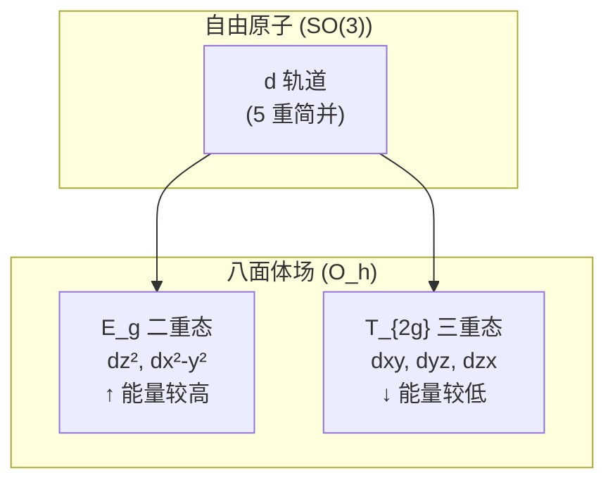
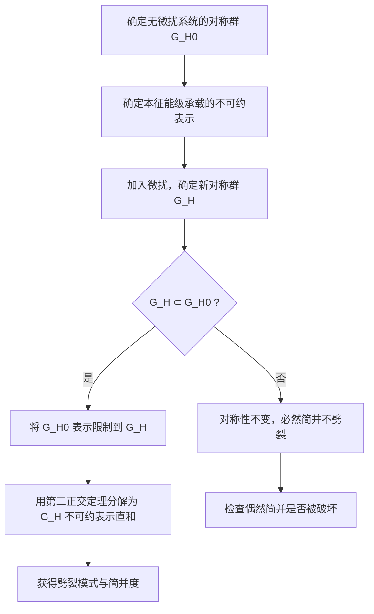

# 4.2 微扰引起的能级劈裂

> [!abstract] 本节要回答的问题
> 给一个系统加上微扰（外场、晶格场等），它的对称性改变了。原来简并的能级会怎么劈？劈成几条？每条几重简并？
>
> **关键承诺**：不求解 Schrödinger 方程，仅靠群论就能回答这些问题。

---

## 4.2.0 准备知识：4.1 节的三个结论

在进入 4.2 之前，需要 4.1 节奠定的三条结论。它们像三块积木，搭起了整节分析的基础。

> [!note] [[4.1 哈密顿算符群与相关定理#定理 4.1 与 4.2\|回顾 4.1 节的两个定理]]
> 1. **定理 4.1**：同一个本征能级上的本征函数，构成系统对称群 $G_H$ 的某个表示的基函数。
> 2. **定理 4.2**：如果一组本征函数承载了 $G_H$ 的一个**不可约**表示，那么它们必定属于**同一个**本征能级。
>
> **推论**：能级的简并度就是它所承载的不可约表示的维数。不同的不可约表示对应不同的能级。

第三条结论是必然简并与偶然简并的区分：

> [!quote]
> **必然简并**：由对称性强制要求的简并。同一个不可约表示内部不同基之间的简并。这种简并在对称性不破坏时永远不能解除。
>
> **偶然简并**：不同不可约表示碰巧能量相等。没有对称性保护，可以被微扰解除。

这三条结合起来，构成了 4.2 节的出发点。

---

## 4.2.1 核心逻辑：加微扰 → 对称性变化 → 表示约化 → 能级劈裂

### 场景设定

系统原本的哈密顿量是 $\hat{H}_0(\boldsymbol{x})$，它的系统对称群是 $G_{H_0}$。本征态用 $G_{H_0}$ 的不可约表示来标记——每个能级对应一个（或几个约化后的）不可约表示。

现在加上微扰 $\hat{H}'(\boldsymbol{x})$，总哈密顿量为：

$$
\hat{H}(\boldsymbol{x}) = \hat{H}_0(\boldsymbol{x}) + \hat{H}'(\boldsymbol{x})
$$

新的系统对称群 $G_H$ 是同时保持 $\hat{H}_0$ **和** $\hat{H}'$ 不变的所有操作的集合。$G_H$ 一般比 $G_{H_0}$ 小——因为 $\hat{H}'$ 破坏了原有的一部分对称性。

### 两种情形

> [!tip] 对称性降低 vs 对称性不变
> 微扰对对称性的影响分两种情况，物理上意义完全不同：

| 情形 | $G_H$ 与 $G_{H_0}$ 的关系 | 后果 |
|------|---------------------------|------|
| **① 对称性降低** | $G_H \subsetneq G_{H_0}$（真子群） | 原有必然简并可能被解除，能级劈裂 |
| **② 对称性不变** | $G_H = G_{H_0}$ | 必然简并不变，但偶然简并可能被破坏 |

---

#### 情形 ① 对称性降低（主菜）

这是最常见、物理上最重要的情况。

> [!info] 群表示的限制（Restriction）
> 原来在 $G_{H_0}$ 下的一个不可约表示 $\Gamma^{(\alpha)}_{G_{H_0}}$，当我们只看子群 $G_H$ 中的操作时，它变成了 $G_H$ 的一个表示（可能可约）。
>
> 这个操作叫**限制**，记作：
> $$
> \Gamma^{(\alpha)}_{G_{H_0}} \big|_{G_H}
> $$
>
> 再用 $G_H$ 的特征标表将它分解为 $G_H$ 的不可约表示的直和：
> $$
> \Gamma^{(\alpha)}_{G_{H_0}} \big|_{G_H} = \bigoplus_i m_i \, \Gamma^{(i)}_{G_H}
> $$

分解后，**每条 $G_H$ 的不可约表示就对应一条新的能级**。原来的一个能级，变成了若干条能级，每条的简并度等于对应的 $G_H$ 不可约表示的维数。

> [!example] 一个直观的类比
> 想象一个圆形餐桌（SO(3) 对称性），桌上坐了 5 个人（d 轨道的 5 个本征态）。在圆形对称下，所有人地位平等（5 重简并）。
>
> 现在把桌子改成方形（O 群对称性）。方形下，有两种人：
> - 坐在四条边中点的人（$E$ 表示，2 个人），他们地位平等
> - 坐在四个角上的人（$T_2$ 表示，3 个人），他们地位平等
>
> 但"边的人"和"角的人"位置不同，能量不同。于是 5 人简并劈成了 2 + 3。

---

#### 情形 ② 对称性不变

如果 $\hat{H}'$ 不破坏 $G_{H_0}$ 的任何对称性，甚至可能引入新的对称性，那么：

- **必然简并**：仍然被对称性保护，不能解除
- **偶然简并**：可能解除。因为微扰改变了能量数值，原本碰巧相等的两个不同表示的能量现在可能分开

---

## 4.2.2 经典例子：晶格场理论（Crystal Field Theory）

这是整个 4.2 节最具体的例子，也是凝聚态物理中最重要的应用之一。

### 物理背景

> [!cite] 历史注记
> 晶格场理论在 20 世纪 30–40 年代发展起来，早期用于解释稀土和过渡金属离子在晶体中的光谱。它是早期激光器设计的理论基础——把稀土或过渡金属离子掺入透明晶体中，其光谱由杂质离子在晶格场中的电子能级决定。

**场景**：把一个自由原子放进一个简立方的晶格场中。过渡金属（如 Fe、Co、Ni）的 d 轨道在氧八面体中的劈裂是最典型的情况。

**设定**：
- 不考虑空间反演对称性（$\hat{H}_0$ 本身是中心力场，SO(3) 是满转动群）
- 不考虑自旋-轨道耦合，只有轨道角动量
- 原子轨道用 $n, l, m$ 标记

| 无微扰 | 微扰后 |
|--------|--------|
| $\hat{H}_0$：自由原子哈密顿量 | $\hat{H}'$：晶格场 |
| $G_{H_0} = \text{SO}(3)$（连续转动群） | $G_H = \mathbf{O}$（立方点群，24 个元素） |
| 本征态：$Y_{lm}(\theta,\varphi)$（球谐函数） | 需要新的标记 |

### 方法：特征标计算

我们需要知道：**O 群中元素作用到 SO(3) 的 $l$ 重态（d 轨道、p 轨道等）上，得到的表示的特征标是多少？** 然后跟 O 群的特征标表对比，做分解。

> [!tip] 计算特征标的技巧
> 因为群元的特征标在同类中相等，我们只需计算每个类中**一个代表元**的特征标。
>
> 又因为球谐函数 $Y_{lm}$ 在转动下的变换性质已知——绕 $z$ 轴转 $\theta$ 角时：
> $$
> \hat{R}(\theta) \, Y_{lm} = e^{-im\theta} \, Y_{lm}
> $$
>
> 所以 $Y_{lm}$ 关于这个转动的表示矩阵是对角矩阵，特征标就是对角元之和：
> $$
> \chi^{(l)}(\theta) = \sum_{m=-l}^{l} e^{im\theta}
> $$
>
> 用等比级数求和公式化简：
> $$
> \chi^{(l)}(\theta) = \frac{\sin[(l+1/2)\theta]}{\sin(\theta/2)}
> $$

> [!warning] 为什么可以只算绕 $z$ 轴的转动？
> 对 SO(3) 群的不可约表示，特征标只依赖于转动角 $\theta$，不依赖于转轴方向。因为所有转相同角度的操作在 SO(3) 中属于同一个类。所以对 O 群的每一类，我们选一个绕 $z$ 轴转对应角度的操作来计算特征标即可。

### O 群的类与对应转角

O 群有 24 个元素，分 5 个类：

| 类 | 元素数 | 几何含义 | 转角 $\theta$ |
|----|--------|----------|--------------|
| $\{E\}$ | 1 | 恒等 | $0$ |
| $\{C_3\}$ | 8 | 绕体对角线转 $120^\circ$ | $2\pi/3$ |
| $\{C_4^2\}$ | 3 | 绕面心轴转 $180^\circ$ | $\pi$ |
| $\{C_4\}$ | 6 | 绕面心轴转 $90^\circ$ | $\pi/2$ |
| $\{C_2\}$ | 6 | 绕面对角线转 $180^\circ$ | $\pi$ |

> [!faq]- 为什么有两个类转角都是 $\pi$，但却是不同的类？
> 在 O 群中，$C_4^2$（转 $\pi$，轴为面心轴）和 $C_2$（转 $\pi$，轴为面对角线轴）在 O 群中共轭类不同。因为 $C_4^2$ 的元素是 $C_4$ 的平方，而 $C_2$ 不是任何 $C_4$ 的平方。尽管转角相同，它们在群中的"位置"不同。

### 特征标计算（逐类）

**① $\{E\}$**：$\theta = 0$

$$
\chi^{(l)}(0) = \sum_{m=-l}^{l} 1 = 2l + 1
$$

s: 1, p: 3, d: 5, f: 7

**② $\{C_3\}$**：$\theta = 2\pi/3$

$$
\chi^{(l)}(2\pi/3) = \sum_{m=-l}^{l} e^{i(2\pi/3)m}
$$

s: $\chi = 1$
p: $\chi = e^{-i2\pi/3} + 1 + e^{i2\pi/3} = 0$
d: $\chi = e^{-i4\pi/3} + e^{-i2\pi/3} + 1 + e^{i2\pi/3} + e^{i4\pi/3} = -1$
f: $\chi = 1$（计算得）

**③ $\{C_4^2\}$**：$\theta = \pi$

$$
\chi^{(l)}(\pi) = \sum_{m=-l}^{l} e^{im\pi} = \sum_{m=-l}^{l} (-1)^m
$$

p: $(-1)^{-1}+1+(-1)^{1} = -1+1-1 = -1$
d: $1+(-1)+1+(-1)+1 = 1$
f: $(-1)+1+(-1)+1+(-1)+1+(-1) = -1$

**④ $\{C_4\}$**：$\theta = \pi/2$

p: $\chi = e^{-i\pi/2}+1+e^{i\pi/2} = -i+1+i = 1$
d: $\chi = e^{-i\pi}+e^{-i\pi/2}+1+e^{i\pi/2}+e^{i\pi} = -1 - i + 1 + i - 1 = -1$
f: $\chi = -1$

**⑤ $\{C_2\}$**：$\theta = \pi$（和 $\{C_4^2\}$ 同转角，但属于不同类，特征标相同）

> [!important] 最终特征标表
> 综上，O 群在球谐函数空间的表示的特征标为：
>
> | SO(3) 态 | $\{E\}$ | $8C_3$ | $3C_4^2$ | $6C_4$ | $6C_2$ |
> |----------|---------|--------|----------|--------|--------|
> | s ($l=0$) | 1 | 1 | 1 | 1 | 1 |
> | p ($l=1$) | 3 | 0 | -1 | 1 | -1 |
> | d ($l=2$) | 5 | -1 | 1 | -1 | 1 |
> | f ($l=3$) | 7 | 1 | -1 | -1 | -1 |

### O 群不可约表示特征标表

O 群有 5 个不等价不可约表示（3 个一维、1 个二维、1 个三维）：

| 表示 | 维数 | $\{E\}$ | $8C_3$ | $3C_4^2$ | $6C_4$ | $6C_2$ |
|------|------|---------|--------|----------|--------|--------|
| $A_1$ | 1 | 1 | 1 | 1 | 1 | 1 |
| $A_2$ | 1 | 1 | 1 | 1 | -1 | -1 |
| $E$ | 2 | 2 | -1 | 2 | 0 | 0 |
| $T_1$ | 3 | 3 | 0 | -1 | 1 | -1 |
| $T_2$ | 3 | 3 | 0 | -1 | -1 | 1 |

### 分解：使用第二正交定理

> [!info] 第二正交定理（分解公式）
> 如果可约表示 $\Gamma$ 的特征标是 $\chi(g)$，那么它包含第 $i$ 个不可约表示的次数为：
>
> $$
> m_i = \frac{1}{n} \sum_{g \in G} \chi(g) \, \chi^{(i)*}(g)
> $$
>
> 其中 $n = |G|$ 是群阶，O 群的 $n = 24$。

以 d 轨道为例：

**分解 d 轨道表示**：
$$
\chi_{\text{d}} = (5, -1, 1, -1, 1)
$$

分别与各不可约表示做内积：

$$
\begin{aligned}
m_{A_1} &= \frac{1}{24}[1\cdot5\cdot1 + 8\cdot(-1)\cdot1 + 3\cdot1\cdot1 + 6\cdot(-1)\cdot1 + 6\cdot1\cdot1] \\
&= \frac{1}{24}[5 - 8 + 3 - 6 + 6] = 0
\end{aligned}
$$

$$
m_{A_2} = \frac{1}{24}[5 + 8(-1)(1) + 3(1)(1) + 6(-1)(-1) + 6(1)(-1)] = \frac{1}{24}[5 - 8 + 3 + 6 - 6] = 0
$$

$$
m_E = \frac{1}{24}[5\cdot2 + 8(-1)(-1) + 3\cdot1\cdot2 + 6(-1)\cdot0 + 6\cdot1\cdot0] = \frac{1}{24}[10 + 8 + 6] = 1
$$

$$
m_{T_1} = \frac{1}{24}[5\cdot3 + 8(-1)\cdot0 + 3\cdot1\cdot(-1) + 6(-1)\cdot1 + 6\cdot1\cdot(-1)] = \frac{1}{24}[15 - 3 - 6 - 6] = 0
$$

$$
m_{T_2} = \frac{1}{24}[5\cdot3 + 8(-1)\cdot0 + 3\cdot1\cdot(-1) + 6(-1)\cdot(-1) + 6\cdot1\cdot1] = \frac{1}{24}[15 - 3 + 6 + 6] = 1
$$

所以：
$$
\boxed{\text{d 轨道：} \quad 5 \;\to\; E \oplus T_2}
$$

类似地：

| 原子轨道 | 简并度 | O 群分解 | 劈裂模式 |
|----------|--------|----------|----------|
| s | 1 | $A_1$ | **不劈裂** |
| p | 3 | $T_1$ | **不劈裂** |
| **d** | 5 | $\boxed{E \oplus T_2}$ | **劈为二：2 + 3** |
| f | 7 | $A_2 \oplus T_1 \oplus T_2$ | 劈为三：1 + 3 + 3 |

### 物理解释

> [!question] 为什么 s 和 p 不劈裂？
>
> s 态是 $A_1$（一维恒等表示），在任何对称操作下都不变——自然不会劈裂。
>
> p 态是 $T_1$（三维表示），而 O 群刚好有一个三维不可约表示 $T_1$——所以 p 态在 O 群下仍然不可约，不劈裂。**这不是偶然**：p 轨道在 O 群中的变换性质正好和 $(x, y, z)$ 这个三维矢量相同，而 O 群在三维欧氏空间的自然表示就是 $T_1$。
>
> d 态在 O 群中变得可约——因为 O 群没有 5 维不可约表示。它自然要劈成 O 群能提供的不可约表示的直和。

### d 轨道在八面体场中劈裂的物理图像

这是凝聚态物理最重要的结论之一。

> [!tip] 为什么是 $E_g$ 在上、$T_{2g}$ 在下？
> 这不是群论能回答的问题——群论只告诉你**劈裂的模式**（劈成 2 + 3），不告诉你**相对顺序**。
>
> 相对顺序由晶格场的**具体形式**决定：
> - 在八面体配位中，配体（通常是 O²⁻ 离子）位于 $\pm x$、$\pm y$、$\pm z$ 方向
> - $d_{z^2}$ 和 $d_{x^2-y^2}$ 的电子云直接指向配体方向，受到较强的 Coulomb 排斥 → 能量高
> - $d_{xy}$、$d_{yz}$、$d_{zx}$ 的电子云指向配体之间 → 能量低
>
> **在四面体配位中，顺序刚好反过来**（$T_2$ 在上，$E$ 在下）。

### 加上空间反演：$O \to O_h$

如果晶格场具有中心反演对称性（实际情况往往如此），O 群变成 $O_h = O \otimes \{E, I\}$，每个不可约表示都加上宇称下标 $g$（偶）或 $u$（奇）：

| O 表示 | $O_h$ 表示 |
|--------|-----------|
| $A_1$ | $A_{1g}$ |
| $A_2$ | $A_{2g}$ |
| $E$ | $E_g$ |
| $T_1$ | $T_{1g}$ |
| $T_2$ | $T_{2g}$ |

d 轨道的球谐函数 $Y_{2m}$ 在空间反演下变换为 $(-1)^2 Y_{2m} = Y_{2m}$（偶宇称），所以 d 轨道在 $O_h$ 下的分解为：

$$
\boxed{\text{d 轨道（$O_h$ 下）} \quad \to\; E_g \oplus T_{2g}}
$$

---

## 4.2.3 从 Si 能带看对称性逐点破缺

教材 4.1 节末尾用 Si 的能带展示了这个思想在固体物理中的应用。

> [!note] [[4.1 哈密顿算符群与相关定理#Si 能带的例子\|回顾 Si 能带的例子]]
>
> Si 是金刚石结构（fcc Bravais 格子 + 双原子基）。沿 $\Gamma \to X$ 方向：
>
> | k 点 | 点群 | 物理后果 |
> |------|------|----------|
> | $\Gamma$ | $O_h$ | 费米面下有 3 重简并的态（$T_{2g}$ 或类似） |
> | $\Delta$ 线 | $C_{4v}$ | 3 重态劈为 2 + 1 |
> | $X$ | $D_{4h}$ | 费米面下第二个能带 2 重简并，但这是**偶然简并** |

这个例子说明：
- 在 $\Gamma$ 点，$O_h$ 的 3 维不可约表示限制了能级的 3 重简并
- 沿 $\Delta$ 线，对称性从 $O_h$ 降到 $C_{4v}$，表示变得可约 → **能级劈裂**
- 在 $X$ 点，两个不同的 1 维表示恰好能量相等（偶然简并），若有微扰可能会分开

> [!quote] 能带的色散关系，本质上就是对称性沿高对称线逐点破缺的过程

---

## 4.2.4 必然简并与偶然简并的对比

> [!warning] 这是实验中常遇到的陷阱
> 在实验谱线中看到一条简并的谱线，不一定是对称性保护的结果，也可能是偶然简并。区分二者的方法：**改变一个可控参数**（温度、压力、掺杂浓度），对称性保护的简并对参数变化不敏感，偶然简并则容易被打破。

| 比较 | 必然简并 | 偶然简并 |
|------|----------|----------|
| **来源** | 对称性强制要求 | 不同表示能量碰巧相等 |
| **原因** | 同一不可约表示内的基 | 不同不可约表示的某两个基 |
| **对称性保持的微扰** | 不能解除 | 可以解除 |
| **对称性破坏的微扰** | 可以解除（劈裂模式已知） | 通常也会解除 |
| **物理含义** | 反映了系统的基本对称性 | 没有深刻的对称性根源 |
| **是否常见** | 常见，有规律 | 罕见，出现时意味着可能没找全对称性 |

---

## 4.2.5 对称性分析的边界

群论在这个问题上的能力是强大的，但不是万能的。

> [!success] 群论可以告诉我们
> - 一个能级会**劈成几条**
> - 每条几重简并（对应哪个不可约表示）
> - 哪些能级之间可以有耦合（矩阵元选择定则）

> [!fail] 群论不能告诉我们
> - 劈裂的**具体能量值**（如 $\Delta_{\text{oct}}$ 的大小）
> - 表示之间的**相对顺序**（$E_g$ 在上还是 $T_{2g}$ 在上）
> - 跃迁的**强度**（只能是零或非零的判断，不能给出具体数值）

这些具体数值需要量子化学计算或实验测量来给出。

---

## 4.2.6 流程图：对称性分析的标准步骤

---

## 参考

- [[4.1 哈密顿算符群与相关定理]]
- [[4.3 投影算符与久期行列式的对角化]]
