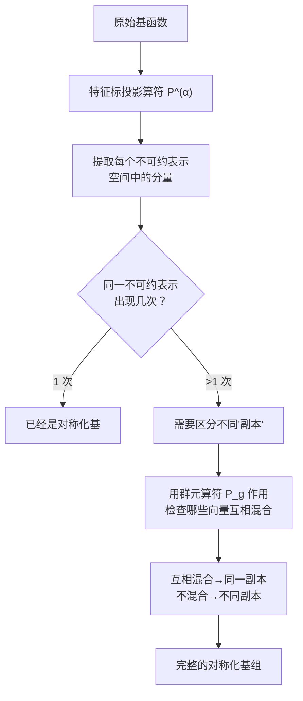
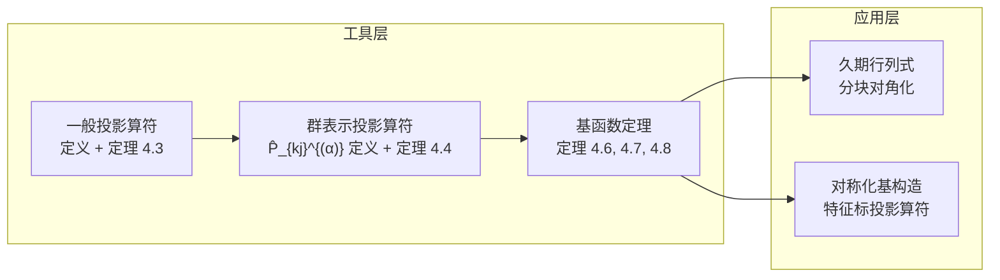

# 4.3 投影算符与久期行列式的对角化

> [!abstract] 本节核心
> 有了对称化基函数（即按不可约表示基函数变换的基），Schrödinger 方程的久期行列式会从稠密的 $N\times N$ 矩阵变为**分块对角**形式，大幅降低求解难度。
>
> 问题是如何从一堆杂乱基函数构造出对称化基？答案：**投影算符**。
>
> 数学工具（投影算符）→ 物理应用（久期行列式简化）

---

## 4.3.1 投影算符的基本概念

### 定义 4.3
线性空间 $V$ 上的线性算符 $\hat{P}$，若满足：

$$
\hat{P}^2 = \hat{P}
$$

则称 $\hat{P}$ 是 $V$ 上的一个**投影算符**。

> [!example] 三维欧氏空间到 $x$-$y$ 平面的投影
> - $\hat{P}^2 r = \hat{P} r = (x,y,0)$，幂等成立
> - 值域 $R_P$：$x$-$y$ 平面（所有 $z=0$ 的向量）
> - 核 $N_P$：$z$ 轴（所有 $(0,0,z)$）

### 定理 4.3：直和分解与投影算符一一对应

若 $V = W_1 \oplus W_2 \oplus \cdots \oplus W_k$，则存在投影算符 $\hat{P}_1,\dots,\hat{P}_k$ 满足：
1. $\hat{P}_i^2 = \hat{P}_i$（幂等）
2. $\hat{P}_i \hat{P}_j = 0$（$i \neq j$，正交）
3. $\sum_i \hat{P}_i = \hat{E}$（完备性）
4. $\hat{P}_i V = W_i$

反过来也成立：存在这样一组算符，空间就分解为值域的直和。

> [!tip] 物理意义
> 我们需要的正是把函数空间按不可约表示分解的那组投影算符。不同的 $W_i$ 就是不同的不可约表示空间。

---

## 4.3.2 群表示投影算符

### 定理 4.4：定义与代数性质

设群 $G$ 的第 $\alpha$ 个不可约酉表示为 $A^{(\alpha)}$，维数 $s_\alpha$，群阶 $n = |G|$。$\hat{P}_g$ 是群元 $g$ 对应的函数变换算符。

定义算符：

$$
\hat{P}_{kj}^{(\alpha)} = \frac{s_\alpha}{n} \sum_{g \in G} A_{kj}^{(\alpha)*}(g) \,\hat{P}_g
$$

这些算符满足**核心代数恒等式**：

$$
\boxed{\hat{P}_{kj}^{(\alpha)} \, \hat{P}_{il}^{(\beta)} = \delta_{\alpha\beta} \, \delta_{ji} \, \hat{P}_{kl}^{(\alpha)}}
$$

> [!info] 这个恒等式的三层含义
> 1. **$\delta_{\alpha\beta}$**：不同不可约表示的投影算符相乘为零——$A_1$ 和 $A_3$ 的投影算符彼此正交
> 2. **$\delta_{ji}$**：第一个算符的第二个指标必须等于第二个算符的第一个指标，才能非零——形如矩阵乘法中求和指标配对
> 3. 结果为 $\hat{P}_{kl}^{(\alpha)}$——第一个指标来自第一个算符，第二个来自第二个

取 $\alpha=\beta$、$i=j=k=l$ 时：

$$
\hat{P}_{jj}^{(\alpha)} \hat{P}_{jj}^{(\alpha)} = \hat{P}_{jj}^{(\alpha)}
$$

所以 **$\hat{P}_{jj}^{(\alpha)}$ 是投影算符**——把向量投影到第 $\alpha$ 个不可约表示的第 $j$ 个基方向。

### 定理 4.5：完备性关系

> [!quote] 所有投影算符之和等于恒等
> $$
> \sum_{\alpha=1}^{q} \sum_{i=1}^{s_\alpha} \hat{P}_{ii}^{(\alpha)} = \hat{P}_e
> $$

证明使用矩阵元的**第二种正交定理**（完备性定理）：

$$
\sum_{\alpha=1}^{q} \sum_{k,l=1}^{s_\alpha} \frac{s_\alpha}{n} A_{kl}^{(\alpha)*}(g') A_{kl}^{(\alpha)}(g) = \delta_{gg'}
$$

> [!tip] 与量子力学的类比
> 这个完备性关系类似量子力学中的 $\sum_i \Psi_i^*(r') \Psi_i(r) = \delta(r'-r)$。群表示论的矩阵元在"群元空间"中是完备的——正好 $n$ 个维度全部占满。

---

## 4.3.3 基函数定理

### 定理 4.6：对称化基函数的充要条件（基函数定理 I）

一组函数 $\varphi_i^{(\alpha)}$（$i=1,\dots,s_\alpha$）构成群 $G$ 的第 $\alpha$ 个不可约酉表示的基，当且仅当：

$$
\boxed{\hat{P}_{ij}^{(\alpha)} \varphi_j^{(\alpha)} = \varphi_i^{(\alpha)}}
$$

> [!note] 证明思路
> **必要性**：若 $\varphi_i^{(\alpha)}$ 是基，则有 $\hat{P}_g \varphi_k^{(\alpha)} = \sum_l A_{lk}^{(\alpha)}(g) \varphi_l^{(\alpha)}$。两边乘 $A_{ij}^{(\alpha)*}(g)$ 并对 $g$ 求和，利用矩阵元正交定理可得 $\hat{P}_{ij}^{(\alpha)} \varphi_k^{(\alpha)} = \delta_{jk} \varphi_i^{(\alpha)}$，取 $k=j$ 即得。
>
> **充分性**：反向推导，利用 $\hat{P}_g$ 与投影算符的关系，可以验证 $\varphi_i^{(\alpha)}$ 在 $\hat{P}_g$ 下的变换规律就是 $A_{ki}^{(\alpha)}(g)$。

**物理意义**：知道一个基函数 $\varphi_j^{(\alpha)}$，就可通过 $\hat{P}_{ij}^{(\alpha)}$ 生成整个不可约表示的所有基函数。

### 定理 4.7：对称化基函数的正交性（基函数定理 II）

有限群不等价不可约酉表示的基函数满足：

$$
\boxed{(\varphi_i^{(\alpha)} \mid \varphi_j^{(\beta)}) = \delta_{ij} \,\delta_{\alpha\beta} \, f^{(\alpha)}}
$$

其中 $f^{(\alpha)}$ 与 $i,j$ 无关。

> [!note] 证明思路
> 利用 $\hat{P}_g$ 是酉变换（保内积），有 $(\varphi_i^{(\alpha)}|\varphi_j^{(\beta)}) = (\hat{P}_g \varphi_i^{(\alpha)} | \hat{P}_g \varphi_j^{(\beta)})$。将 $\hat{P}_g$ 的变换展开，两边对 $g$ 求和，左边乘 $n$，右边用正交定理，得到 $(s_\alpha$ 相关项)，最终约化得到正交性。

**物理意义**：
- 不同不可约表示的基函数正交（$\delta_{\alpha\beta}$）
- 同一不可约表示内不同基方向正交（$\delta_{ij}$）
- 同一表示内归一化因子相同（$f^{(\alpha)}$ 与 $i$ 无关）

### 定理 4.8：哈密顿量保持基函数的对称性

> [!quote] 核心定理
> 若 $\varphi_k^{(\alpha)}(r)$ 按第 $\alpha$ 个不可约表示的第 $k$ 个基变换，则 $\hat{H}(r) \varphi_k^{(\alpha)}(r)$ 也按**完全相同的方式**变换。

**证明**：

$$
\hat{P}_g [\hat{H} \varphi_k^{(\alpha)}] = \hat{H} \hat{P}_g \varphi_k^{(\alpha)} = \hat{H} \sum_l A_{lk}^{(\alpha)}(g) \varphi_l^{(\alpha)} = \sum_l A_{lk}^{(\alpha)}(g) [\hat{H} \varphi_l^{(\alpha)}]
$$

**物理意义**：在对称化基下，不同不可约表示之间的哈密顿量矩阵元**恒为零**。这是久期行列式简化的直接依据。

---

## 4.3.4 久期行列式的对角化（物理应用）

### 问题设定

Schrödinger 方程通常没有解析解，需要用一组基 $\{\varphi_p(r)\}$ 展开波函数：

$$
\Psi(r) = \sum_p c_p \varphi_p(r)
$$

代入 Schrödinger 方程得到**久期方程**：

$$
\left| (\varphi_q | \hat{H} | \varphi_p) - E (\varphi_q | \varphi_p) \right| = 0
$$

当基函数数量为 $N$ 时，这是一个 $N \times N$ 行列式，常规对角化计算量 $O(N^3)$。

### 对称性带来的简化

如果用对称化基函数（按不可约表示组织），结合**定理 4.7 和 4.8**：

- 不同不可约表示之间矩阵元为零
- 同一不可约表示不同基方向之间矩阵元为零
- 只有**同一不可约表示、同一基方向、但不同出现次数**的基之间存在耦合

久期行列式变为**分块对角**形式。

### 具体例子

#### 例 A：$1+2+3$ 维表示各出现一次

对称化基：$\varphi_{11}^1, \varphi_{11}^2, \varphi_{12}^2, \varphi_{11}^3, \varphi_{12}^3, \varphi_{13}^3$

> [!example] 完全对角的行列式
> $$
> \begin{vmatrix}
> K_{11,11}^{11} & 0 & 0 & 0 & 0 & 0 \\
> 0 & K_{11,11}^{22} & 0 & 0 & 0 & 0 \\
> 0 & 0 & K_{12,12}^{22} & 0 & 0 & 0 \\
> 0 & 0 & 0 & K_{11,11}^{33} & 0 & 0 \\
> 0 & 0 & 0 & 0 & K_{12,12}^{33} & 0 \\
> 0 & 0 & 0 & 0 & 0 & K_{13,13}^{33}
> \end{vmatrix} = 0
> $$

#### 例 B：$1$ 维表示出现两次，$2$ 维表示出现两次

正确排序下（先排所有第 1 基，再排所有第 2 基）：

> [!example] 三个 $2\times2$ 块对角
> $$
> \begin{vmatrix}
> K_{11,11}^{11} & K_{11,21}^{11} & 0 & 0 & 0 & 0 \\
> K_{21,11}^{11} & K_{21,21}^{11} & 0 & 0 & 0 & 0 \\
> 0 & 0 & K_{11,11}^{22} & K_{11,21}^{22} & 0 & 0 \\
> 0 & 0 & K_{21,11}^{22} & K_{21,21}^{22} & 0 & 0 \\
> 0 & 0 & 0 & 0 & K_{12,12}^{22} & K_{12,22}^{22} \\
> 0 & 0 & 0 & 0 & K_{22,12}^{22} & K_{22,22}^{22}
> \end{vmatrix} = 0
> $$

计算复杂度从 $O(6^3) = 216$ 降至 $O(3\times 2^3) = 24$——近 10 倍的节省。

---

## 4.3.5 特征标投影算符（实操方法）

实际中往往只知道特征标表，不知道完整的矩阵元。这时用特征标投影算符。

### 步骤 1 构造特征标投影算符

$$
\hat{P}^{(\alpha)} = \frac{s_\alpha}{n} \sum_{g \in G} \chi^{(\alpha)*}(g) \,\hat{P}_g
$$

它与 $\hat{P}_{ii}^{(\alpha)}$ 的关系：$\displaystyle \hat{P}^{(\alpha)} = \sum_{i=1}^{s_\alpha} \hat{P}_{ii}^{(\alpha)}$。

> [!tip] 物理含义
> 特征标投影算符把向量投影到**整个**第 $\alpha$ 个不可约表示空间上，但不区分基方向。

### 步骤 2 提取属于某个不可约表示的分量

将 $\hat{P}^{(\alpha)}$ 作用到任意向量 $\Psi$ 上：

$$
\hat{P}^{(\alpha)} \Psi = \sum_i \sum_l a_{il}^{(\alpha)} \varphi_{il}^{(\alpha)}
$$

得到 $\Psi$ 中属于第 $\alpha$ 个不可约表示空间的所有分量。注意这里对 $l$（基的指标）求和，所以还不能区分不同的基方向。

### 步骤 3 用 $\hat{P}_g$ 生成出其他基函数

对于同一不可约表示出现多次的情况，用 $\hat{P}_g$（群元 $g$ 对应的函数变换算符）作用于步骤 2 所得向量，检查哪些向量在群作用下互相混合——互相混合的属于同一"副本"。

---

## 4.3.6 两个完整例子

### 例 4.1：$D_3$ 群的二次齐次函数空间

**原始基**：$\{x^2, y^2, z^2, xy, yz, xz\}$

**$D_3$ 群特征标表**：

| 表示 | $\{e\}$ | $2\{d\}$ | $3\{a\}$ |
|------|---------|----------|----------|
| $A_1$ | 1 | 1 | 1 |
| $A_2$ | 1 | 1 | -1 |
| $A_3$ | 2 | -1 | 0 |

**特征标投影算符**：

$$
\begin{aligned}
\hat{P}^{(1)} &= \frac{1}{6}(\hat{P}_e + \hat{P}_d + \hat{P}_f + \hat{P}_a + \hat{P}_b + \hat{P}_c) \\
\hat{P}^{(2)} &= \frac{1}{6}(\hat{P}_e + \hat{P}_d + \hat{P}_f - \hat{P}_a - \hat{P}_b - \hat{P}_c) \\
\hat{P}^{(3)} &= \frac{2}{6}(2\hat{P}_e - \hat{P}_d - \hat{P}_f)
\end{aligned}
$$

**投影结果**：

| 表示 | 投影所得向量 |
|------|-------------|
| $A_1$ | $\frac12(x^2+y^2)$，$z^2$ |
| $A_2$ | 全部为零 |
| $A_3$ | $\frac12(x^2-y^2)$，$xy$，$yz$，$xz$ |

**配对验证**（用 $\hat{P}_d$ 作用）：

$$
\hat{P}_d \left[ \frac12(x^2-y^2) \right] = -\frac12 \left[ \frac12(x^2-y^2) \right] - \frac{\sqrt{3}}{2} xy
$$

> [!check] 为什么用 $\hat{P}_d$？
> $\hat{P}_d$ 是群元 $d$ 对应的函数变换算符，不是投影算符。用它的目的是检查两个向量是否在群作用下互相混合——如果混合，它们属于同一副本。

**最终对称化基组**：

| 表示 | 出现次数 i | 基函数 |
|------|-----------|--------|
| $A_1$（1 维） | 第 1 次 | $\varphi_{11}^1 = \frac12(x^2+y^2)$ |
| $A_1$（1 维） | 第 2 次 | $\varphi_{21}^1 = z^2$ |
| $A_3$（2 维） | 第 1 次 | $\varphi_{11}^3 = \frac12(x^2-y^2)$，$\varphi_{12}^3 = xy$ |
| $A_3$（2 维） | 第 2 次 | $\varphi_{21}^3 = yz$，$\varphi_{22}^3 = xz$ |

这正是例 B 的情况——两个 $A_1$ 出现形成 $2\times2$ 块，两组 $A_3$ 各出现形成两个 $2\times2$ 块。

### 例 4.2：$D_3$ 群的群代数空间

**原始基**：群元本身 $\{e, d, f, a, b, c\}$

用相同特征标投影算符：

- $\hat{P}^{(1)}e = \frac16(e+d+f+a+b+c)$ → $\varphi_{11}^1 = \frac1{\sqrt6}(e+d+f+a+b+c)$（正则表示的 $A_1$ 分量）
- $\hat{P}^{(2)}e = \frac16(e+d+f-a-b-c)$ → $\varphi_{11}^2 = \frac1{\sqrt6}(e+d+f-a-b-c)$（$A_2$ 分量）
- 剩下 4 维：用 $\hat{P}^{(3)}(e+a)$ 得到 $\varphi_{11}^3$，用 $\hat{P}_d$ 作用、正交化得到 $\varphi_{12}^3$

> [!warning] 多次出现的处理
> 当同一不可约表示出现多次时，特征标投影算符不能区分不同副本。需要用额外步骤（如例 4.2 所示的正交化处理）。

---

## 4.3.7 本节总结

关键结论：
1. 投影算符 $\hat{P}_{jj}^{(\alpha)}$ 把函数投影到第 $\alpha$ 个不可约表示的第 $j$ 个基方向
2. 对称化基函数满足正交性：不同表示、不同基方向之间正交
3. 哈密顿量保持基函数的对称性分类
4. 因此久期行列式变为分块对角——每块大小为同一不可约表示的同基方向的"出现次数"
5. 特征标投影算符提供实用构造方法，仅需要特征标表
6. 同一表示出现多次时，需用 $\hat{P}_g$ 和正交化区分不同副本

---

## 参考

- [[4.1 哈密顿算符群与相关定理]]
- [[4.2 微扰引起的能级劈裂]]
- [[4.4 矩阵元定理与选择定则、电偶极跃迁]]
