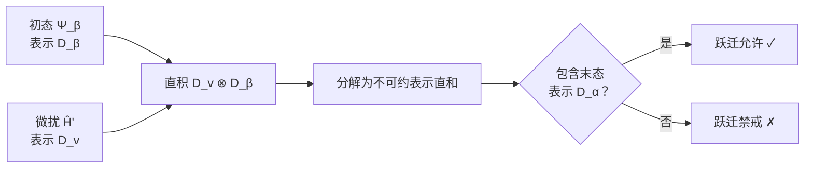
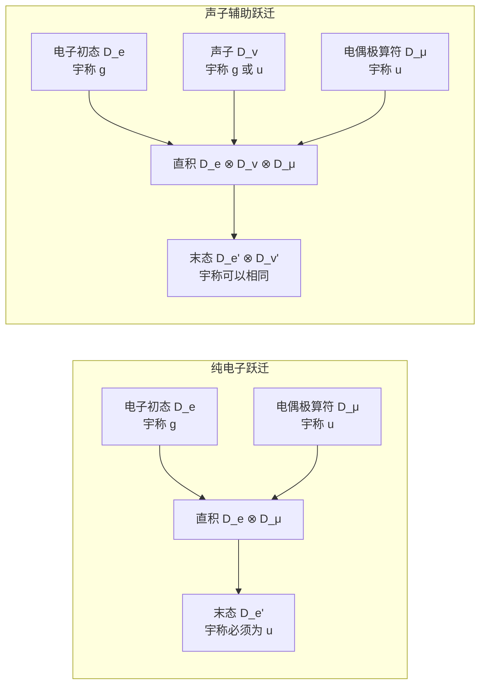
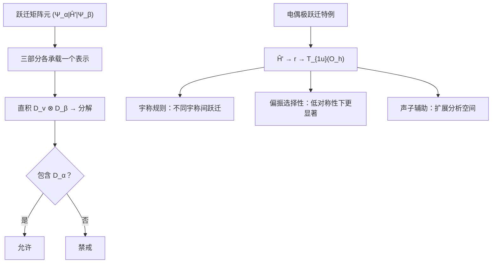

# 4.4 矩阵元定理与选择定则、电偶极跃迁

> [!abstract] 本节核心
> 系统在微扰 $\hat{H}'$ 的作用下，从 $\Psi_\beta$ 跃迁到 $\Psi_\alpha$ 的矩阵元 $(\Psi_\alpha|\hat{H}'|\Psi_\beta)$，它的零或非零完全由三部分（初态、微扰、末态）的对称性决定——**不需要具体计算**。
>
> 判断方法：直积分解。允许还是禁戒，一目了然。

---

## 4.4.1 跃迁矩阵元的"三体问题"

### 三个角色

跃迁矩阵元中涉及三个部分，每部分都承载系统对称群 $G_{H_0}$ 的一个表示：

| 角色 | 符号 | 承载表示 |
|------|------|----------|
| 初态 | $\Psi_\beta$ | $D_\beta$（不可约） |
| 微扰算符 | $\hat{H}'$ | $D_v$（不一定不可约） |
| 末态 | $\Psi_\alpha$ | $D_\alpha$（不可约） |

### 判断方法

$\hat{H}'\Psi_\beta$ 这个乘积函数承载的表示是**直积表示**：

$$
D_v \otimes D_\beta
$$

将其分解为不可约表示直和：

$$
D_v \otimes D_\beta = \bigoplus_i m_i D^{(i)}
$$

然后看 $D_\alpha$ 是否出现在分解结果中：

> [!note] 理论依据
> 定理 4.7（对称化基函数正交性）+ 定理 4.8（哈密顿量保持对称性）+ 直积分解：$\Psi_\alpha$ 与 $\hat{H}'\Psi_\beta$ 的内积只有当它们承载**同一个不可约表示的同一个基方向**时才可能非零。

---

## 4.4.2 微扰对称性的反直觉结论

| 微扰对称性 | $D_v$ | $D_v \otimes D_\beta$ | 能跃迁到的末态 |
|-----------|-------|----------------------|--------------|
| **高**（保持所有 $\hat{H}_0$ 对称性） | 恒等表示 | $D_\beta$ | 只有与 $\Psi_\beta$ 同表示同基的末态 |
| **低**（破坏部分对称性） | 非平凡表示 | 包含大量不可约表示 | 许多不同表示的末态 |

> [!tip] 直觉反了
> 微扰越"粗糙"（对称性越低），反而越**容易**诱导跃迁。因为低对称性的微扰给直积带来了更丰富的分解结果，更多末态可以"够得着"。

---

## 4.4.3 电偶极跃迁

### 电磁场中的微扰

加入电磁场后，哈密顿量为：

$$
\hat{H} = \frac{1}{2m} \left(\hat{p} - \frac{e}{c}A\right)^2 + V(r)
$$

在弱场下，微扰项为：

$$
\hat{H}' = -\frac{e}{mc} \hat{p} \cdot A
$$

### 从动量算符到位置算符

利用量子力学恒等式 $\hat{p} = \frac{im}{\hbar} [\hat{H}, \hat{r}]$：

$$
(\Psi_\alpha | \hat{p} | \Psi_\beta) = \frac{im}{\hbar} (E_\alpha - E_\beta) (\Psi_\alpha | \hat{r} | \Psi_\beta)
$$

能量差 $E_\alpha - E_\beta$ 和 $m/\hbar$ 是常数，不改变对称性分类。因此跃迁矩阵元的对称性完全由 $(\Psi_\alpha | \hat{r} | \Psi_\beta)$ 决定。

> [!important] 核心结论
> 电偶极跃迁（光子吸收/发射）的选择定则等价于研究矩阵元 $(\Psi_\alpha | \boldsymbol{r} | \Psi_\beta)$，其中 $\boldsymbol{r} = (x, y, z)$。
>
> 电偶极算符 $\boldsymbol{\mu} = -e \boldsymbol{r}$ 与 $\boldsymbol{r}$ 差一个常数，对称性相同。

---

## 4.4.4 $O_h$ 例子：完整计算

### 设定

- 系统对称群：$O_h$（立方点群加空间反演）
- 初态 $\Psi_\beta$：$T_{2g}$（$T_2^+$，如 $d_{xy}$ 轨道）
- 电偶极算符 $\boldsymbol{r}$：查表 4.7，$x, y, z$ 承载 $T_{1u}$（$T_1^-$）

### 第一步：计算 $T_{1u} \otimes T_{2g}$ 的特征标

直积表示的特征标 = 两个表示特征标的逐类乘积。

$O_h$ 有 10 个类（$O$ 的 5 个类 $\times$ 有无空间反演）：

| 类 | $E$ | $3C_4^2$ | $6C_4$ | $6C_2'$ | $8C_3$ | $I$ | $3IC_4^2$ | $6IC_4$ | $6IC_2'$ | $8IC_3$ |
|---|-----|----------|--------|---------|--------|-----|-----------|---------|----------|---------|
| $T_{1u}$ | 3 | -1 | 1 | -1 | 0 | -3 | 1 | -1 | 1 | 0 |
| $T_{2g}$ | 3 | -1 | -1 | 1 | 0 | 3 | -1 | -1 | 1 | 0 |
| **直积 $\chi$** | **9** | **1** | **-1** | **-1** | **0** | **-9** | **-1** | **1** | **1** | **0** |

### 第二步：按第二正交定理分解

对每个不可约表示，计算系数：

$$
m_i = \frac{1}{48} \sum_{g \in O_h} \chi_{\text{直积}}(g) \, \chi^{(i)*}(g)
$$

> [!example] $A_{2u}$ 系数的完整计算
> $$
> \begin{aligned}
> m_{A_{2u}} &= \frac{1}{48}[1\cdot9\cdot1 + 3\cdot1\cdot1 + 6(-1)(-1) + 6(-1)(-1) + 8\cdot0\cdot1 \\
> &\qquad + 1(-9)(-1) + 3(-1)(-1) + 6\cdot1\cdot(-1) + 6\cdot1\cdot(-1) + 8\cdot0\cdot(-1)] \\
> &= \dots
> \end{aligned}
> $$

### 分解结果

$$
\boxed{T_{1u} \otimes T_{2g} = A_{2u} \oplus E_u \oplus T_{1u} \oplus T_{2u}}
$$

### 结论

如果初态是 $T_{2g}$，电偶极跃迁允许的末态对称性只能是：

| 允许的末态 | 维数 |
|-----------|------|
| $A_{2u}$ | 1 |
| $E_u$ | 2 |
| $T_{1u}$ | 3 |
| $T_{2u}$ | 3 |

所有其他对称性的末态（如 $A_{1g}$、$T_{1g}$ 等）都是**禁戒**的。

---

## 4.4.5 宇称选择定则

观察上面的分解结果：所有允许的末态都有下标 "$u$"（奇宇称）。

> [!question] 为什么？
> 回到三个部分的宇称：
> - 初态 $T_{2g}$：$g$（偶宇称）
> - 电偶极算符 $T_{1u}$：$u$（奇宇称）
> - $\hat{H}'\Psi_\beta$ 的宇称：$g \otimes u = u$（奇宇称）
> - 末态要与偶宇称的初态内积非零 → 末态宇称必须是 **$u$**（奇宇称）

> [!warning] 电偶极跃迁的宇称规则
> $$
> \boxed{\text{电偶极跃迁只能发生在不同宇称的态之间}}
> $$
>
> - $g \leftrightarrow u$：允许
> - $g \leftrightarrow g$：禁戒
> - $u \leftrightarrow u$：禁戒
>
> 这个规则只在有中心反演对称性的体系中严格成立。

---

## 4.4.6 偏振方向的选择性

### $O_h$：无偏振选择性

在立方对称中，$x$、$y$、$z$ 三个轴等价，都承载 $T_{1u}$。所以不管光沿哪个方向偏振，电偶极算符的对称性分类相同——选择定则也相同，没有偏振依赖性。

### $D_{4h}$：有偏振选择性

当对称性从 $O_h$ 降低到 $D_{4h}$（四方系），$x$、$y$ 与 $z$ 不再等价。

查 $D_{4h}$ 特征标表（表 4.8）：

| 函数 | 表示 |
|------|------|
| $z$ | $A_{2u}$（一维） |
| $(x, y)$ | $E_u$（二维） |

> [!example] 偏振方向不同 → 允许的末态不同
> 对于**同一初态**：
>
> **偏振光沿 $z$ 方向**：
> - 电偶极算符承载 $A_{2u}$
> - 直积：$A_{2u} \otimes D_\beta$
> - 分解结果给出 $z$ 偏振允许的末态集合
>
> **偏振光在 $x$-$y$ 平面**：
> - 电偶极算符承载 $E_u$
> - 直积：$E_u \otimes D_\beta$
> - 分解结果给出 $x$-$y$ 偏振允许的末态集合
>
> 两个集合不同。这就是**偏振诱发的选择性吸收**。

实验中改变入射光偏振方向，如果吸收谱线发生变化，说明晶体的对称性低于立方。

---

## 4.4.7 更复杂的情况：声子辅助跃迁

前面的讨论隐含了一个假设：波函数只依赖于电子坐标 $\boldsymbol{r}$，跃迁发生在纯电子态之间。

但在实际系统中，常常观测到**宇称相同**的电子态之间有电偶极跃迁。这不是对称性分析出了错——而是跃迁过程中**有声子参与**。

### 电子-声子耦合态

实际初末态是电子部分和声子部分的乘积：

$$
\Psi_{\text{初}} = \Psi_{\text{e}} \Psi_{\text{v}}, \qquad \Psi_{\text{末}} = \Psi_{\text{e}}' \Psi_{\text{v}}'
$$

跃迁矩阵元变为：

$$
(\Psi_{\text{e}}' \Psi_{\text{v}}' | \mu | \Psi_{\text{e}} \Psi_{\text{v}})
$$

### 对称性分析的扩展

此时需要三个表示的直积分解：

$$
D_{\text{e}} \otimes D_{\text{v}} \otimes D_\mu
$$

看是否包含 $D_{\text{e}}' \otimes D_{\text{v}}'$。

声子携带特定的对称性（由它在晶格中的振动模式决定），它可以"补偿"电子部分宇称的不匹配——让本来纯电子禁戒的跃迁通过声子辅助变为允许。

> [!info] 对称性的语言依然适用，只是复杂了一些
> 不是对称性分析失效了，而是你考虑的 Hilbert 空间需要扩大——从纯电子空间扩展到电子-声子耦合空间。

---

## 4.4.8 选择定则速查表

### 电偶极跃迁（含宇称）

| 体系 | 对称性 | 初态 → 末态 | 判断标准 |
|------|--------|------------|----------|
| 有中心反演 | $O_h$ | 纯电子 | $g \leftrightarrow u$，且 $D_\mu \otimes D_\beta \ni D_\alpha$ |
| 无中心反演 | 任意 | 纯电子 | $D_\mu \otimes D_\beta \ni D_\alpha$（宇称无约束） |
| 有声子 | $O_h$ | 电子-声子耦合 | $D_\mu \otimes D_{\text{e}} \otimes D_{\text{v}} \ni D_{\text{e}}' \otimes D_{\text{v}}'$ |

---

## 4.4.9 本节总结

核心思想只有一句话：

> **跃迁矩阵元是否为零，完全由 $\mathbf{D_v \otimes D_\beta}$ 的分解是否包含 $\mathbf{D_\alpha}$ 决定。**

这个判断不依赖任何具体数值计算，只依赖对称性的分类——这是群论在量子力学中最有力的应用之一。

---

## 参考

- [[4.1 哈密顿算符群与相关定理]]
- [[4.2 微扰引起的能级劈裂]]
- [[4.3 投影算符与久期行列式的对角化]]
