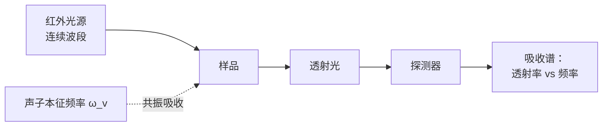
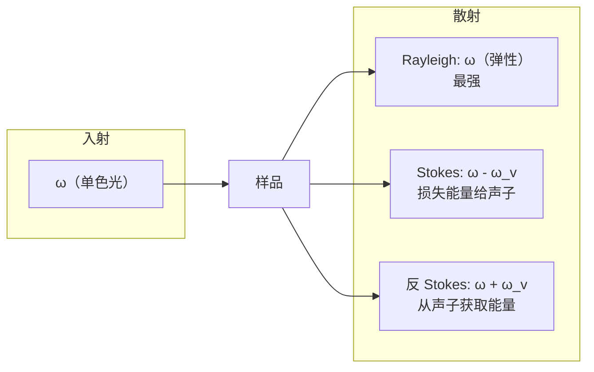
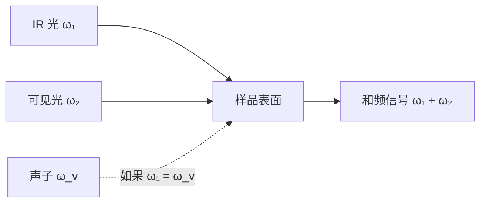
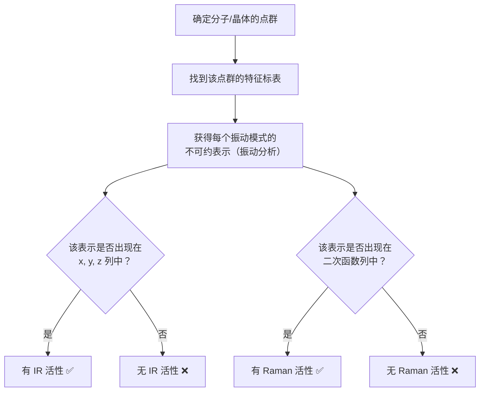

# 4.5 红外谱、Raman 谱、和频光谱

> [!abstract] 本节核心
> 前几节的选择定则理论（4.4）在三种实验光谱上的直接应用。不引入新定理，只是把旧工具用到新问题上。
>
> 核心方法：找出微扰涉及的物理量 → 确定它在对称操作下的变换性质 → 对照特征标表 → 判断活性。

## 三种光谱概览

| 光谱 | 阶数 | 物理过程 | 微扰涉及的张量 | 变换性质 |
|------|------|----------|---------------|----------|
| **IR**（红外） | 一阶 | 声子直接吸收光子 | 电偶极矩 $\mu$（一阶） | 与 $x,y,z$ 相同 |
| **Raman**（拉曼） | 二阶 | 光被声子非弹性散射 | 极化率张量 $\overline{\alpha}$（二阶） | 与 $x^2,y^2,z^2,xy,yz,xz$ 相同 |
| **SFG**（和频） | 三阶 | IR 吸收 + Raman 散射同时发生 | 两者都需要 | 两者都需要 |

三种光谱的阶数递进：一阶（IR）→ 二阶（Raman）→ 三阶（SFG），阶数越高，涉及的张量阶数越高，对称性要求也越丰富。

---

## 4.5.1 红外谱

### 物理过程



向样品打入连续波段的红外光。在某个频率 $\omega$ 上，如果分子/晶格有一个本征振动频率 $\omega_v = \omega$，光子能量被声子吸收，透射光强下降。把有样品和无样品的透射谱做差，得到红外吸收谱。

### 微扰与跃迁矩阵元

振动引起样品的电偶极矩变化 $\mu$（感生偶极矩），与光电场 $E$ 耦合：

$$
\hat{H}' = -E \cdot \mu
$$

跃迁矩阵元：

$$
(\Psi_v' | \hat{H}' | \Psi_v)
$$

其中：
- $\Psi_v$：振动基态（恒等表示 $A_1$）
- $\Psi_v'$：末态振动态
- $\mu$：电偶极矩变化，在对称操作下的变换与 **一次函数 $(x, y, z)$** 完全相同

### 选择定则

因为 $\Psi_v$ 是恒等表示，$D_v \otimes D_{\Psi} = D_{\mu}$，所以：

> [!important] 红外活性条件
> **一个本征振动具有红外活性，当且仅当它承载的不可约表示与 $x$、$y$ 或 $z$ 中至少一个属于同一个不可约表示。**

**操作为：翻到特征标表，看右侧 "$x,y,z$" 列，振动模式的那个表示一旦出现在这一列中，就有红外活性。**

---

## 4.5.2 Raman 谱

### 物理过程

Raman 谱不是吸收谱，是**散射谱**。一束单色光打到样品上，发生三种散射：



| 散射类型 | 频率 | 条件 | 强度 |
|----------|------|------|------|
| Rayleigh（弹性） | $\omega$ | 始终有 | 最强 |
| Stokes（非弹性） | $\omega - \omega_v$ | 声子被激发 | 较强 |
| 反 Stokes（非弹性） | $\omega + \omega_v$ | 声子已处于激发态 | 弱（低温下极弱） |

### 与 IR 的本质区别

| | IR | Raman |
|--|----|-------|
| 过程 | 吸收 | 散射 |
| 阶数 | 一阶 | 二阶 |
| 耦合方式 | 电偶极矩 $\mu$ **直接**与光场耦合 | 光通过**极化率张量** $\overline{\alpha}$ 间接与声子耦合 |
| 张量阶数 | 一阶（向量） | 二阶（$3\times3$ 张量） |
| 变换性质 | $x,y,z$ | $x^2,y^2,z^2,xy,yz,xz$ |
| 有中心反演时的宇称 | $u$（奇） | $g$（偶） |

### Raman 的物理推导

入射光 $E_i \cos(\omega t)$ 通过极化率张量 $\overline{\alpha}$ 诱发感生偶极矩：

$$
\mu = \overline{\alpha} \cdot E_i \cos(\omega t)
$$

极化率随原子核振动而变化：

$$
\overline{\alpha} = \overline{\alpha}_0 + \Delta\overline{\alpha}_0 \cos(\omega_v t)
$$

代入展开：

$$
\mu = \overline{\alpha}_0 E_i \cos(\omega t) + \frac{\Delta\overline{\alpha}_0}{2} [\cos(\omega - \omega_v)t + \cos(\omega + \omega_v)t] \cdot E_i
$$

| 项 | 频率 | 对应过程 |
|----|------|----------|
| $\overline{\alpha}_0 E_i \cos(\omega t)$ | $\omega$ | Rayleigh 散射 |
| $\frac{\Delta\overline{\alpha}_0}{2} \cos(\omega - \omega_v)t$ | $\omega - \omega_v$ | Stokes |
| $\frac{\Delta\overline{\alpha}_0}{2} \cos(\omega + \omega_v)t$ | $\omega + \omega_v$ | 反 Stokes |

### Raman 活性的对称性判断

微扰项为 $-\left[\frac{\Delta\overline{\alpha}_0}{2}\right] \cdot E_i \cdot E_s$，$E_i$ 和 $E_s$ 是外场。关键在 $\Delta\overline{\alpha}_0$——**二阶张量**，变换性质与**二次齐次函数 $x^2, y^2, z^2, xy, yz, xz$** 相同。

> [!important] Raman 活性条件
> **一个本征振动具有 Raman 活性，当且仅当它承载的不可约表示与 $x^2, y^2, z^2, xy, yz, xz$ 中至少一个属于同一个不可约表示。**

**操作为：翻到特征标表，看最右侧 "$x^2, y^2, z^2, xy, yz, xz$" 列，振动模式的那个表示一旦出现在这一列中，就有 Raman 活性。**

---

## 4.5.3 IR 与 Raman 的互补性

### 有中心反演对称性的体系

> [!quote] 互补规则
> 在具有中心反演对称性的体系中，IR 活性与 Raman 活性**互相排斥**。一个振动模式**不可能**同时具有 IR 和 Raman 活性。

**原因**：宇称分析

| 光谱 | 微扰的宇称 | 基态宇称 | 末态必需宇称 |
|------|-----------|---------|-------------|
| IR | $u$（$x$ 是奇函数） | $g$（$A_g$） | $u$ |
| Raman | $g$（$x^2$ 是偶函数） | $g$（$A_g$） | $g$ |

IR 活性的振动必须有 $u$ 宇称，Raman 活性的必须有 $g$ 宇称。一个振动模式不可能同时有 $u$ 和 $g$ 两种宇称 → 互补。

### 无中心反演对称性的体系

此时宇称不再是好量子数，一个振动模式**可以同时**具有 IR 和 Raman 活性。

> [!tip] 实验意义
> 如果在 IR 谱和 Raman 谱的同一位置都看到峰，说明该分子/晶体**很可能没有中心反演对称性**。这是判断对称性的一个实验判据。

---

## 4.5.4 完整例子：$C_{2h}$ 群

$C_{2h}$ 特征标表：

| 表示 | $E$ | $C_2$ | $\sigma_h$ | $I$ | 一次函数 | 二次函数 |
|------|-----|-------|------------|-----|---------|---------|
| $A_g$ | 1 | 1 | 1 | 1 | $R_z$ | $x^2,y^2,z^2,xy$ |
| $A_u$ | 1 | 1 | -1 | -1 | **$z$** | |
| $B_g$ | 1 | -1 | -1 | 1 | $R_x,R_y$ | **$xz,yz$** |
| $B_u$ | 1 | -1 | 1 | -1 | **$x,y$** | |

判断：

| 表示 | 在 $x,y,z$ 列？ | 在二次函数列？ | IR 活性 | Raman 活性 |
|------|----------------|---------------|---------|-----------|
| $A_g$ | ❌ | ✅ $x^2,y^2,z^2,xy$ | ❌ | ✅ |
| $A_u$ | ✅ $z$ | ❌ | ✅ | ❌ |
| $B_g$ | ❌ | ✅ $xz,yz$ | ❌ | ✅ |
| $B_u$ | ✅ $x,y$ | ❌ | ✅ | ❌ |

> [!example]
> - 沿 $z$ 方向偏振的红外光 → 激发 $A_u$ 振动
> - 沿 $x$ 或 $y$ 方向偏振的红外光 → 激发 $B_u$ 振动
> - Raman 谱 → 只激发 $A_g$ 和 $B_g$ 振动
> - IR 与 Raman **完全互补**，没有重叠

### 例子：$O_h$ 群（立方）

| 表示 | IR 活性 | Raman 活性 |
|------|---------|-----------|
| $T_{1u}$ | ✅ $x,y,z$ | ❌ |
| $E_g$ | ❌ | ✅ $x^2-y^2, 2z^2-x^2-y^2$ |
| $T_{2g}$ | ❌ | ✅ $xy,yz,zx$ |

$O_h$ 下 IR 和 Raman 活性也完全互补。

### 例子：$C_{3v}$ 群

$C_{3v}$ 没有中心反演对称性：

| 表示 | $x,y,z$ 列 | 二次函数列 | IR | Raman |
|------|-----------|-----------|----|-------|
| $A_1$ | $z$ | $x^2+y^2,z^2$ | ✅ | ✅ |
| $A_2$ | $R_z$ | — | ❌ | ❌ |
| $E$ | $(x,y)$ | $(x^2-y^2,xy)$, $(xz,yz)$ | ✅ | ✅ |

$C_{3v}$ 下 $A_1$ 和 $E$ 模式**可以**同时具有 IR 和 Raman 活性。

---

## 4.5.5 和频光谱（SFG）

### 基本过程

和频光谱（Sum Frequency Generation, SFG）是一个**三阶非线性光学过程**，结合了 IR 吸收和 Raman 散射：



1. IR 光（$\omega_1$）激发声子
2. 可见光（$\omega_2$）同时被这个声子调制（Raman 过程）
3. 产生和频信号（$\omega_1 + \omega_2$）

### 选择定则

> [!important] SFG 活性条件
> **一个振动模式具有 SFG 活性，当且仅当它同时具有 IR 活性和 Raman 活性。**

即 $D_\nu$ 必须同时出现在 $x,y,z$ 列 **和** 二次函数列中。

### 为什么 SFG 对表面敏感

这是 SFG 最重要的实验特征。

**在液体内部**（有中心反演对称性）：
- IR 和 Raman 互补 → 没有振动能同时满足两者 → **SFG 信号极弱**

**在液体表面**（中心反演被自发破缺）：
- 表面一侧是液体，另一侧是空气 → 左右不对称 → 中心反演对称性破坏
- IR 和 Raman 不再互补 → 一些振动可以同时具有两种活性 → **SFG 信号强**

> [!tip] SFG 的价值
> 和频光谱是为数不多的**对表面具有本征敏感性的光谱技术**。你测到的信号几乎全部来自表面，本体（bulk）几乎没有贡献，不需要任何背景扣除。

---

## 4.5.6 实操流程：如何判断一个分子/晶体的振动活性



### 振动分析的步骤

要得到每个振动模式的不可约表示，需要做完整的振动分析：

1. **确定点群**（分子的几何对称性）
2. **将所有 $3N$ 个原子的坐标作为基**，构建表示，求特征标
3. **分解为不可约表示的直和**（用第二正交定理）
4. **减去平动和转动**：
   - 平动：变换与 $x,y,z$ 相同（查表 $x,y,z$ 列）
   - 转动：变换与 $R_x,R_y,R_z$ 相同（查表 $R_x,R_y,R_z$ 列）
   - 剩余 $3N-6$（或 $3N-5$ 线型分子）个自由度即**振动模式**
5. **用特征标表判断活性**

---

## 4.5.7 完整例子：H₂O（水分子）

### ① 点群

H₂O 是 V 形分子 → $C_{2v}$

```
C₂v   | E | C₂ | σv(xz) | σv'(yz) |          |          |
------|---|---|--------|---------|----------|----------|
A₁    | 1 | 1 |   1    |    1    | z        | x², y², z²
A₂    | 1 | 1 |  -1    |   -1    | Rz       | xy
B₁    | 1 | -1|   1    |   -1    | x, Ry    | xz
B₂    | 1 | -1|  -1    |    1    | y, Rx    | yz
```

### ② 振动分析

H₂O 有 $N=3$ 个原子，共 $3N=9$ 个自由度。

经过标准振动分析（用投影算符或特征标法），结果如下：

| 类型 | 对称性 |
|------|--------|
| 平动（3 个） | $A_1(z) + B_1(x) + B_2(y)$ |
| 转动（3 个） | $A_2(R_z) + B_1(R_y) + B_2(R_x)$ |

剩下的三个振动模式：

| 模式 | 名称 | 表示 | 描述 |
|------|------|------|------|
| $\tilde{\nu}_1$ | 对称伸缩 | $A_1$ | 两个 O-H 键同时伸缩 |
| $\tilde{\nu}_2$ | 弯曲 | $A_1$ | H-O-H 角变化 |
| $\tilde{\nu}_3$ | 反对称伸缩 | $B_2$ | 一个 O-H 伸长，另一个缩短 |

### ③ 活性判断

| 模式 | 表示 | 在 $x,y,z$ 列？ | 活性判断 IR | 在二次函数列？ | 活性判断 Raman |
|------|------|----------------|------------|--------------|--------------|
| $\tilde{\nu}_1$ | $A_1$ | $z$ ✅ | **活性** | $x^2,y^2,z^2$ ✅ | **活性** |
| $\tilde{\nu}_2$ | $A_1$ | $z$ ✅ | **活性** | $x^2,y^2,z^2$ ✅ | **活性** |
| $\tilde{\nu}_3$ | $B_2$ | $y$ ✅ | **活性** | $yz$ ✅ | **活性** |

H₂O 的三种振动模式同时具有 IR 和 Raman 活性。因为 $C_{2v}$ **没有中心反演对称性**，互补规则不适用。

---

## 4.5.8 对称性分析方法的边界

> [!warning] 四个重要的注意事项

### ① 外场均匀性假设

前面推导假设 $E_i$、$E_s$ 在声子波函数的空间范围内为常数。当这个假设不成立时——比如 **TERS（针尖增强 Raman 散射）**——选择定则可能被突破，一些原本禁戒的模式变得可见。

这不是对称性分析出错了，而是**前提变了**。如果引入场的空间变化，对称性分析仍然适用，但需要把场的空间分布也纳入表示分析。

### ② 声子辅助跃迁

4.4 节提到过：纯电子跃迁中宇称禁戒的跃迁，在声子辅助下可以变为允许。类似地，某些振动模式在纯振动光谱学中禁戒，在电子-振动耦合光谱中可能可见。

### ③ 局域对称性与整体对称性不同

TERS 中针尖下的局域场对称性可能与晶体的整体对称性不同——选择定则应以**局域对称性**为准。

### ④ 共振增强

Raman 信号可能因为入射光频率接近电子跃迁而大幅增强（共振 Raman）。此时选择定则可能需要考虑中间电子态的对称性。

---

## 4.5.9 IR vs Raman vs SFG 速查表

| 项目 | IR | Raman | SFG |
|------|----|-------|-----|
| 阶数 | 一阶 | 二阶 | 三阶 |
| 信号 | 吸收 | 散射 | 和频产生 |
| 变换性质 | $x,y,z$ | $x^2,y^2,z^2,xy,yz,xz$ | 同时需要两者 |
| 判断依据 | 特征标表 $x,y,z$ 列 | 特征标表二次函数列 | IR ∩ Raman ≠ ∅ |
| 有中心反演时 | $u$ 宇称 | $g$ 宇称 | 互补 → 弱 |
| 无中心反演时 | 无宇称限制 | 无宇称限制 | 可重叠 → 强 |
| 表面敏感性 | 无（体相） | 无（体相） | **有（表面）** |

---

## 参考

- [[4.4 矩阵元定理与选择定则、电偶极跃迁]]
- 习题 7：某晶体 IR 和 Raman 谱都有明显的振动峰 → 可排除哪些点群？
