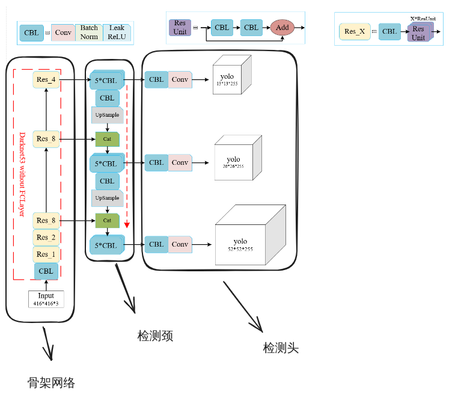

# 1. 神经网络是如何学习的？什么是梯度下降法？

- 神经网络基于 **前向传播 (Forward Propagation)** 对输入的数据进行推理，通过 **反向传播 (Backward Propagation)** 对参数进行更新。其中，在推理和更新参数的时候用到 **Computation Graph** ，便于计算。而更新参数最重要的就是 **梯度下降 (Gradient Descent)** 。我们不断地输入数据，推理结果，并将推理得到的结果 (prediction) 与预设的结果 (label) 相比较，并计算他们之间的 **损失 (loss)** ，企图寻找一些参数使得预测与预设的损失最小，这样就相当于神经网络 “学习” 到了我们想要的东西。
- 梯度下降是用于计算各个参数该如何(往哪个方向)变化的算法。他通过计算 **损失函数 (Loss Function)** $L (x, y)$ 对各个参数的偏导数，得到梯度的方向，并结合学习率使得参数沿梯度反方向进行变化，直到达到极小值点，这样就能找到使得损失函数最小的参数的值。以参数 $w$ 为例子，其梯度下降的公式为：
  $$w = w - \alpha \dfrac{\partial L}{\partial w}$$
  其中， $\alpha$ 为学习率，用于调控参数的变化速率

# 2. 简述BP神经网络基本原理。

BP神经网络就是方向传播神经网络，是一种最简单的神经网络。其参数通过梯度下降来计算，通过方向传播来更新。

# 3. 简述卷积神经网络基本原理。

**卷积神经网络 (CNN)** 是一种用于图像处理的神经网络，其网络结构主要分为 **卷积层 (Convolutional Layer)** 和 **全连接层 (Fully Connected Layer)** 。在卷积层，我们通常使用 **卷积核 (filter)** 来提取图像特征， **激活函数** 来计算 activations， **池化层 (Pooling Layer)** 来压缩样本特征信息量，进一步提取特征。等我们认为特征提取完成之后，将卷积得到的结果展开接入全连接层，也就是接入一个普通的神经网络，通过这些展开的结果来预测我们的图像。 CNN 网络一般用于预测图像类别，因此，其全连接层最后得到的是一组类别的概率，我们通常选用 CrossEntropy 作为其损失函数。

# 4. 简述循环神经网络基本原理。

**循环神经网络 (RNN)** 是一种用于处理 **序列数据** 的神经网络。卷积神经网络是一种前向传播 (Feed Forward) 网络，其每一层的结果，每一个输入之间都互不干涉，每一个节点的权重 (weights) 都是不同的，而在 RNN 中，每一次的结果都会与新的输入一起参与到下一次的计算，拥有一种记忆能力，能够记住已经传入的数据，能够通过将数据循环输入 (recurrent) 来获取最终的结果。与 CNN 不同的一点，还在于 RNN 的参数是参与到所有网络层的计算的，每一层网络(准确来说应该是每一个 Hidden State)之间都共享相同的参数。而对于 RNN 的参数更新，使用的是 **BPTT (Backward Propagation Through Time)** ，字面上理解就是根据时间来确定反向传播的途径。 CNN 的反向传播是根据层与层之间的连接情况来确定的，而 RNN 则是通过输入数据不同的顺序来确定的。在梯度的计算上上， RNN 的计算也与 CNN 不同。由于 RNN 的每一个 Hidden State 共享同样的参数，而每一个 Hidden State 又与之前的数据及新输入的数据有关，因此其损失函数的梯度应该将每一个 Hidden State 都关联起来。

# 5. 简述Transformer的基本原理。

Transformer 是一种完全基于 **注意力机制 (Attention)** 构建的用于处理关联性很大的数据的神经网络结构 ，最主要的就是自然语言处理。Transformer基本由 Encoder 和 Decoder 组成。其中，Encoder用于处理输入的数据，Decoder用于根据Encoder的结果预测输出，其中，注意力机制是核心。Transformer先将所有可用词汇投影在一个高维空间中，每个向量代表一个单词，这个过程称为 **Embeding** 。在得到了每个单词对应的向量之后，我们就可以对这些数据进行处理了。

首先是输入数据，我们将数据输入到Encoder之前，需要先将输入的文本与提前设计好的向量关联起来，并编码每个 token 的位置 (Transformer 将每一个数据元称为一个token，对于文本来说，一个token可以认为就是一个单词)，这一步称为 Positional Encoding。

在获得这些数据的基本信息后，我们就需要处理各个tokens之间的关联。文本中的单词并非独立的，而是与其他单词相关联，同一个单词在不同的语境下拥有不同的含义。因此，我们需要将这些关系通过数据表达出来，这一过程用到注意力机制。Transformer先将每个代表一个token的向量 $E_i$ 用一个查询矩阵 $W_Q$ 与之相乘，得到一个较低维度的向量 $Q_i$ ，这个向量代表了 $E_i$ 与其他 $E_i$ 之间的可能存在的关系，每个 $E_i$ 应该注意其他哪些 $E_i$ 。接着，再把 $E_i$ 与一个键矩阵 $W_K$ 相乘，得到一个向量 $K_i$ ，这个向量包含了每个 $E_i$ 与其他 $E_i$ 之间的关系。 $Q_i$ 与 $K_i$ 的点乘反映了两个 $E_i$ 之间的关联性的大小，我们通过这种方式确定了文本中的token应该关注其他哪些tokens。换句话说， $Q_i$ 告诉模型当前token应该去注意什么，而 $K_i$ 则是告诉模型当前的token对其他tokens的重要性，回答了 $Q_i$ 的问题。确定了关联性之后，我们就可以通过一个值矩阵 $W_V$ 与 $E_i$ 相乘，得到一个新的向量 $V_i$ ，是用于更新前面的 Embeding过程中一个token的编码向量的向量，使得新的向量 $E_i'$ 更符合当前语境。

简单来说，通过注意力机制，我们能够让模型认识到不同token之间的关联，并将token编码成更符合当前语境的一个向量，即带有语义的数据。

获取了带有语义的数据之后，我们的工作就完成了大半，接下来计算残差，将数据归一化，并沿着网络前向传播就完事了。

而 Decoder 对于数据的处理也是同样的道理，只不过由于 Decoder 既用于处理输出的数据，又用于预测结果，输出新数据，会使用多层的注意力机制，并且这些注意力机制还与 Encoder 有些许不同。其中第一层使用 Mask 将 "未来" 的位置遮掩住，防止未知对结果产生影响 (模型的输出结果可以很长，但是需要一个token一个token的输出，这个时候就要将输出结果中还未预测到的位置屏蔽掉)。而第二层的 $K$ 与 $V$ 则是使用了 Encoder 的输出结果， $Q$ 采用 Decoder 前一层注意力机制的结果。这样就将我们的输入与模型的输出关联起来。

在得到这些含有语义的数据之后，就仍然对数据计算残差，归一化，前向传播，与普通神经网络一样，最后计算每一个预测的概率。

综上所述， Transformer 的重点就是通过 **注意力机制** 将上下文都关联起来，然后再对这些含有语义的数据在神经网络中传播，计算结果。与 RNN 不同的是， RNN 的每一个输入是按照时间顺序的，只能通过向前查找数据之间的关联性，而且只能一个一个递归向前，并且记忆时间不长，而 Transformer 则能够做到将任意 tokens 关联起来。

# 6. YOLO算法是怎么实现目标检测的，以yolov1为例？

YoloV1 先将图像分割成不同的 grid cell，并让每个 grid cell 负责预测其位置上的物体的类别与bbox的信息。在所有bbox都预测完成之后，通过 NMS (非极大值抑制) 剔除重复的bbox，最后得到的就是我们要的结果。(好像说得有点简单，不过好像也就这样了) 。

# 7. 什么是BN层？

BN层就是 BatchNormalization，用于将一批数据标准化，使数据整体的方差为1，均值为0。经过BN层之后的数据分布会更加明确，使得后续的计算更加简单，提高神经网络的训练速度，同时也能提高神经网络的精度。

# 8. 什么是FPN结构？

FPN (Feature Pyramid Network) 是一个用于处理图像特征的结构。在目标识别中，大物体和小物体的识别难度不一样。随着网络深度的增加，小物体的特征容易被忽略，FPN结构就是为了解决小物体识别而产生的。该结构利用不同深度的特征图来提取图片的语义，上层用于大物体的提取，下层用于小物体的提取。

首先是正常的CNN网络传播，获得图像金字塔，然后从将最高层的图像开始上采样，得到一系列特征金字塔，然后将原本的图像金字塔通过1x1卷积核调整通道后和特征金字塔结合，利用结合后的图像输出预测。

# 9. 参考YOLOv3的结构图，解释什么是骨干网络、检测颈和检测头

YoloV3的骨干网络为Draknet-53，用于提取图像的主要特征，其检测颈参考了 FPN 结构通过对图像进行上采样，实现对小物体的检测，最后在不同层次的图像样本上通过卷积层直接预测结果。

# 10. 用pytorch自己搭建一个神经网络，实现简单的物品分类（提供数据集）。

用于提交任务的仓库为 [25-vision-zwq](https://gitee.com/blake-john/25-vision-zwq) 