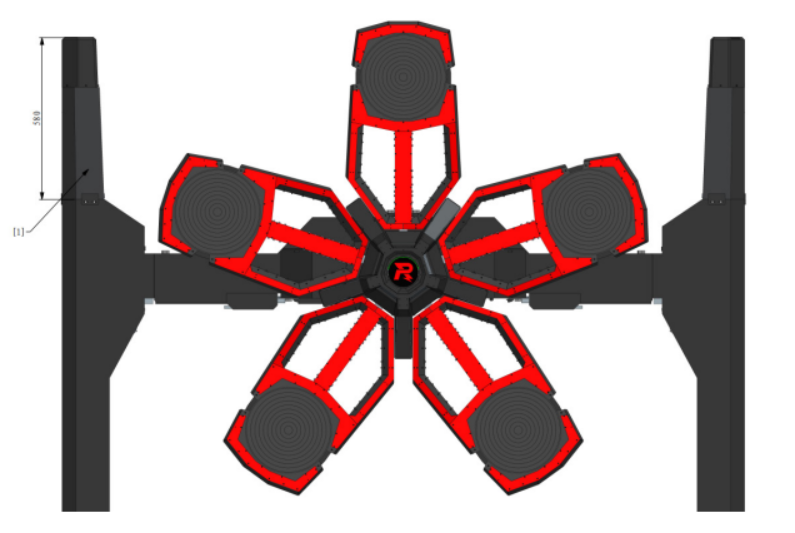
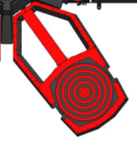
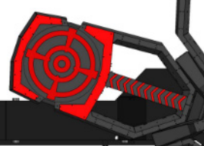
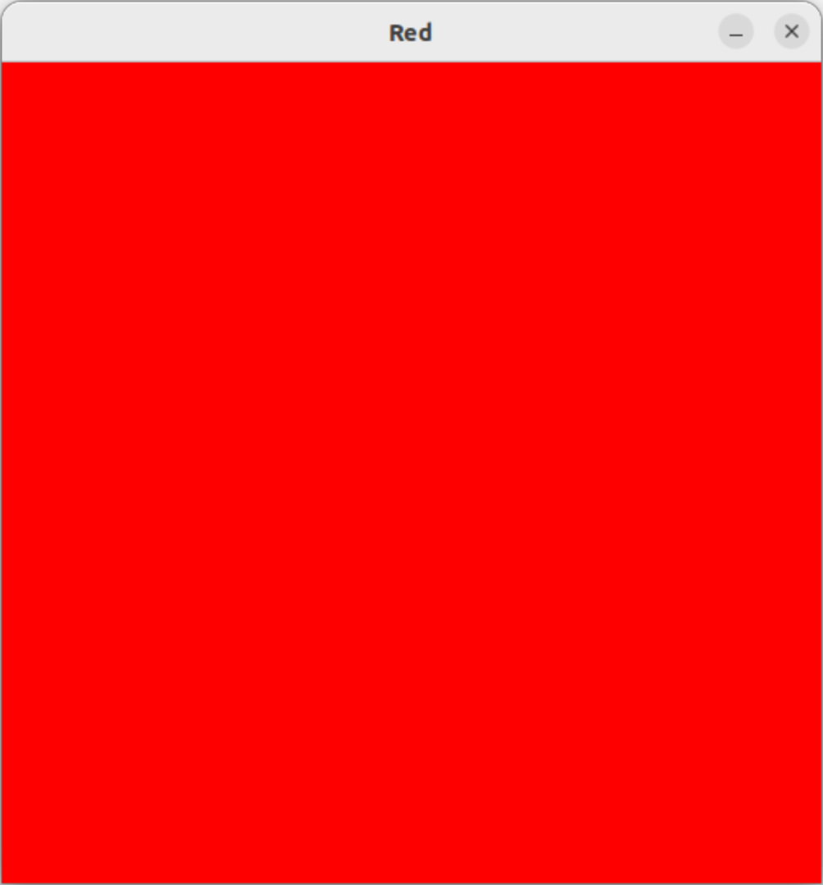

# RM

###### 1. 前哨站是什么？基地是什么？基地护甲展开是什么意思？什么情况下基地护甲会展开？怎么判定胜利？

- 前哨站位于前哨站底座上，靠近公路飞坡，由 **前哨站主体** ， **装甲模块** ， **飞镖检测模块** 组成

- 基地是双方攻防的核心，位于启动区中央的基地底座上。基地由 **基地主体** ， **装甲模块** ， **飞镖检测模块** ， **基地护甲等组成** 。基地的形态包括 : **护甲闭合** 和 **护甲展开** 

- 基地护甲展开指的是包围在基地外围的护甲打开，露出里面的基地本体。

- 在前哨站被击毁的情况下，出现以下情况会导致基地护甲展开 : 
	- 从哨兵机器人离开巡逻区开始计时，若计时超过特定时间
	- 哨兵机器人未上场
	- 哨兵机器人被罚下
	- 哨兵机器人首次死亡

- 胜利的判定方式比较复杂 : 
	1. 一局比赛时间耗尽或一方 **基地被击毁**时，基地剩余血量高的一方获胜。
	2. 一局比赛时间耗尽时，若双方基地剩余血量一致，**前哨站剩余血量高**的一方获胜。 
	3. 一局比赛时间耗尽时，若双方基地剩余血量一致，前哨站均被击毁，**哨兵机器人可战亡次数多的一方** 获胜。 
	4. 一局比赛时间耗尽时，若双方基地剩余血量一致，前哨站均被击毁，哨兵机器人可战亡次数一致，**哨兵当前血量高** 的一方获胜 
	5. 一局比赛时间耗尽时，若双方基地剩余血量一致、前哨站均被击毁，哨兵机器人可战亡次数和剩余血量一致，全队**攻击伤害高**的一方获胜。 
	6. 一局比赛时间耗尽时，若双方基地剩余血量一致、前哨站均被击毁、哨兵机器人可战亡次数和剩余血 量一致、全队攻击伤害一致，全队 **机器人总剩余血量高** 的一方获胜。
	7. 一局比赛时间耗尽时，若双方基地剩余血量一致、前哨站均未被击毁且剩余血量一致，**全队攻击伤害高** 的一方获胜。 
	8. 一局比赛时间耗尽时，若双方基地剩余血量一致、前哨站均未被击毁且剩余血量一致、全队攻击伤害 一致，全队 **机器人总剩余血量高** 的一方获胜。 
	9. 若上述条件无法判定胜负，该局比赛视为平局。在 BO3 和 BO5 的对局中，出现平局则立即加赛一局， 直至分出胜负。

###### 2. 一般队伍会以哪些方式推前哨站？一般队伍会以哪些方式推基地？

- 推进前哨站
	- 通过无人机硬推
	- 英雄机器人远程消耗
	- 哨兵机器人借助无敌时间直接强推
	- 飞镖远距离打击
- 推进基地
	- 最好用的就是有大符加持的飞镖，无敌
	- 英雄机器人吊射也很合适
	- 取得大优的情况下直接全体围攻

###### 3. 英雄的主要任务是什么？

- 远距离火力压制
- 吊射前哨站和基地

###### 4. 英雄发射的弹丸与步兵发射的弹丸有什么不同？英雄和步兵发射弹丸最高射速分别是多少？

- 英雄发射的弹丸为 **42mm** 超大口径弹丸，而步兵发射的是 **17mm** 小口径弹丸。
- 英雄的最高射速为 **16m/s** , 步兵的最高为 **30m/s** 

###### 5. 步兵有哪些主要工作？步兵有哪两种类型？小陀螺是什么意思？

- 步兵的主要工作有击毁敌方机器人，协助推进前哨站、基地，占领飞坡区域， **激活神符** 
- 步兵有 **常规步兵机器人** 以及 **平衡步兵机器人** 
- 小陀螺是指让机器人的底盘旋转的同时保持云台的稳定，用于 **干扰敌方机器人的视觉算法**， **规避子弹** 

###### 6. 2024赛季的能量机关长什么样子？已激活的扇叶长什么样子？待激活的扇叶长什么样子？

- 能量机关 : 
	
- 已激活的扇叶 : 
	
- 待激活扇叶 : 
	

###### 7. 能量机关有哪两种模式？有什么不同？大能量机关怎么获得更高的增益效果？

- 能量机关分大小
- 大小能量机关的区别主要在于旋转速度的不同和激活状态不同
	- 小能量机关的转速固定为 $\dfrac{1}{3 \pi}\ rad/s$ 
	- 大能量机关的转速为 $w_{rot} = A\sin{wt} + b\ (rad/s)$ 
- 要通过大能量机关获得更高的增益效果，重点是 **尽可能多地命中更高的环数，意味着命中的精确性要高** 

###### 8. 工程的主要任务是什么？矿石有哪两种？

- 工程的主要任务是收集矿石，兑换金币
- 矿石分为白银矿石和黄金矿石，分别位于环形高地下方以及神符下的资源区

###### 9. 哨兵跟步兵有什么不同？哨兵启动区在哪里？

- 哨兵是全自动的，没有操作手，且一级就有着很高的血量和热量上限，可以发射的子弹也多。最重要的是，在前哨站未被击毁前，哨兵是无敌的
- 哨兵的启动区位于基地前的哨兵区域

###### 10. 无人机跟步兵有什么不同？无人机停机坪在哪里？

- 无人机属于空中活力支援，没有热量上限，一次支援可发射500发子弹，且不会受到敌方机器人的干扰
- 无人机的停机坪位于基地区域

###### 11. 飞镖是什么？一局比赛（7分钟）最多能发射几发飞镖？

- 飞镖是一个超远距离打击系统，**伤害高**，但是一局比赛 **最多能发射4发飞镖** ，类似导弹

###### 12. 雷达的主要任务是什么？雷达站在哪里？

- 雷达可以自主获取战场信息，并通过多机通信向己方机器人或选手发送信息。主要任务就是开全图视野，提供地方机器人的位置，同时精确定位地方机器人能够使机器人进入 **易伤** 状态，使其受到的伤害增加
- 雷达站在场地外

###### 13. 环高是哪里？梯高是哪里？

- 环形高地是基地门口正对着的高地
- 梯形高地是基地前方位于哨兵巡逻区两侧的高地

###### 14. 视觉组主要负责哪些工作？

- 装甲板识别，用于自动瞄准
- 用于识别神符并拟合神符的运动状态，用于自瞄激活神符
- 哨兵的巡逻，索敌，决策等
- 工程的矿石识别，兑换槽的位姿识别
- 雷达的全局视野，目标检测，定位等
- 实现飞镖的主动制导
- ......

###### 15. 如果你通过了考核最终加入我们，你希望你是担任什么工作，你希望在这里能收获什么？

- 可能会参与雷达站的开发，飞镖制导
- 希望能够学习并做到通过雷达站精确定位敌方机器人，通过雷达站与哨兵的联动用于更好地巡逻，制敌，通过雷达和飞镖的联动实现更精确的制导
    
###### 16. 比赛的赛事文化中有哪些文化标语？列出至少六个标语（例如：“初心高于胜负”、“7分钟的飞驰，源于7000次的测试”，如果不知道也可以写战队口号），选择其中三个解释其含义及你对其的理解。

- **华南虎，不要怂，就是干 !** 
	- 这有什么好解释的/doge
	- 看完 [关于【RoboMaster2019总决赛】的故事——华南理工大学](https://www.bilibili.com/video/BV1pJ41127VN/?spm_id_from=333.999.0.0&vd_source=caad4fcda780a379435d0144faf78679) 之后，我发现这个口号其实很有意思，也很鼓舞人心。2019年由于老队员离场，新队员懵懂，导致备赛做得不好，甚至临赛还气势委靡不振，开始摆烂，我认为其原因就是新队员处在冠军队伍的光辉下，但是却没有老队员来引领，导致到比赛前夕已经怂了，各组都没有斗志。
	
- **为青春赋予荣耀，让思考拥有力量，服务全球青年工程师成为追求极致、有实干精神的梦想家**
	- 青春就是用来奋斗的，青春就是需要不停思考的，没有谁的青春可以充满死气，没有谁的青春静止不动。只有自己奋斗过才能为自己的青春赋予荣耀，只有自己思考过才能知道自己的力量。
	
- **拒绝平庸 挑战极限**
- **勤为径，创新求胜**； **苦作舟，荣辱与共** 
	- 这是电子科技大学的口号，主要讲的就是 **勤奋** ，**刻苦** 。无论什么时候，无论要做到什么，都必须能够持之以恒，天才是少数的，大部分人都是通过不懈的努力才能做到自己想要的成果，更何况天才并不是不需要勤奋刻苦，只是勤奋刻苦地不是那么明显罢了
- **极限犹可突破 至臻亦不可止**
- **欲戴王冠 必承其重**

###### 17. 如果你对全自动哨兵感兴趣，请基于比赛规则允许，尝试设计一套你认为极具优势的战术，以及在赛场上实现这些功能你认为需要做哪些方面的突破（技术难点）。

**战术** ： 

我觉得自动哨兵一开始的无敌应该好好地利用起来。我看了一些比赛的视频，其中东北大学的哨兵打得很凶猛，但也有进有退。像他们那种开局就靠着哨兵的无敌时间强压的战术十分无赖，我们可以学习并借鉴一下，同时还得留一手来反制他们。 [2023 华南虎 vs TDT](https://www.bilibili.com/video/BV1GP41147Gf/?spm_id_from=333.880.my_history.page.click&vd_source=0f7bf6e98597c64847b8d689f7a280c6) 的那一场的第二局比赛，东北大学就是利用了哨兵的无敌时间，直接压进对方基地，然后迅速解决掉准备吊射的英雄机器人，这个时候他们的英雄机器人也趁机上环形高地点前哨站，并且很快就点掉，这就导致了开局1分钟我们连续掉点，对方哨兵在基地里面堵人，看到谁打谁。其实到这个时候对方的哨兵要是和其他机器人直接进攻基地，基本就已经赢了，但是他们选择撤退，这个就给我们反击的机会。

因此，我觉得应该率先出动哨兵，给对方的工程施加压力，让他们无法获取经济，同时也能阻碍对方的推进。就算不能让对方的工程爆毙，也至少要堵住前哨塔的关键位置，让对方没办法压进基地里。这个时候，如果对方选择掩护工程，那么我们这个时候可以让步兵两翼包夹，往前推进。如果他们的步兵选择分散开来占领增益点，那么我们可以在两翼给对方造成干扰。利用哨兵的无敌牵制住对方之后，英雄就应该找好位置对前哨塔进攻，可以选择远距离吊射，发挥我们本来的优势。此时哨兵可以通过雷达系统获取英雄的位置信息，倘若决定吊射前哨塔，哨兵就可以英雄站位来辅助，掩护英雄，并对前哨塔攻击。

在第一波进攻结束后(提前估算大概的时间)，如果对方前哨塔还没破除，那么我们可以选择让哨兵后退卡住己方前哨塔的位置，然后让其他机器人回去补状态。这个时候可以出动无人机，将前哨塔剩余的血量磨掉，或者是火力压制对面的机器人，让他们没办法激活神符，没办法越过我们的前哨塔，或者是没办法安心获取资源。等无人机的攻势结束后，对方的哨兵也该回家了，这时候我们就可以继续利用我们远距离打击优势，先让英雄吊射基地，然后派步兵在侧边等候时机。当对方出现致盲时，步兵就可以突进去围杀一个步兵，等另一个步兵神符激活后赶过来看情况要强攻还是撤退。

倘若对方一开始就选择和我们互换前哨，那我们就要比对方更快速地摧毁前哨站，要么步兵和英雄配合，要么直接派无人机，这个时候无人机可以选择去击打对方攻击我们前哨的机器人，也可以一起拆前哨。在必要的时候可以用飞镖加快前哨的夺取。在双方互换前哨的时候，哨兵就需要利用无敌去干扰对方对前哨的进攻，这是利用雷达获取对方的机器人站位以及前哨血量变化来产生的决策。如果真的运气不好被对面先一步拆掉前哨，我们需要让哨兵快速回到巡逻区，同时利用雷达获取对方位置信息，提前狙击打算继续推进的机器人。并且这个时候的哨兵不能停留在原地旋转，而应该在巡逻区内不停地摆动，干扰对方的进攻，毕竟以及不是无敌的了。

接上上段。如果我们第二波进攻取得较大的优势(全歼对方步兵)，那么我们可以留下激活神符的步兵以及哨兵，此时他状态应该是最好的，继续给对方施加压力，其他的机器人应该回去补状态，等其他机器人回到基地时，神符步兵就应该撤退，回去补状态，激活神符。然后这个时候的哨兵就可以回到场地中央的资源岛，掩护工程，并阻碍对面的资源获取。然后接下来可以选择前压，趁对面复活的时间差逐个击破，也可以选择游击干扰，并让英雄找狙击点吊射其他机器人。

如果推进速度快，可以直接配合飞镖拆基地，如果对面守势很好，那么可以继续找机会逐个击破，等大符激活后，可以再派无人机配合飞镖拆基地。

**技术难点** : 

1. 遇到对面的哨兵之后该如何决策：忽略对方哨兵，继续执行任务/堵对方的哨兵
2. 突进到基地之后如何决策：到底先杀谁
3. 如何配合英雄拆前哨：战术里面写了一点是通过雷达获取英雄的站位，来拆前哨。但是英雄适合用来吊射的位置不外乎环高和梯高，如何确定是在吊射前哨而不是其他单位是个问题。
4. 如果对方选择互换前哨，哨兵要如何干扰对方：如何确定干扰的时机，位置以及对象；如何确定哨兵需要回防前哨
5. 决策的参考信息的优先级如何选定
6. 在上面战术中写的第二波进攻之后怎么让哨兵留下来施加压力，然后回退资源岛
7. 决策不一定只靠哨兵，由于雷达站可以与哨兵通信，雷达站是否可以和哨兵共同决策？辅助决策的优先级又该如何？
8. 雷达的扫描受限于环形高地以及神符及资源岛，相机也受限与分辨率，视野，因此敌方半场的位置信息不容易获取，能否让哨兵辅助地图的绘画，位置信息的构建？
9. 英雄的吊射能否根据雷达提供的更加精确的位置信息通过更精确的计算来减少手动调节次数？
10. ......

以上都是个人想象，参考需谨慎。

###### 18. 在上面的赛事文化的视频中，至少观看其中三个视频并至少以一个视频为基础写不少于200字的观后感。

续前面的标语。

在冠军光环下新队员其实压力会比其他人更加庞大。这意味着他们至少要在一年的时间内学习其他老队员年三年的知识，同时还得根据每年的赛规变化对机器人进行改进与创新，这是及其困难的指标，也是极大的压力。如果没能在这种压力下找到突破口，找到自己的奋斗的方向，那么就会出现像视频中的队员一样的低迷状态。

但是张东老师有一点说得很好，实验室是要夺取更好的成绩，但是更重要的是培养有梦想，敢热爱的人。虽然这样的迭代传统让新人有着数不清的压力，但是只有在这种压力下，一个人的潜能才能被完全开发出来。而当我们认识到自己究竟是为了什么而奋斗的时候，我们就有了前进的动力，我们会自发地去参与进来，会想着能不能做到更好，能不能突破自己。我觉得这个才是最难得的。


# Markdown

###### 1. 如何打标题？

- `#` 为标题，从一级到最多六级 `######` 

> 注意 : 符号和文本之间 **严格有一个空格** 

###### 2. 如何打出好看的数学公式？

- `$<math>$` 可以根据 **Latex** 的规则渲染出数学公式，其中 `$<math>$` 为嵌入式， `$$<math>$$` 为独立公式

###### 3. 如何打出加粗字？

- `**<bold>**` 

###### 4. 如何打出引用？如何打出像本文档一样的蓝色序号，蓝色圆点？

- `>` 为引用
	- `> [!note]` 可以实现 callout 卡片，部分markdown引擎可渲染，github上的就可以
- `1. <list>` 可以打出有序列表
- `* <list>` 可以打出无序列表

> 注意 : 列表的符号和文本之间 **严格有一个空格**

###### 5. 如何打出代码块？如何打出引用？

```
使用 ```<code>```
可以打出代码块，可以指定语言
```

# Ubuntu and VSCode

###### 1. 解释下列命令的含义：cd，cat，mkdir，touch，mv，cp，rm，chmod，在表示地址时，.和..分别是什么意思？sudo是什么意思？

- `cd` - 切换目录
- `cat` - 获取文件内容
- `mkdir` - 创建目录
- `touch` - 创建文件/更改文件修改时间
- `mv` - 移动文件/目录
- `cp` - 复制文件/目录
- `rm` - 删除文件/目录
- `chmod` - 修改文件权限 **可读 4/r** ， **可写 2/w** ， **可执行 1/x** 
- `.` - 当前目录
- `..` - 上一级目录
- `sudo` - 使用 `root` 用户权限来执行命令

###### 2. build文件夹有什么作用？怎么编译一份C++代码？

- `build/` 用于实现外部构建，通过将编译信息及编译文件写在 `build/` 中，可以让项目的工程文件更加整洁，结构更加严谨
- 通过 `g++` 编译 : `g++ main.cpp -o main -I<include_dir> -l<libs>` 
- 通过 `CMake` 编写构建信息，通过 `make` 来构建项目

###### 3. 自行安装Ubuntu系统，安装VSCode，配置C++，CMake，OpenCV，跟着教程成功用OpenCV输出一张红色图片。



###### 4. ~/.bashrc是什么文件，有什么作用？

- `~/.bashrc` 是 bash 终端的配置文件，在 `~/.bashrc` 中的配置在每一次启动一个 `bash` 会话的时候都会被激活，也就是说，每一次启动一个 `bash` 会话，都会先执行一个 `source ~/.bashrc` 的命令，用于加载其中配置好的环境变量。